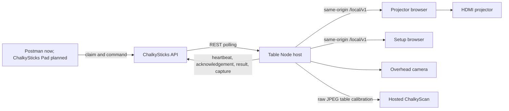

Table Node turns a small computer beside a pool table into a remotely controlled projector and camera appliance. It registers and claims a table, presents portable ChalkySticks diagrams, clears the projector, captures a host-owned USB camera, runs API inference, automatically registers table corners through hosted ChalkyScan pocket detection, and calibrates physical output from measured projected light.

`@chalkysticks/table-node` (v0.1.0) is an application, not a library — it is deployed to hardware rather than installed as a dependency. The controller side of the same system is [`@chalkysticks/sdk-table-control`](/sdk/table-control).

## Division of Authority

The ChalkySticks API is the authority for identity, ownership, authorization, state, command history, and capture metadata. The Node is the authority for its attached hardware and its calibration.



| Process | Responsibility |
|---------|----------------|
| **Node host** | Registration, device identity and credential storage, API communication, REST command polling, local HTTP routes, camera capture, hosted pocket inference, capture uploads, runtime status |
| **Output client** | Claim-code onboarding, black idle output, portable scene rendering, measured-light calibration patterns, calibrated warping, capture-safe blanking |
| **Setup client** | Enrollment, connection, hardware status, camera preview, camera selection, corner registration, calibration controls |
| **ChalkySticks API** | Device enrollment, ownership and permission checks, locks, durable commands, realtime channel grants, captures, audit history |
| **ChalkySticks Pad** *(planned)* | Table discovery and claim, diagram serialization, present and clear controls, scan requests, applying returned normalized coordinates |

## Runnable Slice

Three command types are implemented:

| Command | Behavior |
|---------|----------|
| `projection.present` | Renders a normalized projection scene |
| `projection.clear` | Returns the projector to black |
| `scan.capture` | Uses the selected USB camera in hardware mode, or a deterministic fixture in simulation mode |

Registration, credential persistence, heartbeat, durable command recovery, output status, and API history all use the real contracts.

<Note>
Advertisements, games, attract loops, playlists, and scheduled content are **later** command types. They should be added as new versioned command contracts and execution handlers — not hidden inside the three first-release command payloads.
</Note>

Command delivery is REST-only in this slice. An Ably wake-up can later reduce latency, but REST polling remains the recovery path.

## Local Addresses

The host runs on port `7010` and serves the compiled browser clients from `build/public`.

| Purpose | Address |
|---------|---------|
| Projector output | `http://127.0.0.1:7010/output` |
| Local setup | `http://<table-node-hostname>.local:7010/setup` |
| Local diagnostics | `http://<table-node-hostname>.local:7010/diagnostics` |
| Local status | `http://<table-node-hostname>.local:7010/local/v1/snapshot` |
| Development API | `http://192.168.1.88:8000/v3` |

The projector browser uses loopback so it continues to load when the venue internet connection is unavailable. A phone or laptop on the same local network uses the Node hostname or address for setup; remote attempts to open `/output` redirect to `/setup`, while the actual projector output hides its cursor and contains no setup navigation.

Before the table is claimed, the projector shows its claim code. After it is claimed, idle and cleared output is black.

<Warning>
Port `7010` is a **private commissioning boundary, not a public API**. The first slice assumes a trusted admin LAN. Before a Node is placed on a player-accessible network, setup mutations require a local PIN-backed session plus origin and request-forgery protection. Never expose `7010` to the public internet — commands arrive through the authenticated API.
</Warning>

## Durable Command Flow

1. An authenticated controller creates an idempotent command through `POST /v3/pool-table-commands`.
2. The API stores the command and returns its durable identifier.
3. The Node retrieves authoritative pending commands through REST polling.
4. The Node acknowledges the command **before** changing browser-owned output state.
5. The Node executes `projection.present`, `projection.clear`, or host-camera-backed `scan.capture` **serially**.
6. The Node reports a completed result or a bounded failure message through `PATCH /v3/table-node/commands/{command}`.
7. Heartbeats and command-list polling recover work after a disconnect or process restart.

A hardware `scan.capture` blacks the projector, captures an original JPEG, completes a private upload, requests canonical API inference, and returns its capture reference, `table.surface.normalized.v1` coordinates, orientation-uncertainty flag, and warnings.

## Local Routes

The Node host exposes device-token-free status and browser IPC. Browser clients call same-origin `/local/v1/*` routes and **never** hold the device token.

| Route | Purpose |
|-------|---------|
| `GET /output`, `/setup`, `/diagnostics` | Compiled browser views |
| `GET /local/v1/snapshot` | Sanitized runtime, claim, configuration, and pending-command status |
| `GET /local/v1/events` | Server-sent runtime and command events |
| `GET /local/v1/hardware`, `/hardware/preview` | Device-token-free hardware state and transient camera preview |
| `POST /local/v1/hardware/control` | Venue setup operations, including hosted table detection |
| `POST /local/v1/hardware/capture`, `/hardware/report` | Loopback-only capture and calibrated hardware reporting |
| `POST /local/v1/output/status` | Loopback-only projector readiness |
| `POST /local/v1/commands/{id}/acknowledge` | Loopback-only command acknowledgement |
| `POST /local/v1/commands/{id}/capture` | Loopback-only multipart capture handoff |
| `POST /local/v1/commands/{id}/complete` | Loopback-only successful result |
| `POST /local/v1/commands/{id}/fail` | Loopback-only failure result |

The snapshot intentionally includes the short-lived claim code and pending command payloads.

## Remote API Families

The host reaches these through `@chalkysticks/sdk-table-control`:

| Route family | Purpose |
|--------------|---------|
| `POST /v3/table-node/register` | Create or resume device identity |
| `POST /v3/table-node/heartbeat` | Publish health and receive pending identifiers |
| `GET /v3/table-node/commands` | Recover assigned durable commands |
| `PATCH /v3/table-node/commands/{id}` | Acknowledge, complete, or fail a command |
| `POST /v3/table-node/commands/{id}/capture-upload…` | Allocate and complete direct scan uploads |
| `/v3/pool-tables…` | Controller discovery, claim, configuration, locks |
| `/v3/pool-table-commands…` | Controller command creation and history |

## Identity and Storage

The first registration creates a stable pool-table record and returns a one-time device bearer credential plus a short-lived claim code. While the table remains unclaimed, the authenticated Node automatically refreshes expired claim material.

The host persists its device record and a separate hardware profile — camera selection, camera corners, hosted model diagnostics, projector calibration — under `TABLE_NODE_DATA_DIRECTORY`. Commands remain authoritative in the API.

Laptop development may choose `TABLE_NODE_DATA_DIRECTORY`; the packaged Raspberry Pi service fixes it at `/var/lib/chalkysticks-table-node` so it stays consistent with the systemd write sandbox and kiosk profile.

<Warning>
The credential is never placed in browser storage, query strings, logs, or the environment example. **Deleting the data directory loses the local identity and must be treated as device replacement, not routine troubleshooting.**
</Warning>

## Availability and Recovery

- The host starts before Chromium and is supervised by systemd.
- Chromium loads `http://127.0.0.1:7010/output`, so DNS and venue internet are not required for the local surface.
- A heartbeat runs every **15 seconds**; the API considers a Node offline after **45 seconds** without one.
- Initial registration retries use bounded exponential backoff from 1 second through a 30-second cap. Enrolled heartbeat and command failures retry on their configured 15-second and 5-second cadences.
- Commands are idempotent and executed one at a time; restarts resume from API state instead of guessing from realtime messages.

<Note>
Add per-device jitter before a large fleet rollout — every Node currently retries on the same cadence.
</Note>

## Simulation and Hardware Modes

| Mode | Behavior |
|------|----------|
| `TABLE_NODE_SIMULATION=true` | Advertises the three runnable command types with a deterministic scan fixture |
| `TABLE_NODE_SIMULATION=false` | Derives capabilities from the real output and UVC camera, uses server-side inference, restores the persisted hardware profile |

Hardware appliances run with simulation disabled. Retain simulation only for deterministic laptop tests.

## Local Development

Run the same host and browser clients on a laptop before installing a Raspberry Pi:

```bash
TABLE_NODE_API_URL=http://192.168.1.88:8000/v3 \
TABLE_NODE_DATA_DIRECTORY=.data \
TABLE_NODE_PORT=7010 \
TABLE_NODE_SIMULATION=true \
yarn dev
```

Then open `http://127.0.0.1:7011/output`, `/setup`, and `/diagnostics`. The Vue development server on `7011` proxies same-origin `/local/v1/*` calls to the host on `7010`, so changing the remote API only requires changing the host environment. A production build serves all three browser routes directly from `7010`.

### Prerequisites

- The development API reachable at `http://192.168.1.88:8000/v3`, with Laravel bound to all interfaces (`php artisan serve --host=0.0.0.0 --port=8000`), not only loopback.
- Migrations run against the intended development database — the pool-table registration, command, organization, and capture contracts are local API changes.
- Laptop and any test tablet or Pi on the same LAN.
- Local firewall allows inbound TCP `8000`, `7010`, and `7011`.

<Warning>
`127.0.0.1` means the current machine. A Node running on the Pi must use `192.168.1.88`, not `localhost`, for the laptop API.
</Warning>

### First End-to-End Exercise

1. Start with an empty, dedicated `.data` directory only when intentionally simulating a new appliance.
2. Verify `curl --fail http://192.168.1.88:8000/v3/config/health` reaches Laravel rather than another local service.
3. Start Table Node in simulation mode and wait for registration plus its claim code.
4. Claim the registered table with the Pool Tables requests in the Postman collection.
5. Create a `projection.present` command and verify the output client renders the scene.
6. Create a `projection.clear` command and verify the output returns to black.
7. Create a `scan.capture` command and verify the fixture produces a completed command containing a real uploaded capture reference and normalized ball coordinates.
8. Restart Table Node and verify it resumes the same device identity and polls for pending commands.
9. Disconnect the API briefly, restore the network, and verify heartbeat and command recovery.

## Environment

| Variable | Purpose |
|----------|---------|
| `TABLE_NODE_API_URL` | ChalkySticks API base |
| `TABLE_NODE_PORT` | Host port (default `7010`) |
| `TABLE_NODE_DATA_DIRECTORY` | Identity and hardware profile storage |
| `TABLE_NODE_SIMULATION` | Simulation vs hardware mode |
| `TABLE_NODE_SCAN_URL` | Hosted ChalkyScan endpoint |
| `TABLE_NODE_SCAN_TIMEOUT_MS` | Scan request timeout |
| `TABLE_NODE_HEARTBEAT_INTERVAL_MS` | Heartbeat cadence |
| `TABLE_NODE_POLL_INTERVAL_MS` | Command poll cadence |
| `TABLE_NODE_RETRY_MINIMUM_MS` / `TABLE_NODE_RETRY_MAXIMUM_MS` | Backoff bounds |
| `TABLE_NODE_LOG_FORMAT` | `text` or `json` |
| `TABLE_NODE_MAXIMUM_REQUEST_BYTES` | Local request body cap |
| `TABLE_NODE_BOOT_BRANDING` | Early-boot splash, off by default |

## Build Contract

A production build must produce all three artifacts — the Raspberry Pi installer validates every path before modifying system services:

```text
build/cli/index.js     # installation, deployment, diagnostics
build/host/index.js    # the Node service
build/public/          # output, setup, and diagnostics clients
```

## Logs

The host emits ISO-8601 timestamps in text mode, or one JSON record per line with `TABLE_NODE_LOG_FORMAT=json`. Both formats intentionally reduce errors to safe messages instead of serializing HTTP request headers, API credentials, or the device token. Installed logs are retained by journald and available through `table-node logs`.
