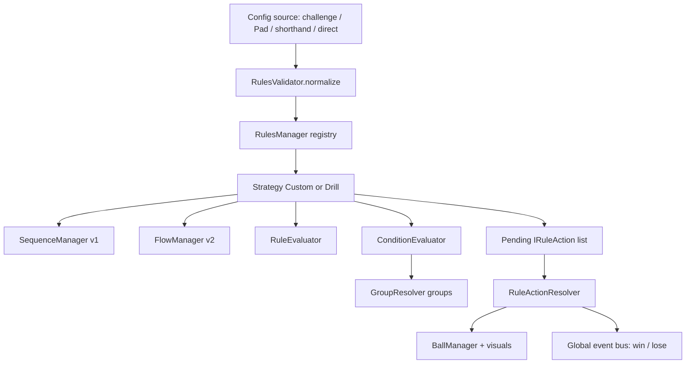
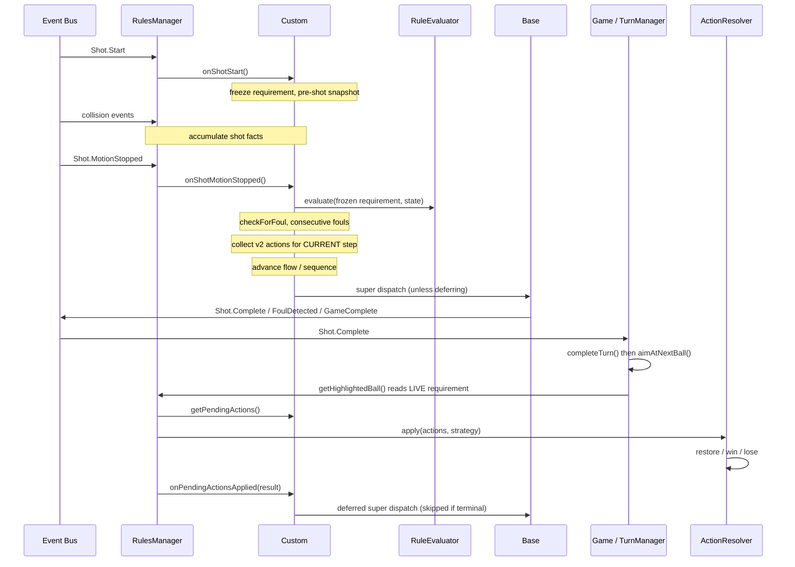

## Overview

This page is a deep dive into the runtime under `src/App/System/Rules/`. It assumes you know the config shape ([Config Schema](/trainer/custom-rules/schema)) and how configs get in ([Entry Points & Integration](/trainer/custom-rules/integration)). Everything here is code-verified against the trainer source; where older markdown docs in the repo disagree, this page reflects the code.

## Architecture

| Component | File | Responsibility | Construction / injection |
|-----------|------|----------------|--------------------------|
| `RulesManager` | `RulesManager.ts` | Event-bus front door. Registers strategies keyed by `Enum.GameType`, routes collision/shot/game events into the active strategy, re-broadcasts strategy-local events onto the global bus, drives schema-v2 action application. | Constructed by `Game.ts` (`new RulesManager()`) and injected into TurnManager, RackController, the AI opponent, multiplayer, and the aim system. A vestigial `export default new RulesManager()` singleton exists at the bottom of the file but is unused — do not rely on it. |
| `RulesValidator` | `RulesValidator.ts` | Normalization gate. Coerces `schemaVersion` (anything but exactly `2` becomes `1`), down-maps `hybrid`/unknown modes to `global`, replaces malformed payloads with a safe default. Idempotent. | Static; called once per registration inside `registerRulesForGameType()`. |
| `Strategy/Custom` | `Strategy/Custom.ts` | The config-driven strategy. Owns the frozen `shotRequirement`, per-shot rail-phase counters, pre-shot and rack snapshots, `consecutiveFouls`, both walkers (v1 `SequenceManager`, v2 `FlowManager`), and the v2 pending-action/defer flow. Subclass `Drill` adds a terminal pass/fail seam. | Instantiated only inside `RulesManager.registerRulesForGameType()` — never eagerly. |
| `RuleEvaluator` | `RuleEvaluator.ts` | **Pure static** requirement evaluator: `evaluate(requirement, state)` returns errors, foul type, and severity. Never mutates. | Static; called by `Custom` for foul checks, win gating, and previews. |
| `ConditionEvaluator` | `ConditionEvaluator.ts` | **Pure static** schema-v2 condition-tree evaluator (`when` / `unless`). Combinators `all`/`any`/`not`; leaf atoms `shot` and `table`. Missing condition is vacuously true; unrecognized atoms are false (fail-closed). | Static; called from `Custom.collectV2Actions()` with a context built via `GroupResolver.buildGroupMap()`. |
| `RuleActionResolver` | `RuleActionResolver.ts` | **The one place that mutates the table** for the rules layer: respot/restore balls, strip pocket credit, dispatch win/lose. | **Constructed in `Game.ts`** with `ballManager`, `ballSystem`, and `playerManager`, then injected via `rulesManager.setActionResolver(resolver)`. |
| `FlowManager` | `FlowManager.ts` | Schema-v2 flow walker. Expands `config.flow` into a flat step list at construction time, then walks an index. | Constructed in the `Custom` constructor only when `config.flow` exists. |
| `SequenceManager` | `SequenceManager.ts` | v1 `mode: 'sequential'` walker over `config.sequence`. Richer API (`goBack`, `getProgress`, `skip`); completion is an implicit win. | Constructed unconditionally in the `Custom` constructor. |
| `GroupResolver` | `@chalkysticks/sdk-pad` | Merges built-in groups (`solids`/`lows` 1–7, `stripes`/`highs` 9–15, `objectBalls` 1–15) with `config.groups`; author wins on name clash. | Static, SDK-side; the only engine consumer is condition evaluation (`groupCleared` / `groupHasActive`). |
| `FoulHandler` | `FoulHandler.ts` | Global-bus foul responder: records the foul on the player, respots cue/off-table balls after a 750 ms visual delay, delegates turn handling to `TurnManager.handleFoulTurn()`. | Constructed in `Game.ts` with `ballManager`, `ballSystem`, `playerManager`, `turnManager`. |
| `OutcomePreviewAdapter` | `OutcomePreviewAdapter.ts` | **Pure static** converter: precomputed physics outcome + trajectory into the same `Trainer.IShotState` shape the live listeners accumulate, so previews and live verdicts agree. | Static; called from `Base.previewShotResolution()` and from the tutorial's `System/Tutorial/ShotValidator.ts` (objective checking against precomputed outcomes). |
| `RulesSummaryFormatter` | `RulesSummaryFormatter.ts` | **Pure static, display-only** humanizer: rule-spec input to prose lines for intro modals and history accordions. Never touches runtime state. | Static; UI callers only. |

Two supporting pieces worth knowing: `Strategy/Base.ts` holds the shot-fact accumulators (`ballsContacted`, `ballsPocketed`, `secondaryContacts`, `cushionHits`, `railContacts`, `firstBallContacted`, `targetBalls`) and the post-shot dispatch pipeline that every strategy shares; the barrel at `System/Rules/index.ts` exports all of the above except `OutcomePreviewAdapter` (deep-imported by its two callers), plus `export * as Strategy`.

## Data Flow



Config flows in through the validator exactly once, the strategy consults the pure evaluators to reach a verdict, and any resulting table mutation flows out through the action resolver — never through the strategy itself.

## Registration Path

Every custom-rules source flows through one gate:

1. `RulesManager.registerCustomRules(config, name?)` is a thin alias for `registerRulesForGameType(name || Enum.GameType.Custom, config)`.
2. `registerRulesForGameType(gameType, config)`:
    - Normalizes: `RulesValidator.normalize(config)` — the single normalization gate. Normalize is idempotent, so upstream boundaries (the challenge resolver) can safely normalize again.
    - Selects the subclass **here** — callers never name one: `gameType === Enum.GameType.Drill` gets `new Game.Drill(normalizedConfig)`, everything else gets `new Game.Custom(normalizedConfig)`.
    - Stores the instance in the registry keyed by `gameType` and returns it.
3. Registration does **not** activate. Activation is `setGameType(gameType)`, which detaches the previous strategy's four local listeners (`Rules.BallHighlightsChanged`, `FoulDetected`, `GameComplete`, `HighlightedBallChanged`), wires the `PlayerManager` if the strategy accepts one, attaches the four listeners to the new strategy, calls `initialize(balls)` if balls exist, and commits `game/setGameType` to the store.

Callers of the gate: `Game.ts.setRules()`, `RackController.applyRulesForRack()` (which resolves explicit config over compiled shorthand — see [Shorthand DSL](/trainer/custom-rules/shorthand)), and `RackController.applyCustomRules()` (re-rules the current rack without re-racking). A config may self-identify via `config.name`, but `Drill` force-overrides its name regardless — the registry key is supplied at registration, not by the config.

The dependency wiring happens once in `src/App/Game.ts` during startup — the rules layer never constructs its own mutator:

```typescript
// Wire PlayerManager to RulesManager for player-aware rules (8-ball groups)
this.rulesManager.setPlayerManager(this.playerManager);

// Initialize the schema-v2 action resolver and wire it into the
// rules manager. It owns the table mutations (respot, restore,
// win/lose) that declarative custom rules trigger after a shot.
this.rulesManager.setActionResolver(
    new Rules.RuleActionResolver({
        ballManager: this.ballManager,
        ballSystem: this.ballSystem,
        playerManager: this.playerManager,
    }),
);
```

The `FoulHandler` is constructed alongside it (`new Rules.FoulHandler(...)`) with the same collaborators plus the `TurnManager`. `Game.ts` also hands the `RulesManager` to the `RackController`, the `TurnManager`, the AI opponent controller, and the aim system (`aimSystem.setRulesManager()`).

## The Shot Lifecycle



### Phase-by-phase

1. **`onShotStart()`** — `Base.onShotStart()` latches the break flag, zeroes all accumulators, and captures `targetBalls = [...getLegalBalls()]` (the shot-start legal set used by dynamic-token resolution). `Custom` then **freezes the requirement**: `this.shotRequirement = resolveDynamicRequirement(getCurrentRequirement())` — `lowest`/`highest` tokens are resolved to concrete numbers now. Under schema v2 it also snapshots every ball's state into `preShotSnapshot` (the rack snapshot was already captured once in `initialize()`).
2. **During the shot** — `RulesManager` routes `Collision.BallBall` / `BallRail` / `BallPocket` into the strategy's record methods. Pocket-mouth rail ids (like `pocket:head-top`) normalize to null and are excluded from rail *identity*, though the scalar cushion count still includes them.
3. **`onShotMotionStopped()`** — gated first by game state (`BallsMoving`, undo guard) and by the multiplayer single-writer gate (`game/ownsShotVerdict`; only one client computes the verdict). Then, in exact order inside `Custom`:
    1. Evaluate `getEvaluationRequirement()` (the **frozen** requirement) against the accumulated shot state via `RuleEvaluator.evaluate()`.
    2. Record the shot in `shotHistory` (capped at 12).
    3. `checkForFoul()` — frozen requirement, then `globalRules`, then `loseConditions` in array order. Update `consecutiveFouls`.
    4. **Capture pending v2 actions for the CURRENT step** via `collectV2Actions()`: matching `events` entries (only `on: 'shotResolved'` exists; `when` via `ConditionEvaluator`; per-action `unless` honored) plus — only when the step succeeded legally — the just-played flow step's own `actions`. This is pure with respect to the table.
    5. **Advance the flow/sequence** on legal success (`sequenceManager.advance()` and/or `flowManager.advance()`).
    6. `Drill` only: the terminal-outcome seam may claim the shot (win/loss via `Rules.GameEnded`) and short-circuit everything below.
    7. If pending actions exist, set `deferShotResolution = true` and **return without calling Base**. Otherwise call `super.onShotMotionStopped()` now.
4. **Base dispatch** — off-table check first (dispatches `FoulDetected` with the respot list and returns), then foul dispatch, then win check with the **universal fallback** (no win condition matched, no foul, zero active balls → synthesized "All balls pocketed" win), then `Shot.Missed`/`Shot.Complete`.
5. **Downstream of `Shot.Complete`** — `Game.Handle_OnShotComplete` → `turnManager.completeTurn()` → `rulesManager.prepareForNextShot()` + `aimSystem.aimAtNextBall()` → `TargetSelector.getSuggestedBall()`, which reads `rulesManager.getHighlightedBall()` first — i.e. the **live** `getCurrentRequirement()`.
6. **RulesManager applies pending actions** — back in `Handle_OnShotMotionStopped`, it pulls `getPendingActions()` and calls `ruleActionResolver.apply(actions, strategy)` (the strategy is passed as the `source`, supplying `getPreShotState`/`getRackState` snapshots). Then `onPendingActionsApplied(result)` runs: if `result.terminal` (a v2 `win`/`lose` fired), it returns without Base dispatch — no trailing `Shot.Complete` or universal win. Otherwise the deferred `super.onShotMotionStopped()` runs **now**, after the mutations, so highlights and re-aim see the restored ball.

### Why the flow advances before super

Base's `Shot.Complete` dispatch synchronously triggers the re-aim chain, and the re-aim reads the **live** requirement. If the flow had not advanced yet, `getHighlightedBall()` would still point at the step just completed — the aim system would target the ball just pocketed and fall through to a neutral down-table aim. Advancing first fixes that off-by-one. It cannot misfire a foul, because evaluation already used the frozen requirement.

### The frozen-requirement architecture

Two distinct getters on `Custom`:

| Getter | Returns | Used by |
|--------|---------|---------|
| `getCurrentRequirement()` | The LIVE walker state (flow step / sequence step / `globalRules`), after fast-forwarding past dead steps | `getBallHighlights()`, `getHighlightedBall()`, `getLegalBalls()` — pointing the player at the **next** target |
| `getEvaluationRequirement()` | `this.shotRequirement` (frozen at `onShotStart`), falling back to a resolved live read | `checkForFoul()`, the motion-stopped evaluation, win gating, `wrongBall` lose condition, preview resolution — judging the shot **against the step you aimed at** |

Without the freeze, the just-taken shot would be re-judged against the *next* step's requirement (because the flow advances mid-resolution), misfiring fouls and leaving the aim pointing at a pocketed ball. The freeze also performs dynamic-token resolution, and that is load-bearing: `RuleEvaluator` treats an unresolved `lowest`/`highest` as **always invalid** — a guaranteed `wrongBall` foul. Resolution prefers the shot-start `targetBalls` set over the current active balls, because a legal shot may pocket the target before evaluation runs. The frozen value clears in `prepareForNextShot()` and `reset()`.

### Downstream foul handling

`FoulHandler` is deliberately narrow. It subscribes to `Foul.Any`, `Foul.OffTable`, `Foul.Scratch`, and `Foul.ShotClock` on the global bus, but **only the `Foul.Any` handler does work** — since `RulesManager` re-dispatches every foul as `Foul.Any` plus the specific type, the specific handlers are documented no-ops to prevent double `handleFoul()` runs and double turn switches. `handleFoul()` then:

1. Records the foul on the current player (`addFoul()`).
2. For scratch/off-table fouls: captures the state version, sleeps 750 ms for the visual fall, bails if an undo changed the state version, then respots from `foulResult.ballsToRespot` (ball 0 resets the cue; others go to the best open spot). The respot list captured at motion-stop is trusted over re-reading live flags, which the physics settle step or a multiplayer broadcast can clear during the delay.
3. Calls `turnManager.handleFoulTurn()` — deliberately AFTER respotting, so the subsequent `aimAtNextBall()` sees the new ball position. That path ends the turn, switches players, forces the `Aiming` state, clears the frozen requirement via `prepareForNextShot()`, and grants ball-in-hand.
4. Dispatches global `Foul.Resolved` (the multiplayer broadcast hook) and a local `'foul'` event.

`FoulHandler` never dispatches `Shot.Complete` — that would double-run `completeTurn()`.

## Evaluation Semantics

`RuleEvaluator.evaluate()` runs four sections in order — ballContact, pockets, rails, shotType — accumulating error strings; `success` means zero errors. `Custom.mapToStandardFoulType()` maps `noContact`/`noRail`/`scratch`/`wrongBall` to their specific `Event.Foul.*` values; **every other internal foul type maps to `Event.Foul.Any`**.

Internal foul-type strings the evaluator can emit:

| Section | Foul types |
|---------|-----------|
| Ball contact | `noContact`, `wrongBall`, `requiredContactMissed`, `wrongOrder`, `tooFewContacts`, `doubleKiss`, `carom` |
| Pockets | `requiredBallMissed`, `wrongPocket`, `forbiddenPocket`, `tooFewPocketed`, `tooManyPocketed` |
| Rails | `tooFewRails`, `tooManyRails`, `noRail`, `disallowedRail` |
| Shot type | `requiredShotTypeMissing`, `forbiddenShotType`, `shotTypeUnavailable` |

Key semantics:

- **Fail-closed shot type**: if `state.shotClassifications` is not an array, the evaluator immediately fouls with `shotTypeUnavailable` (severity `major`) rather than guessing. A shot-type requirement can never silently pass because classification data was missing.
- **`clean` is a two-count split**: `maxContacts` bounds how many unique object balls the **cue** directly struck (exceeding it is a `doubleKiss` hard foul — object-to-object caroms are not in that count), while `maxCaroms` separately bounds object-to-object collisions (`secondaryContacts`). The `clean` shorthand emits `maxContacts: 1` plus `maxCaroms: 0`. The aim-preview path omits `secondaryContacts`, which reads as 0 — no false preview fouls.
- **`railMode` flavors**: absent or `strict` enforces rail caps against the raw cushion scalar. `local` forgives a ball's contact with rails bordering **the pocket that same ball dropped into** — strictly per-ball, so the cue (never pocketed) is never forgiven, and one ball's forgiveness never covers another ball hitting the same rail. Scoped or relaxed **counts** fail closed to the scalar when the per-contact `railContacts` log is unavailable; rail **allow-sets** fail open (skipped) without the log, because scalar counts cannot express rail identity and fouling blind would reject every shot.
- **A pot excuses the missing rail**: the standard no-rail foul (`afterContact.required`) only fires when zero rails were hit after contact **and** no ball was pocketed.
- **Hard caps are real fouls**: `total.max` (used by `norails`) and `maxContacts` foul on their own, so cap-only requirements actually trip `checkForFoul`.

`checkForFoul()` layers: frozen requirement first (reason = first error string), then `globalRules` (still honored under v2 as an extra global foul layer), then `loseConditions` in array order.

## Action Resolution

`RuleActionResolver` embodies the **single-mutation-owner principle**: the strategy computes verdicts and stages actions but never touches the table; the resolver is the only rules-layer code that moves balls or dispatches terminal outcomes. `apply(actions, source)` iterates in order and returns `{ terminal: boolean }` — true if any action was terminal.

| Action type | Behavior | Terminal |
|-------------|----------|----------|
| `restoreBall` / `respotBall` | Identical: resolve ball number, place per `to`, optionally strip pocket credit, resync | No |
| `win` | Dispatch `Rules.GameComplete` on the global bus — the exact pipeline Base's own win uses | Yes |
| `lose` | Dispatch `Foul.Any` — routes into `FoulHandler` as a terminal failure | Yes |
| `continueGame` | Explicit no-op (authors state intent; not dispatching win/lose IS continue) | No |
| `score`, `advancePhase` | **Not implemented** — warn and skip | No |

### The single-ball restore visual path

`restoreBall` places the ball (snapshot/vector targets via `ball.respawn(x, y, z)`; named spots via the BallManager placement helpers — see Placement target resolution below), then force-pushes `ballManager.syncToStore()` and `ballSystem.resyncAllVisuals()`. The full resync matters because the normal render path filters out balls that were invisible the previous frame — without it, a just-pocketed mesh stays hidden after respawn.

It deliberately does **not** call `BallManager.restoreState([oneBall])`: `restoreState` is a whole-table operation whose first step **deactivates ALL balls** and re-activates only those present in the passed array — a single-ball array would clear the rest of the table. So the resolver replicates the tail of that pipeline manually (respawn + store sync + visual resync). `removePocketCredit` runs after placement and before the store sync, iterating **all** players and stripping the ball from whoever holds it — no "current player" lookup needed.

### Placement target resolution

`placeBall` checks the `to` operand in order: `footSpot` → `headSpot` → `rackPosition` (from the strategy's rack snapshot; missing snapshot warns and falls back to best spot) → `bestSpot`/`configuredSpot` (currently aliases) → a normalized table position object (`type: 'normalizedTablePosition'`, converted via `TablePlacementResolver`) → any other object treated as an explicit x/y/z vector → default `preShotPosition` (from the pre-shot snapshot; missing snapshot falls back to best spot). An unresolved flow token in `action.ball` (e.g. `phaseTarget`) resolves to null — warn and skip.

## Flow Advancement Details

- **Skipping dead concrete steps**: every `getCurrentRequirement()` call first runs `syncUnavailableRuleSteps()`, which fast-forwards `FlowManager.skipUnavailableTargets()` (and the sequence equivalent) past steps whose concrete numeric `firstBall` — or every member of an array `firstBall`, or any `required` numeric pocket target — is off the table. Dynamic forms (`any`/`lowest`/`highest`) are never skipped this way. `getRequirementAtOffset(offset)` is the read-only peek used by the aim-preview path, applying the same skip logic against predicted final ball states.
- **`generatedSequence`**: expanded once at construction into the cross product of `items` and `stepsPerItem`. The `item: true` token resolves in exactly three places — `ballContact.firstBall`, `pockets.targetBalls[].ball`, and each action's `ball` operand — via deep clone, producing fully concrete steps with ids like `step:3`.
- **Deferred phase types**: `repeatingPhases` and `phases` log a "not yet implemented" warning and expand to an **empty step list**. The strategy then falls back to `requirements.everyShot` (or an empty requirement). An empty flow is never "complete" (`isComplete()` requires at least one step), and v2 games end via a `win` event action, a declared `winConditions` entry (evaluated in `Custom.checkForWin()` for both schema versions), or Base's universal all-cleared fallback — flow completion itself is never a win. (v1 sequences differ: `SequenceManager.isComplete()` **is** an implicit win.) The shorthand compiler sidesteps the deferred types by pre-expanding into `flow.type: 'steps'`.

### SequenceManager vs FlowManager

Both walkers are advanced in the same success branch of `onShotMotionStopped()`, and both share the identical unavailable-step skip logic, but they differ in shape:

| Aspect | SequenceManager (v1) | FlowManager (v2) |
|--------|----------------------|------------------|
| Source | `config.sequence` — raw requirement array, no expansion | `config.flow` — expanded once at construction into flat steps |
| Per-step actions | None — steps are bare requirements | Each step carries token-resolved `actions`, staged on legal step success |
| Completion | Explicit latched flag; `advance()` stops at the last step | Index-only; `isComplete()` derived from index past the end |
| Win semantics | Completion **is** an implicit win ("Completed all required shots") | No implicit win — v2 games end via a `win` event action, a declared `winConditions` entry (evaluated in `Custom.checkForWin()` for both schema versions), or the universal fallback; flow completion itself is never a win |
| Extra API | `goBack()`, `getProgress()`, `getShotIndex(id)`, `skip()` (gated on `options.allowSkip`) | Leaner: `getCurrentStepActions()`, `getCurrentTargetBall()`, `hasSteps()` |
| Construction | Always, in the `Custom` constructor | Only when `config.flow` exists |

## Ball Highlights

`Custom.getBallHighlights()` is driven by the **live** requirement's `ballContact.firstBall`:

| Situation | Highlight |
|-----------|-----------|
| `firstBall` undefined or `'any'`, or no legal balls | None |
| Exactly one legal ball (concrete number, resolved `lowest`/`highest`, compiled flow step) | One steady ring — `behavior: 'persistent'`, preset `drill-target` |
| Multiple legal balls (array `firstBall`) | Each flashes for 2000 ms — preset `eight-ball-flash` for the 8, `solid-option-flash` for 7 and under, `stripe-option-flash` otherwise |

**Refresh path**: `Base.updateHighlights()` runs at `initialize`, `reset`, `onShotMotionStopped`, and `prepareForNextShot`. It deep-diffs against the previous highlight set and dispatches strategy-local `Rules.BallHighlightsChanged`; `RulesManager` forwards it verbatim to the global bus, and re-labels the companion `HighlightedBallChanged` as `Rules.LowestBallChanged`. The visual consumer is the `Mixin/World/Highlights.ts` mixin, which hides highlights on `Shot.Start` (saving persistent ones) and restores them on `Shot.MotionStopped`/`Shot.Undo`. `getHighlightedBall()` (single target) additionally feeds aim assistance through `TargetSelector`.

## Events Reference

| Event | Value | Direction | Payload / notes |
|-------|-------|-----------|-----------------|
| `Shot.Start` | `'shot:start'` | Consumed by RulesManager (global) | Starts the shot; triggers freeze + snapshot |
| `Collision.BallBall` / `BallRail` / `BallPocket` | — | Consumed by RulesManager (global) | Fact accumulation during the shot |
| `Shot.MotionStopped` | `'shot:motion-stopped'` | Consumed by RulesManager (global) | Triggers resolution (state + single-writer gated) |
| `Shot.OutcomeReady` | `'shot:outcome-ready'` | Consumed by RulesManager (global) | Advisory preview trigger while balls still move |
| `Shot.ResolutionPredicted` | `'shot:resolution-predicted'` | Dispatched by RulesManager (global) | `IShotResolutionPrediction` — advisory only; no real fouls fire from preview |
| `Rules.FoulDetected` | `'rules:foul:detected'` | Strategy-local, consumed by RulesManager | `IFoulResult` — re-dispatched globally as `Foul.Any` **plus** the specific foul type |
| `Rules.GameComplete` | `'rules:game:complete'` | Base: local + global; ActionResolver: global only | `IWinResult`; `Game.ts` consumes the global one and dispatches `Game.End` |
| `Rules.GameEnded` | `'rules:game:ended'` | Dispatched by Drill (local + global) | `IGameEndResult` — terminal pass/fail for drills |
| `Rules.BallHighlightsChanged` | `'rules:ball-highlights:changed'` | Strategy-local, forwarded globally | `highlights` + `previousHighlights` |
| `Rules.LowestBallChanged` | `'rules:lowest-ball:change'` | Dispatched by RulesManager (global) | Re-labeled from strategy-local `HighlightedBallChanged` |
| `Shot.Complete` / `Shot.Missed` | `'shot:complete'` / `'shot:missed'` | Dispatched by Base (local + global) | No payload; `Shot.Complete` drives `completeTurn()` and the re-aim chain |
| `Foul.Any` | `'foul:any'` | Consumed by FoulHandler (global) | Only `Foul.Any` does work; the specific-foul handlers are deliberate no-ops to avoid double turn switches |
| `Foul.Resolved` | `'foul:resolved'` | Dispatched by FoulHandler (global) | Multiplayer broadcast hook, after respot + turn switch |
| `state:restored` | `'state:restored'` | BallManager → Ball Facade | Bridges full-snapshot restores to `resyncAllVisuals()`; the single-ball restore path bypasses this and resyncs itself |

## Known Caveats

- **Universal fallback vs v2 `win` action**: on the current code path they cannot double-fire on the same shot — a matched v2 `win` makes `apply()` return terminal, and `onPendingActionsApplied()` early-returns without Base dispatch, so the universal all-cleared fallback never runs. But the resolver's win path does **not** set the strategy's `hasGameEnded` flag (only Base's own win dispatch does), so dedup relies entirely on the terminal short-circuit plus `Game.ts` teardown. Treat that invariant carefully when touching the defer path — break it and you get a double `GameComplete`.
- **`score` and `advancePhase` are deferred**: typed, logged, skipped. `score` awaits a Player score setter; `advancePhase` belongs to a future phase flow engine.
- **Pocket nomination is unsupported** in Custom: `requiresPocketNomination()` is hardcoded `false`, and `RulesManager.nominatePocket()` is gated on it, so nomination calls are inert. Called-pocket **requirements** via `pockets.targetBalls[].pocket` do work — different mechanism.
- **`isBreakable()` is hardcoded `false`** — custom sets never report a break shot, even from a clustered rack.
- **Off-table fouls short-circuit Base resolution** — no win check runs on an off-table shot.
- **`foulsInRow` pre-counts the current shot** (`consecutiveFouls + 1 >= threshold`) and lose conditions run even on requirement-clean shots, so a clean shot following threshold-minus-one fouls still trips it.
- **Spec coverage is partial**: `tests/System/Rules/` covers the pure pieces (ConditionEvaluator, FlowManager, RuleEvaluator, RulesSummaryFormatter, RulesValidator, SequenceManager) and runs via `yarn test`, but there is no spec for `Custom.ts` or `RulesManager` — the lifecycle ordering described on this page (freeze, advance-before-super, deferred dispatch) is guarded only by in-game behavior. Verify changes to those paths by exercising the game.

For runnable configurations that exercise these paths, see [Recipes & Examples](/trainer/custom-rules/recipes).
