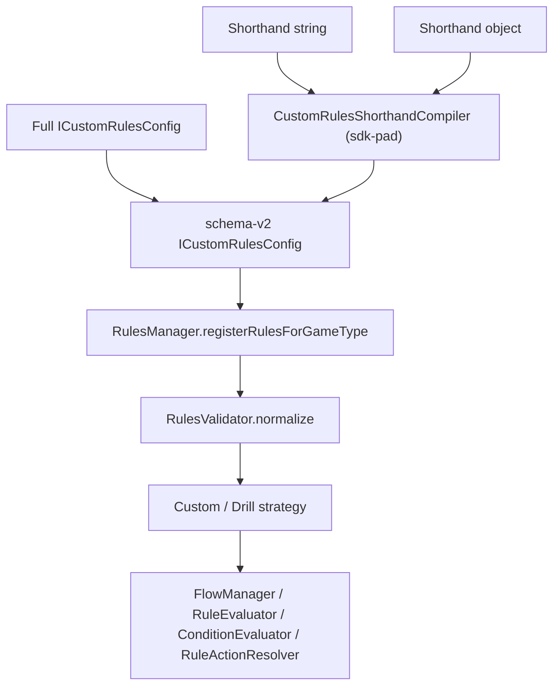

## Overview

Custom rules let you define drills and game variants declaratively instead of writing a new strategy class. A ruleset describes shot requirements (which ball to contact first, which pocket, how many rails, bank/kick/jump constraints), fouls, win/lose conditions, and post-shot actions such as respotting a ball or restoring it to its pre-shot position. You can author a ruleset three ways — a tiny shorthand string (`'flow=lowest,8&lose=scratch'`), a structured shorthand object, or a raw schema-v2 `ICustomRulesConfig` — and every tier compiles down to the same config, evaluated by the same runtime engine.

## Quick Start

### One-line shorthand string

The fastest path: pass a shorthand string as the third argument of `GameService.rackBalls`. It compiles against the racked balls automatically.

```typescript
// Standard 8-ball rack: pocket lowest-first, potting the 8 after each ball below it (1-7).
// The 8 respots after each of its pots except the last; balls 9-15 are then run lowest-first; scratch loses.
GameService.rackBalls(Enum.RackStrategy.EightBall, null, 'flow=lowest,8&lose=scratch');
```

Pick this for drill catalog entries, scene props (`rulesShorthand` on `SceneFreeplay` / `SceneGame`), saved links, and anywhere a ruleset needs to travel as a string.

### Shorthand object

When you are building rules programmatically — custom groups, win/lose lists — compile an `ICustomRulesShorthand` object and rack with the result. The compiler lives in the SDK at `ChalkySticks.Pad.Rules.CustomRulesShorthandCompiler`.

```typescript
const placements = [
    { ball: 0, x: 0.5, y: 0.85 },
    { ball: 1, x: 0.25, y: 0.4 },
    { ball: 3, x: 0.5, y: 0.35 },
    { ball: 5, x: 0.75, y: 0.4 },
    { ball: 8, x: 0.5, y: 0.6 },
];

const compiledRules = ChalkySticks.Pad.Rules.CustomRulesShorthandCompiler.compile({
    activeBalls: [1, 3, 5, 8],
    flow: ['reds', '8'],
    groups: { reds: [1, 3, 5] },
    lose: ['scratch', '3fouls'],
    win: 'clear',
});

GameService.rackCustom(placements, compiledRules);
```

Note the explicit compile step: the `GameService.rackCustom` facade accepts a compiled config, not raw shorthand. `GameService.rackBalls` and `GameService.rackPad` accept shorthand directly (as their third and fourth arguments respectively) and compile it for you.

### Full schema-v2 config

For anything the shorthand cannot express — condition trees, custom events, generated sequences — write the `ICustomRulesConfig` yourself and pass it as `customRules`. Explicit configs always take precedence over shorthand.

```typescript
const customRules: ICustomRulesConfig = {
    activeBalls: [1, 3, 5, 8],
    globalRules: {
        rails: {
            afterContact: { min: 1, required: true },
        },
    },
    loseConditions: [{ type: 'scratch' }],
    mode: 'global',
    schemaVersion: 2,
    winConditions: [{ type: 'allBallsPocketed' }],
};

GameService.rackCustom(placements, customRules);
```

## The Three Layers



Shorthand is pure sugar. The compiler pre-expands every string and object — against the actual racked balls — into the same schema-v2 `ICustomRulesConfig` a hand-written config uses: ordered flows become a flat `flow.type: 'steps'` list, free-order keywords become `mode: 'global'`, and respot behavior is derived from repeated ball occurrences. From there a single path applies: `RulesManager.registerRulesForGameType` (also reached via its delegating alias `registerCustomRules`, used by `GameService.setRules`) normalizes the config exactly once through `RulesValidator.normalize`, constructs a `Custom` strategy (or the `Drill` subclass for the Drill game type, which adds pass/fail framing), and the engine components take over — `FlowManager` walks the steps, `RuleEvaluator` judges each shot, `ConditionEvaluator` matches event conditions, and `RuleActionResolver` is the one component that mutates the table (respots, win/lose dispatch).

Because everything converges on one config shape, the [Config Schema](/trainer/custom-rules/schema) page is the single reference for what a ruleset can say, regardless of how you authored it.

## Capabilities

| Capability | Status | Summary |
|---|---|---|
| First-ball contact | Supported | Concrete number, array of numbers, `lowest` / `highest` (resolved at shot start), or `any` |
| Contact constraints | Supported | Required/forbidden contacts, contact order, min/max contacts, max caroms (`clean`) |
| Pocket requirements | Supported | Required target balls, specific pocket or `corner` / `side` / `any`, forbidden pockets, min/max pocketed |
| Rail requirements | Supported | Before/after-contact minimums, rail allow-sets, total caps, relaxed or strict `norails`, per-ball scope |
| Shot types | Supported | `bank` / `combo` / `jump` / `kick`, each required or forbidden; classified by the trainer at runtime |
| Conditions | Supported | `all` / `any` / `not` trees over shot and table atoms, via `when` on events and `unless` on actions |
| Actions | Partial | `restoreBall` / `respotBall`, `win`, `lose`, `continueGame` work; `score` and `advancePhase` are typed but skipped with a warning |
| Win / lose conditions | Supported | `allBallsPocketed`, `ballPocketed`, `ballsRemaining`; `scratch`, `wrongBall`, `foulsInRow` |
| Flow modes | Partial | `global`, `sequential` (v1), and v2 `flow` with `steps` / `generatedSequence`; `repeatingPhases` and `phases` are deferred (shorthand sidesteps this by pre-expanding to steps) |
| Power requirements | Not evaluated | `minPower` / `maxPower` exist in the types but no evaluator reads them |
| Pocket nomination | Not supported | The Custom strategy never requests nomination; called-pocket *requirements* still work via `pockets.targetBalls[].pocket` |

## Section Map

<CardGroup cols={2}>
    <Card title="Shorthand DSL" href="/trainer/custom-rules/shorthand">
        The full string/object grammar: tokens, operators, selectors, modifiers, win/lose sugar, and worked compilations.
    </Card>
    <Card title="Config Schema" href="/trainer/custom-rules/schema">
        The schema-v2 `ICustomRulesConfig` reference: requirements, conditions, actions, events, and flow definitions.
    </Card>
    <Card title="Engine Internals" href="/trainer/custom-rules/engine">
        How the runtime works: RulesManager, the Custom strategy, the post-shot lifecycle, frozen requirements, and the action resolver.
    </Card>
    <Card title="Entry Points & Integration" href="/trainer/custom-rules/integration">
        Every way rules enter the game: GameService rack methods, scene props, match config, challenges, and the drill catalog.
    </Card>
    <Card title="Recipes & Examples" href="/trainer/custom-rules/recipes">
        Copy-paste rulesets for common drills and game variants, from one-liners to full configs.
    </Card>
</CardGroup>
