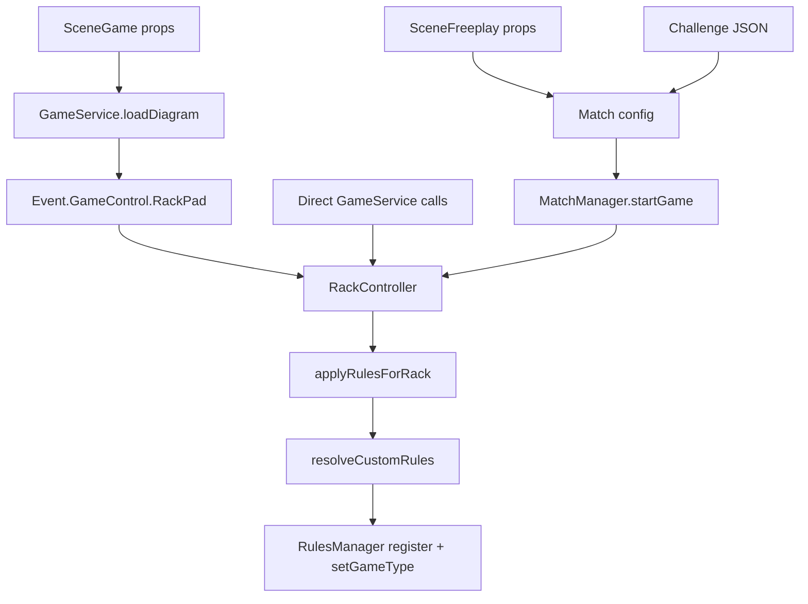

## Overview

Custom rules reach the engine through several surfaces — direct `GameService` calls, scene props, match configuration, challenge JSON, and the event bus — but every path converges on the same two chokepoints:

1. **`RackController.resolveCustomRules()`** (`src/App/System/Ball/RackController.ts`) decides *which* config applies (explicit config, compiled shorthand, or none).
2. **`RulesManager.registerRulesForGameType()`** (`src/App/System/Rules/RulesManager.ts`) normalizes the config exactly once and installs the strategy.



One naming note up front: the identifier is **`rulesShorthand`** everywhere — prop, match-config key, and method parameter. There is no `simpleRules` identifier in the codebase; older notes that use that name refer to the same [Shorthand DSL](/trainer/custom-rules/shorthand).

## Entry Points

All signatures below are verified against current source. `Trainer.RulesShorthandInput` is `string | ICustomRulesShorthand | null` (`types/system/ball.d.ts`).

| Entry point | Signature | Notes |
|---|---|---|
| `GameService.rackBalls` | `rackBalls(strategyName?: Enum.RackStrategy, customRules?: ICustomRulesConfig \| null, rulesShorthand?)` | Standard rack. Resets `playerManager` and `rulesManager` before delegating. |
| `GameService.rackCustom` | `rackCustom(placements?: Array<any>, customRules?: any)` | The facade drops the `rulesShorthand` parameter that `RackController.rackCustom` supports — compile shorthand yourself (see below). Does **not** reset players/rules. |
| `GameService.rackPad` | `rackPad(idOrModel: string \| ChalkySticks.Model.Diagram, customRules?, inverse?: boolean, rulesShorthand?): Promise<void>` | Fetches by id or uses a pre-fetched model. Resets players/rules first. |
| `GameService.applyCustomRules` | `applyCustomRules(customRules?, rulesShorthand?)` | Applies rules to the **current** rack without re-racking. |
| `GameService.loadDiagram` | `loadDiagram(config: { diagramId?, diagramModel?, inverse?, rulesShorthand? })` | Early-returns if neither diagram key is set; otherwise dispatches `Event.GameControl.RackPad`. |
| `RulesManager.registerCustomRules` | `registerCustomRules(config: ICustomRulesConfig, name?: Enum.GameType): Game.Custom` | Registration only — call `setGameType()` afterwards to activate. |
| Match config | `customRules` / `rulesShorthand` keys on `IMatchConfig` | Threaded by `MatchManager.startGame` into the rack call. The production path. |
| Challenge JSON | `{ name: 'Custom', rules: { ... } }` | Outer API shape; unwrapped by `ChallengeStrategyResolver` (see [Wrapper Shapes](#wrapper-shapes)). |

### Event-bus entry points

| Event | Payload | Behavior |
|---|---|---|
| `Event.GameControl.Rack` | `Enum.RackStrategy` or falsy | Re-racks; re-reads `customRules`/`rulesShorthand` from `match/config`, so **re-racks preserve custom rules** instead of snapping back to the gameType default. |
| `Event.GameControl.RackPad` | diagram id string, or `{ diagramId?, diagramModel?, inverse?, customRules?, rulesShorthand? }` | The object form carries rules; a falsy payload falls back to the full match config. |
| `Event.GameControl.RackCustom` | placements array only | **Never carries rules.** The `shift+v` clipboard import uses this path, so a pasted diagram's persisted rules are dropped. |
| `Event.GameControl.Rules` | `{ name: string; customRules: any }` | Registers rules and sets the game type without racking. No internal dispatchers today — it is a seam for external callers. |

## Precedence

**`customRules` beats `rulesShorthand` beats the gameType default.** The single source of truth is `RackController.resolveCustomRules()`:

```typescript
// RackController.ts (verbatim logic)
if (customRules) {
    return customRules;
}

if (rulesShorthand) {
    return ChalkySticks.Pad.Rules.CustomRulesShorthandCompiler.compile(rulesShorthand, ballNumbers);
}

return null;
```

Every rack path (`rackBalls`, `rackCustom`, `rackPad`, `applyCustomRules`) funnels into `applyRulesForRack()`, which calls `resolveCustomRules()`. When rules resolve, the game type collapses to `Enum.GameType.Custom` — except a configured `Drill` keeps its identity so drill takeovers still fire. When nothing resolves, the default gameType strategy stays active.

```typescript
// A NineBall rack whose shorthand overrides NineBall rules:
// play highest-first with the 8 as a recurring closer.
GameService.rackBalls(Enum.RackStrategy.NineBall, null, 'highest,8');
```

Two additional layers of precedence:

- **Inside `rackPad`:** an explicit `rulesShorthand` argument wins over the diagram's own persisted rules (`Diagram.getRules()`), which win over null. A pad-authored diagram carrying rules therefore enforces them automatically on load. An explicit `customRules` object still beats both.
- **Match config:** `IMatchConfig` documents the same rule — `customRules` takes precedence when both keys are present.

## Code Examples

### rackCustom with placements and compiled shorthand

The facade's `rackCustom()` has no shorthand parameter, so compile the shorthand into a config first. Pass the object-ball numbers (cue excluded) as the second argument so the flow expands against the actual rack.

```typescript
import ChalkySticks from '@chalkysticks/sdk';

// Normalized table coordinates: 0,0 = top-left pocket corner, 1,1 = bottom-right.
const placements = [
    { ball: 0, x: 0.25, y: 0.5 },
    { ball: 1, x: 0.6, y: 0.4 },
    { ball: 8, x: 0.75, y: 0.5 },
];

// Compile "lowest first, scratch loses" against balls 1 and 8.
const customRules = ChalkySticks.Pad.Rules.CustomRulesShorthandCompiler.compile('flow=lowest&lose=scratch', [1, 8]);

GameService.rackCustom(placements, customRules);
```

### rackPad with a diagram id and shorthand

```typescript
// Fetch diagram 'p6OvASA', invert its coordinates, and compile the
// shorthand against the diagram's actual ball numbers at rack time.
await GameService.rackPad('p6OvASA', null, true, 'flow=lowest,8&lose=scratch');
```

### Manual registration (no rack)

```typescript
const customRules: ICustomRulesConfig = {
    activeBalls: [1, 2, 3, 9],
    loseConditions: [{ type: 'scratch' }],
    mode: 'global',
    schemaVersion: 2,
    winConditions: [{ ball: 9, onLegalShot: true, type: 'ballPocketed' }],
};

// registerCustomRules() normalizes and registers a Game.Custom strategy
// but does NOT activate it — setGameType() completes the install.
GameService.rulesManager.registerCustomRules(customRules, Enum.GameType.Custom);
GameService.rulesManager.setGameType(Enum.GameType.Custom);
```

For the common "change rules on the table as it stands" case, prefer `GameService.applyCustomRules(customRules)` — it does both steps and scopes the rules to the current object balls.

### Match config (the production path)

```typescript
GameService.matchManager.configure({
    gameType: Enum.GameType.NineBall,
    mode: Enum.MatchMode.Practice,
    rulesShorthand: 'flow=lowest&lose=scratch,3fouls',
});

await GameService.matchManager.startMatch();
```

`MatchManager.startGame` reads `customRules` and `rulesShorthand` from the config and threads them into `rackPad` (when `diagramModel`/`diagramId` is set) or `rackBalls` (standard rack). See [Match System](/trainer/match-system) for the rest of the config surface.

## Scene Props (Vue)

| Scene | `rulesShorthand` prop | Route |
|---|---|---|
| `SceneGame` | Yes (default `null`) | `loadInitialDiagram()` → `GameService.loadDiagram()`. **Requires `diagramId` or `diagramModel`** — `loadDiagram` early-returns without a diagram, so a bare shorthand on SceneGame does nothing. |
| `SceneShell` | Passthrough | Forwards all SceneGame props via `v-bind="$attrs"`. |
| `SceneFreeplay` | Yes | Rides the match config (`Match.freeplayPreset` → `startMatch()`), so a bare shorthand **works with a standard rack** here. Also suppresses tutorial auto-start. |
| `SceneTrainer` | No | Has `diagramId` only. |

```vue
<template>
    <!-- Diagram + shorthand through the shell (props pass through untouched) -->
    <SceneShell
        preset="gameplay"
        v-bind:diagramId="'p6OvASA'"
        v-bind:diagramInverse="true"
        v-bind:rulesShorthand="'flow=lowest,8&lose=scratch'"
    />
</template>
```

The event chain the prop triggers:

1. `SceneGame` receives `rulesShorthand` (query/CSV string or `ICustomRulesShorthand` object).
2. World ready → `loadInitialDiagram()` → `GameService.loadDiagram({ diagramId, diagramModel, inverse, rulesShorthand })`.
3. `loadDiagram` dispatches `Event.GameControl.RackPad` with the whole config.
4. `RackController.Handle_OnRequestRackPad` unpacks it and calls `rackPad(...)`.
5. `rackPad` fetches the diagram, normalizes/inverts coordinates, resolves the effective shorthand (explicit prop wins over the diagram's persisted rules), and delegates to `rackCustom(balls, customRules, effectiveShorthand)`.
6. `rackCustom` derives ball numbers from the placements and hands everything to `applyRulesForRack` — so **the shorthand compiles against the diagram's actual balls** at rack time.

There is no URL/query entry point wired in the trainer itself — the compiler *accepts* query-string-formatted input (`'flow=...&lose=...'`), but the string still has to arrive via a prop, config key, or API call. Downstream hosts can pass a raw query string straight through as the prop value.

## Wrapper Shapes

Two shapes exist and are easy to confuse:

- **Inner config** — `ICustomRulesConfig` (ambient type from `@chalkysticks/sdk-pad`). This is what every rack/register API accepts. See [Config Schema](/trainer/custom-rules/schema).
- **Outer challenge/API shape** — `{ name: '<RackStrategy>', rules: { ...inner } }`. This is storage/transport only. Never pass the wrapper into `rackCustom`/`rackPad`; pass only the nested `rules` object.

Who unwraps what:

| Consumer | Behavior |
|---|---|
| `ChallengeStrategyResolver.resolve()` | Non-Custom `name` → `{ customRules: null, gameType }` from the rack strategy. `Custom` (or invalid/missing name, which falls back to Custom with a warning) → unwraps `rules`, guarantees a `{ type: 'scratch' }` lose condition, and normalizes via `RulesValidator.normalize`. |
| `ChallengeMatchConfigFactory.build()` | Produces the match config: `customRules`, `gameType`, `diagramId`, `matchType: 'challenge'`. |
| Trainer `RulesSummaryFormatter.humanize(ruleSpec)` | Accepts the outer shape; named strategies render as a ruleset label, Custom expands `rules`. |

Challenge launch surfaces: `GameService.playChallenge(options, overrides)` is the quick-play path (remaps `GameType.Custom` to `GameType.Drill` for the drill takeover framing); `Scene/DailyChallenge.vue` is the full experience and pre-racks a preview via a direct `rackPad` call. Official drills in `Config/Drills.ts` carry their rules as a **shorthand string** that rides the match config as `rulesShorthand` at launch.

## activeBalls Inference

Which ball set the shorthand compiles against depends on the entry path:

| Path | Ball set |
|---|---|
| `rackCustom` / `rackPad` | Derived from the placements (`ballNumbersFromPlacements`), cue excluded — the rules' active-ball set can never diverge from the racked balls. |
| `rackBalls` / `applyCustomRules` | Live active object balls on the table, cue excluded. |
| Direct `compile()` call | `shorthand.activeBalls` in the object → the second `compile()` argument → best-effort derivation from concrete ball/range tokens. Bare selectors (`lowest`, `highest`) cannot be derived and need an explicit set. |

At runtime, the Custom strategy scopes itself with its own precedence: explicit `config.activeBalls`, then the active balls auto-captured at `initialize()` when the config declares none, then all non-pocketed object balls.

## Player-Facing Surfaces

### Humanized rules copy

The shorthand-to-prose formatter is `ChalkySticks.Pad.Rules.ShorthandSummaryFormatter` — `humanize(shorthand, activeBalls?): string[]`, `summarize(shorthand, activeBalls?): string`, plus `setPhrases(overrides)` / `resetPhrases()` for localization or copy overrides.

| Surface | Call |
|---|---|
| Drill intro takeover (instruction lines) | `humanize(shorthand)` — only when the match config's `rulesShorthand` is a non-empty **string**; object shorthand yields no lines. |
| Official-drill menu cards | `summarize(drill.rules)` |
| Drill-built diagram description | `summarize(drill.rules)` |

The trainer's own `RulesSummaryFormatter` (config-level, `System/Rules/`) is currently used only by Example components — player-facing prose comes from the SDK's `ShorthandSummaryFormatter`.

### Ball highlights

`Strategy/Custom.getBallHighlights()` drives the table guidance:

- `firstBall` undefined or `'any'` → no highlights.
- Exactly one legal ball (concrete number, `lowest`, `highest`, or the current flow step) → one persistent `drill-target` ring.
- A legal **set** (array `firstBall`) → every legal ball flashes for 2000ms, preset per ball (8-ball, solid, stripe variants).

Delivery: the strategy emits `Event.Rules.BallHighlightsChanged` → `RulesManager` relays onto the global bus → `Mixin/World/Highlights` renders rings/flashes. Highlights are cleared during shot playback and restored after.

## Validation Gate

Everything funnels through `RulesManager.registerRulesForGameType()`, where `RulesValidator.normalize(config)` runs **exactly once**:

- Malformed payloads (null, non-object, array) fall back to the default rules config rather than throwing.
- `schemaVersion` is clamped — anything other than 1 or 2 coerces to 1.
- The removed `hybrid` mode down-maps to `global` with a warning; any unrecognized mode also coerces to `global`.
- `GameType.Drill` gets a `Game.Drill` strategy; everything else gets `Game.Custom`.

Malformed *shorthand* degrades even earlier: the compiler warns and ignores unknown tokens/modifiers on the `rules:shorthand` log channel instead of failing (see [Shorthand DSL](/trainer/custom-rules/shorthand)).

## Testing

- **Trainer specs:** `tests/System/Rules/` — `ConditionEvaluator`, `FlowManager`, `RuleEvaluator`, `RulesSummaryFormatter`, `RulesValidator`, `SequenceManager`. Jest is installed (`jest@^29.7.0`, `ts-jest`, jsdom environment) and runs via `yarn test` (`jest --config jest.config.json`). Older notes claiming the Jest toolchain is not installed are stale.
- **SDK specs:** `sdk-pad/test/rules.spec.ts` pins shorthand compilation (shot-type modifiers, free-order, respot-until-final, query parsing) and the summary formatters.

## Related Pages

- [Overview](/trainer/custom-rules/index)
- [Shorthand DSL](/trainer/custom-rules/shorthand) — the compact rules language
- [Config Schema](/trainer/custom-rules/schema) — the `ICustomRulesConfig` shape
- [Engine Internals](/trainer/custom-rules/engine) — how rules are evaluated at runtime
- [Recipes & Examples](/trainer/custom-rules/recipes) — copy-paste rule sets
