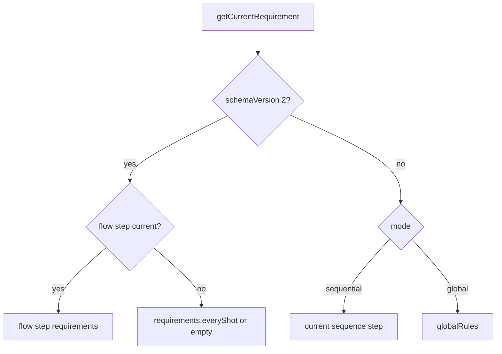

## Overview

This page is the exhaustive reference for `ICustomRulesConfig`, the JSON shape that drives the [custom rules engine](/trainer/custom-rules/engine). Most authors should start with the [Shorthand DSL](/trainer/custom-rules/shorthand), which compiles down to this schema; write raw configs when you need constructs the shorthand cannot express.

**Where the types live.** The config-shape types (`ICustomRulesConfig`, `IShotRequirement`, `ICondition`, `IRuleAction`, and friends) are ambient globals declared in `@chalkysticks/sdk-pad` at `types/index.d.ts`. The trainer's own `types/custom-rules.d.ts` retains only app-side types that depend on `Model.Ball` (`Trainer.IShotState`, `Trainer.IShotResult`, `Trainer.IEvaluationResult`, `Trainer.ICustomRulesScenario`); evaluation/resolver types live in `types/system/rules.d.ts`.

**v1 vs v2.** `schemaVersion: 2` opts into the flow/conditions/actions engine (`requirements.everyShot`, `flow`, `events`, pre-shot and rack snapshots for respotting). Omitted or any other value means the v1 requirements-only engine (`globalRules` / `sequence`). All v2 behavior gates on `schemaVersion === 2` — not on `mode`.

**Normalization.** Every config — challenge, Pad diagram, API, direct `rackCustom`, shorthand-compiled — passes through `RulesValidator.normalize()` at the single registration gate, `RulesManager.registerRulesForGameType()`; challenge configs are additionally normalized once at the challenge boundary. Normalization is idempotent, so the double pass is harmless. The `'hybrid'` mode was removed from the type entirely; stored `'hybrid'` configs are down-mapped to `'global'` with a warning. See [Normalization and Validation](#normalization-and-validation) and [Entry Points & Integration](/trainer/custom-rules/integration).

## Top-Level Fields

| Field | Type | Required | Default after normalize | Notes |
|---|---|---|---|---|
| `mode` | `'sequential' \| 'global' \| 'flow'` | Yes | `'global'` when missing/unknown/`'hybrid'` | See [Modes](#modes). |
| `schemaVersion` | `1 \| 2` | No | `1` | Anything other than exactly `2` (including `"2"` or `3`) coerces to `1`. |
| `name` | `string` | No | — | Strategy identity: sets the strategy's `name` property, cast to `Enum.GameType`, falling back to `Enum.GameType.Custom` (used for logging and name-based lookups). The registry key is the gameType supplied at registration — the rack layer collapses it to `Custom`/`Drill` — not `config.name`. The Drill strategy force-overrides its name regardless. |
| `description` | `string` | No | — | First line of the humanized summary shown in intro modals. |
| `activeBalls` | `number[]` | No | — | Scopes active-ball queries, lowest/highest lookups, and win checks. When omitted, auto-detected at `initialize()` from the racked balls (active, non-cue). |
| `globalRules` | `IShotRequirement` | No | — (default config sets `{}`) | v1 `mode: 'global'`: this IS the per-shot requirement. Under v2 it is never returned as the per-shot requirement, but it is still evaluated as an **additional global foul layer** in foul checks and the win-legality gate. The shorthand compiler's free-order path relies on exactly this. |
| `sequence` | `IShotRequirement[]` | No | — | v1 `mode: 'sequential'` step list. Advances on legal success; completion is an implicit win; steps whose concrete target is off the table are skipped. v2 + `sequence` is an unintended combo — sequence is a v1 feature. |
| `requirements` | `{ everyShot?: IShotRequirement }` | No | — | **v2 only.** The fallback per-shot requirement when no flow step is current. `everyShot` is the only key. |
| `flow` | `IFlowDefinition` | No | — | **v2 only.** See [Flow](#flow). |
| `events` | `IRuleEvent[]` | No | — | **Ignored unless `schemaVersion === 2`.** See [Events](#events). |
| `groups` | `{ [name: string]: number[] }` | No | — | Overlaid on built-in groups; author wins on name clash. See [Groups](#groups). |
| `winConditions` | `IWinCondition[]` | No | — (default config: `allBallsPocketed`) | See [Win Conditions](#win-conditions). |
| `loseConditions` | `ILoseCondition[]` | No | — (default config: `scratch`) | See [Lose Conditions](#lose-conditions). |
| `options` | `ICustomRulesOptions` | No | — | `{ allowRetry?, allowSkip?, resetOnFoul?, strictOrder? }`. Effectively dead: only `allowSkip` has a code path (`SequenceManager.skip()`), and `skip()` has no caller. |

### Modes

| Mode | Meaning |
|---|---|
| `global` | One requirement (`globalRules`) applies to every shot. The v1 workhorse, and what the shorthand compiler emits for free-order rules (paired with `schemaVersion: 2`). |
| `sequential` | Walks the `sequence` array one step per legal success. Completing the sequence is an implicit win. |
| `flow` | Naming convention for v2 configs that use `flow`/`requirements`/`events`. At runtime nothing branches on `mode === 'flow'` — the validator whitelists it, but all v2 behavior gates on `schemaVersion === 2`. |

How the engine picks the requirement for the current shot:



The requirement is **frozen at shot start** (with `lowest`/`highest` tokens resolved to concrete numbers) and the shot is judged against that frozen copy — see [Engine Internals](/trainer/custom-rules/engine).

## Shot Requirements: `IShotRequirement`

Fields: `ballContact?`, `cueBall?`, `description?`, `id?`, `pockets?`, `rails?`, `shotType?`. Evaluated by `RuleEvaluator.evaluate(requirement, state)` in the order ballContact → pockets → rails → shotType; the shot succeeds when zero errors accumulate, and the first error string becomes the foul reason. `id` is used by sequence lookup and as flow step ids; `description` is display-only.

### `ballContact`

| Field | Type | Behavior |
|---|---|---|
| `firstBall` | `number \| number[] \| 'any' \| 'lowest' \| 'highest'` | No contact at all is always a `noContact` foul. `'any'` accepts anything. `number` requires an exact match; `number[]` requires membership. `'lowest'`/`'highest'` are resolved to a concrete number at shot start against the shot-start legal set — an **unresolved** token always fails at the raw evaluator, so the freeze/resolve step is load-bearing. Mismatch is a `wrongBall` foul. |
| `requiredContacts` | `number[]` | Every listed ball must appear in the contacted set; each miss is a `requiredContactMissed` foul. |
| `forbiddenContacts` | `number[]` | Any listed ball contacted is a `wrongBall` foul. |
| `contactOrder` | `number[]` | Positional prefix match against the contact order; first mismatch or shortfall is a `wrongOrder` foul. |
| `minContacts` | `number` | Fewer cue-to-object contacts than this is a `tooFewContacts` foul. |
| `maxContacts` | `number` | More is a hard `doubleKiss` foul. The contact count includes only object balls the **cue** directly struck. |
| `maxCaroms` | `number` | Bounds object-to-object collisions (`secondaryContacts`). Exceeding is a `carom` foul. The aim-preview path omits the counter, which reads as 0 — no false preview fouls. |

The shorthand's `clean` compiles to `maxContacts: 1` plus `maxCaroms: 0`; `nocarom` sets only `maxCaroms: 0`.

### `cueBall` — typed but dead

`{ scratchAllowed?: boolean; scratchRequired?: boolean }` exists on the type but is **never read** by the engine. Scratch handling lives in the `scratch` lose condition.

### `pockets`

```jsonc
"pockets": {
    "targetBalls": [{ "ball": 9, "pocket": "corner", "required": true }],
    "forbiddenPockets": [{ "ball": "any", "pocket": "middle-top" }],
    "minPocketed": 0,
    "maxPocketed": 3
}
```

- `targetBalls`: array of `{ ball, pocket?, required? }`. Only entries with `required: true` are enforced. `ball` accepts a number, `'cue'` (ball 0), or `'any'`. A required ball not pocketed is a `requiredBallMissed` foul; pocketed in the wrong pocket is `wrongPocket`.
- `pocket` accepts a `PocketLocationId` string (`'foot-bottom'`, `'foot-top'`, `'head-bottom'`, `'head-top'`, `'middle-bottom'`, `'middle-top'`), an array of them, `'any'`, `'corner'` (the four corner pockets), or `'side'` (the two middle pockets).
- `forbiddenPockets`: any matching pocketing is a `forbiddenPocket` foul.
- `minPocketed` / `maxPocketed`: bounds on the total pocketed this shot, **including the cue** — fouls `tooFewPocketed` / `tooManyPocketed`.

Note: interactive pocket **nomination** is unsupported in Custom (`requiresPocketNomination()` is hardcoded `false`); called-pocket rules via `targetBalls[].pocket` are a different mechanism and work.

### `rails`

**Type declaration caveat.** The inline `rails` declaration on `IShotRequirement` is narrower than reality: it omits `railMode`, top-level `ballScope`, and the `allowed`/`ballScope` sub-fields. The standalone `IRailRequirement` has all of them, the evaluator honors them, and the shorthand compiler emits them. JSON/JSONC configs are unaffected; a hand-authored TypeScript object literal typed as `IShotRequirement` will get excess-property errors on the extra fields — the inline declaration is the stale artifact.

Full shape and behavior:

| Field | Behavior |
|---|---|
| `beforeContact.min` / `.max` | Rails before first cue-to-object contact. Shortfall is `tooFewRails`, excess is `tooManyRails`. |
| `beforeContact.allowed` | Allow-set of rail names; a qualifying contact outside the set is a `disallowedRail` foul. |
| `afterContact.min` / `.max` | Rails after contact. `min` shortfall with `required` also set escalates to `noRail` (major); plain shortfall is `tooFewRails`. |
| `afterContact.required` | The classic no-rail foul: fouls (`noRail`, major) only when rails after contact are 0 **and** no ball was pocketed — a pot excuses the missing rail. |
| `afterContact.allowed` | With `required`: "must hit a rail, and only these" (shorthand `rails-after:<set>`). Without: "these or none" (shorthand `rails-allow:<set>`). |
| `afterContact.ballScope` / `beforeContact.ballScope` | Restrict the count/allow-set to the named ball numbers (cue = 0), e.g. the shorthand `rails-after:cue:ht\|h` requires the **cue** to take the rail. |
| `total.min` / `.max` | Whole-shot rail count. `min` shortfall is `tooFewRails`; `max` excess is a **hard foul** `tooManyRails` — this is what makes `norails` (`total.max: 0`) a real foul rather than advisory. |
| `ballScope` (top level) | Scopes the `total` cap to the named balls (shorthand `norails:cue`). |
| `railMode` | `'strict' \| 'local'`. Absent means strict against the raw cushion-hit scalar. `'local'` forgives a ball's contact with rails bordering **the pocket that same ball dropped into**, per ball — the cue is never pocketed, so it is never forgiven anything. |

Count semantics: unscoped strict checks use precomputed scalars; scoped or local checks filter the per-contact `railContacts` log, **falling back to the scalar (fail closed) when the log is missing**. The `allowed` checks require the log and are **skipped (fail open) without it**, because scalar counts cannot express rail identity. Rail names are `Enum.RailLocation` strings; the shorthand aliases are `h`/`head`, `hb`/`head-bottom`, `ht`/`head-top`, `f`/`foot`, `fb`/`foot-bottom`, `ft`/`foot-top`.

### `shotType`

```jsonc
"shotType": { "bank": "required", "jump": "forbidden", "kick": null, "combo": null }
```

Each of `bank`, `combo`, `jump`, `kick` takes `'required'`, `'forbidden'`, or `null`. Presence is judged against the shot classifier's output: bank = Bank or BankMultiRail; kick = Kick, KickMultiRail, or RailFirst; combo = Combo; jump = Jump. Required-but-absent is a `requiredShotTypeMissing` foul; forbidden-but-present is `forbiddenShotType`. Both are severity major.

**Fails closed:** if the shot classifications are unavailable, the evaluator fouls with `shotTypeUnavailable` (major) rather than passing silently.

**Power fields are typed but NOT evaluated:** `english`, `maxPower`, `minPower`, and `shotPower` exist on `IShotTypeRequirement` but no code reads them. Do not rely on them.

## Flow

```typescript
interface IFlowDefinition {
    completeWhen?: ICondition;   // typed, never read
    items?: any[];
    phases?: any[];
    steps?: any[];
    stepsPerItem?: any[];
    type: 'steps' | 'generatedSequence' | 'repeatingPhases' | 'phases';
}
```

The `FlowManager` expands `flow` once at construction into a flat step list of `{ actions, id, requirements }` and walks an index: advance on legal step success, skip steps whose concrete target ball is off the table.

### `type: 'steps'` — supported

Pass-through of an already-resolved list; this is what the [shorthand compiler](/trainer/custom-rules/shorthand) emits. Each raw step maps to `{ actions: rawStep.actions ?? [], id: rawStep.id ?? 'step:N', requirements: rawStep.requirements ?? {} }`. Compiler-emitted step ids are `'ball:index'`, and every non-final occurrence of a recurring ball gets a derived `restoreBall` action with `removePocketCredit: true`.

### `type: 'generatedSequence'` — supported

Cross product of `items × stepsPerItem`, pre-expanded deterministically. The `{ item: true }` token resolves to the current item's value in exactly three places: `requirements.ballContact.firstBall`, `requirements.pockets.targetBalls[].ball`, and `actions[].ball`. Step ids become `'templateId:item'`.

```jsonc
"flow": {
    "type": "generatedSequence",
    "items": [1, 2, 3],
    "stepsPerItem": [
        {
            "id": "pocket",
            "requirements": {
                "ballContact": { "firstBall": { "item": true } },
                "pockets": { "targetBalls": [{ "ball": { "item": true }, "required": true }] }
            }
        }
    ]
}
```

### `type: 'repeatingPhases'` / `'phases'` — deferred

Not implemented. The FlowManager logs a `rules:flow` warning ("Flow type ... is not yet implemented; falling back to per-shot requirements.") and yields an **empty step list**; the strategy then falls back to `requirements.everyShot` (or `{}`, i.e. free play). The `{ phaseTarget: true }` token is typed but never resolved — if it reaches the action resolver it is warned and skipped. `completeWhen` is typed but never read. The shorthand compiler sidesteps all of this by pre-expanding repeating patterns into `flow.type: 'steps'`.

Flow completion is **not** an implicit win (unlike v1 sequences). End a v2 flow via a `win` event action or the engine's universal all-balls-cleared fallback.

## Conditions: `ICondition`

Used by `IRuleEvent.when` and `IRuleAction.unless`. A missing condition is **vacuously true**; a node with no recognized key is **false** (fail closed — a malformed condition can never grant a win).

```typescript
interface ICondition {
    all?: ICondition[];          // every child true
    any?: ICondition[];          // some child true
    ball?: number;               // operand for ballPocketed / ballActive / ballInactive
    balls?: number[];            // operand for allCleared
    group?: string;              // operand for groupCleared / groupHasActive
    not?: ICondition;            // negate child
    shot?: 'ballPocketed' | 'legal' | 'foul' | 'scratch';
    table?: 'ballActive' | 'ballInactive' | 'allCleared' | 'groupCleared' | 'groupHasActive';
}
```

Evaluation precedence: `all` → `any` → `not` → `shot` atom → `table` atom.

### Shot atoms (about the shot just resolved)

| Atom | Example | True when |
|---|---|---|
| `ballPocketed` | `{ "shot": "ballPocketed", "ball": 8 }` | Ball 8 was pocketed this shot. Without `ball`: any **object** ball was pocketed. |
| `legal` | `{ "shot": "legal" }` | The shot committed no foul. |
| `foul` | `{ "shot": "foul" }` | The shot fouled. |
| `scratch` | `{ "shot": "scratch" }` | The cue ball (0) was pocketed this shot. |

### Table atoms (about the table state after the shot)

| Atom | Example | True when |
|---|---|---|
| `ballActive` | `{ "table": "ballActive", "ball": 6 }` | Ball 6 is on the table (active, not pocketed). Missing `ball` operand: false. |
| `ballInactive` | `{ "table": "ballInactive", "ball": 6 }` | Ball 6 is off the table. Missing `ball` operand: false. |
| `allCleared` | `{ "table": "allCleared", "balls": [1, 2, 3] }` | Every listed ball is inactive. Empty/missing `balls` is **vacuously true**. |
| `groupCleared` | `{ "table": "groupCleared", "group": "solids" }` | Group resolves non-empty AND every member is inactive. Unknown/empty group: false. |
| `groupHasActive` | `{ "table": "groupHasActive", "group": "stripes" }` | Some group member is active. Unknown group: false. |

### Combinators

```jsonc
{
    "all": [
        { "shot": "ballPocketed", "ball": 8 },
        { "not": { "shot": "scratch" } },
        { "any": [{ "table": "groupCleared", "group": "solids" }, { "table": "groupCleared", "group": "stripes" }] }
    ]
}
```

## Actions: `IRuleAction`

```typescript
interface IRuleAction {
    ball?: number | IFlowToken;
    points?: number;             // operand for 'score' — currently unused
    reason?: string;
    removePocketCredit?: boolean;
    to?:
        | 'preShotPosition'
        | 'rackPosition'
        | 'footSpot'
        | 'headSpot'
        | 'bestSpot'
        | 'configuredSpot'
        | { x: number; y: number; z: number }
        | { type: 'normalizedTablePosition'; x: number; y: number };
    type: 'restoreBall' | 'respotBall' | 'win' | 'lose' | 'score' | 'advancePhase' | 'continueGame';
    unless?: ICondition;
}
```

| Type | Behavior | Terminal |
|---|---|---|
| `restoreBall` / `respotBall` | Identical (same code path). Resolve `ball` to a concrete number (an unresolved flow token is warned and skipped), place it per `to`, optionally strip pocket credit, then force a store sync and full visual resync so a just-pocketed mesh reappears. | No |
| `win` | Dispatches the same game-complete event the built-in win path uses, with `reason` (default "Custom rule win"). | **Yes** |
| `lose` | Dispatches a terminal foul with `reason` (default "Custom rule loss"), routed through the standard foul handler. | **Yes** |
| `continueGame` | Explicit no-op — exists so authors can state intent. | No |
| `score` | **Not implemented** — logged and skipped (awaits a player score setter). | No |
| `advancePhase` | **Not implemented** — logged and skipped (belongs to the deferred phase flow engine). | No |
| unknown | Warned and skipped. | No |

When any applied action is terminal, the engine skips the trailing shot-complete dispatch so a win/lose never double-fires with the built-in resolution. The `unless` guard is checked at collection time (in the strategy), not in the resolver.

### Placement targets (`to`)

Resolved in this order:

| Target | Placement |
|---|---|
| `'footSpot'` | Foot spot via BallManager. |
| `'headSpot'` | Head spot via BallManager. |
| `'rackPosition'` | The rack snapshot captured at `initialize()` (v2). Missing snapshot: warn + best open spot. |
| `'bestSpot'` / `'configuredSpot'` | Best open spot (`configuredSpot` is currently an alias). |
| `{ "type": "normalizedTablePosition", "x": 0.5, "y": 0.5 }` | Normalized 0..1 table space; `y` maps to table z. |
| `{ "x": 0, "y": 0, "z": 0 }` (any other object) | Explicit world coordinates. |
| `'preShotPosition'`, omitted, or unknown string | The pre-shot snapshot captured at shot start (v2). Missing snapshot: warn + best open spot. The unknown-string fallback is runtime resolver behavior only — the `to` type does not admit arbitrary strings, so a hand-authored TypeScript config cannot express it. |

### `removePocketCredit`

When `true`, after placement and before the store sync, the pocketed-ball credit is stripped from **whichever player holds it** (all players are scanned, so no "current player" bookkeeping is needed). Use it whenever a respotted ball should not count toward anyone's tally.

## Win Conditions

```typescript
interface IWinCondition {
    ball?: number;               // operand for 'ballPocketed'
    ballsRemaining?: number;     // operand for 'ballsRemaining'
    description?: string;        // becomes the win reason
    onLegalShot?: boolean;
    type: 'ballPocketed' | 'allBallsPocketed' | 'ballsRemaining';
}
```

| Type | True when |
|---|---|
| `ballPocketed` | The named `ball` was pocketed this shot (missing `ball`: never). `onLegalShot: true` additionally re-checks foul state. |
| `allBallsPocketed` | The active-ball set (scoped by `activeBalls` or auto-detected) is empty. |
| `ballsRemaining` | Active balls remaining is at or below `ballsRemaining` (missing operand: never). |

**Legality gate:** every win condition first passes through an is-shot-legal-for-win check — the frozen requirement, `globalRules`, and every lose condition must all be clean. Effectively every win already requires a legal shot; `onLegalShot` adds a redundant second check.

## Lose Conditions

```typescript
interface ILoseCondition {
    description?: string;        // becomes the foul reason
    foulsInRow?: number;         // operand for 'foulsInRow'
    type: 'scratch' | 'wrongBall' | 'foulsInRow';
}
```

| Type | Fires when |
|---|---|
| `scratch` | Ball 0 was pocketed this shot. |
| `wrongBall` | First contact does not match the frozen requirement's `firstBall` (skipped when there was no contact, `firstBall` is undefined, or it is `'any'`). |
| `foulsInRow` | `foulsInRow > 0` and `consecutiveFouls + 1 >=` the threshold. |

Lose conditions run last inside the foul check, in array order. Current-code caveat on `foulsInRow`: the `+ 1` presumes the current shot fouled, but the check runs on every shot — a **clean** shot taken after N−1 consecutive fouls will still trip the condition. Treat this as observed behavior, not documented intent.

Daily challenges automatically append `{ type: 'scratch' }` when no scratch lose condition is present.

## Events

```typescript
interface IRuleEvent {
    actions: IRuleAction[];
    id?: string;                 // authoring metadata only
    on: 'shotResolved';          // the only trigger in the union
    when?: ICondition;           // missing = always fires
}
```

Events are evaluated only when `schemaVersion === 2`, after every shot resolves. Each matched event contributes its actions; per-action `unless` guards can still veto individual actions. **Event actions are collected regardless of shot legality** — gate with `{ "shot": "legal" }` when you only want legal shots to count. (Flow-step actions, by contrast, are only collected when the step succeeded legally.)

The canonical example — the 8-ball respots until the 6-ball is cleared:

```jsonc
"events": [
    {
        "id": "restore-eight-while-six-remains",
        "on": "shotResolved",
        "when": {
            "all": [
                { "shot": "ballPocketed", "ball": 8 },
                { "table": "ballActive", "ball": 6 },
                { "shot": "legal" }
            ]
        },
        "actions": [
            { "type": "restoreBall", "ball": 8, "to": "preShotPosition", "removePocketCredit": true },
            { "type": "continueGame" }
        ]
    },
    {
        "id": "eight-stays-down-after-six-cleared",
        "on": "shotResolved",
        "when": {
            "all": [
                { "shot": "ballPocketed", "ball": 8 },
                { "table": "ballInactive", "ball": 6 },
                { "shot": "legal" }
            ]
        },
        "actions": [{ "type": "win", "reason": "8-ball pocketed after the 6-ball was cleared." }]
    }
]
```

## Groups

Built-in groups (from the sdk-pad `GroupResolver`):

| Name | Balls |
|---|---|
| `solids` | 1–7 |
| `lows` | 1–7 |
| `stripes` | 9–15 |
| `highs` | 9–15 |
| `objectBalls` | 1–15 |

`colors` is intentionally absent (it means different things across variants) — declare it explicitly in `config.groups`. Author-defined groups are overlaid on the built-ins, and the **author wins** on a name clash.

Where group names work at runtime:

- `ICondition.group` with the `groupCleared` / `groupHasActive` table atoms — the **only** engine-level consumer.
- **Not** in `ballContact.firstBall` (the type only admits numbers, arrays, `'any'`, `'lowest'`, `'highest'`), win/lose conditions, flow `items`, or action `ball` operands.
- In the [Shorthand DSL](/trainer/custom-rules/shorthand), group names ARE valid flow tokens — but that is compile-time resolution; the emitted config contains only concrete ball numbers.

## Complete Annotated Example

This exercises most of the schema. It is JSON-valid; the three rail fields marked with a comment exceed the stale inline `rails` type declaration but are fully evaluator-supported (see [rails](#rails)).

```jsonc
{
    // Challenge/API wrapper. Pass only "rules" to rackCustom/rackPad.
    "name": "Custom",
    "rules": {
        "schemaVersion": 2,                  // 1|2; anything else coerces to 1
        "mode": "flow",                      // 'global' | 'sequential' | 'flow'
        "name": "Custom",
        "description": "Ordered 1,8,2,8 with a respotting 8.",
        "activeBalls": [1, 2, 8],            // omit to auto-detect from the rack
        "groups": { "money": [8] },          // overlays the built-ins

        // v2 fallback requirement when no flow step is current.
        "requirements": {
            "everyShot": {
                "ballContact": { "firstBall": "any", "maxContacts": 2, "maxCaroms": 1 },
                "pockets": { "forbiddenPockets": [{ "ball": "any", "pocket": "middle-top" }] },
                "rails": {
                    "railMode": "local",     // exceeds the inline type; evaluator-supported
                    "afterContact": {
                        "required": true,
                        "allowed": ["head-top", "head-bottom"],  // exceeds the inline type
                        "ballScope": [0]                          // exceeds the inline type
                    },
                    "total": { "max": 6 }
                },
                "shotType": { "jump": "forbidden", "kick": null, "bank": null, "combo": null }
            }
        },

        // v2 flow: expands to 1,8,2,8.
        "flow": {
            "type": "generatedSequence",
            "items": [1, 2],
            "stepsPerItem": [
                {
                    "id": "pocket-object",
                    "requirements": {
                        "ballContact": { "firstBall": { "item": true } },
                        "pockets": { "targetBalls": [{ "ball": { "item": true }, "required": true }] }
                    }
                },
                {
                    "id": "pocket-eight",
                    "requirements": {
                        "ballContact": { "firstBall": 8 },
                        "pockets": { "targetBalls": [{ "ball": 8, "required": true }] }
                    },
                    "actions": [
                        {
                            "type": "restoreBall",
                            "ball": 8,
                            "to": "preShotPosition",
                            "removePocketCredit": true,
                            "unless": { "table": "allCleared", "balls": [1, 2] }
                        }
                    ]
                }
            ]
        },

        // v2 declarative events. Only on:'shotResolved' exists.
        "events": [
            {
                "id": "win-on-final-eight",
                "on": "shotResolved",
                "when": {
                    "all": [
                        { "shot": "ballPocketed", "ball": 8 },
                        { "table": "allCleared", "balls": [1, 2] },
                        { "shot": "legal" }
                    ]
                },
                "actions": [{ "type": "win", "reason": "Cleared 1 and 2, then finished the 8." }]
            }
        ],

        // Still honored under v2 as an extra global foul layer.
        "globalRules": {},

        "winConditions": [{ "type": "allBallsPocketed" }],
        "loseConditions": [
            { "type": "scratch", "description": "Scratch ends the attempt." },
            { "type": "foulsInRow", "foulsInRow": 3, "description": "Three fouls in a row ends the attempt." }
        ]
    }
}
```

## Normalization and Validation

`RulesValidator.normalize()` runs once at the registration gate. Everything it does — nothing more:

1. A malformed payload (null, undefined, non-object, array) is replaced with a fresh clone of the default config: `{ globalRules: {}, loseConditions: [{ type: 'scratch' }], mode: 'global', schemaVersion: 1, winConditions: [{ type: 'allBallsPocketed' }] }`.
2. The config is shallow-copied — the caller's object is never mutated.
3. `schemaVersion`: exactly `2` stays `2`; anything else becomes `1`.
4. `mode`: `'hybrid'` is coerced to `'global'` with a warning ("hybrid mode was removed"); anything missing or outside `global`/`sequential`/`flow` is coerced to `'global'` (warned only when a value was present).

It does **not** deep-validate `sequence`, `flow`, `events`, `winConditions`, or `groups`. Malformed inner shapes are handled at runtime with warn-and-skip: unsupported flow types fall back to `requirements.everyShot`, unknown action types are skipped, and unrecognized condition atoms evaluate to false. Normalization is idempotent, so the second pass at the challenge boundary is harmless.

For registration flow and entry points (`rackCustom`, `rackPad`, challenges, the Drill subclass mapping), see [Entry Points & Integration](/trainer/custom-rules/integration). For runnable configs, see [Recipes & Examples](/trainer/custom-rules/recipes).
