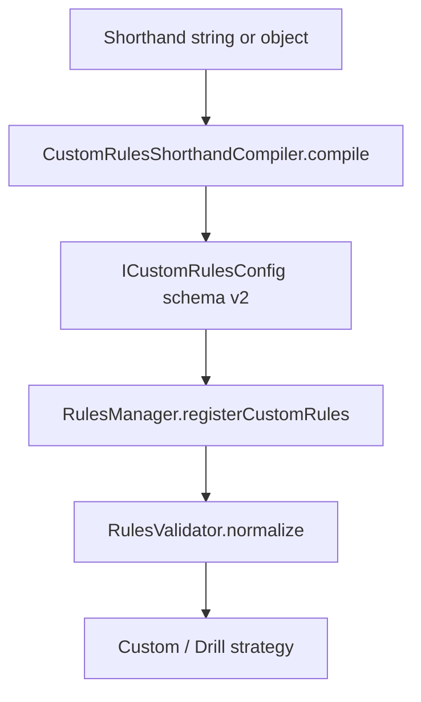

## Overview

The shorthand DSL is pure sugar over the schema-v2 rules format. `CustomRulesShorthandCompiler.compile()` turns a tiny `flow` description into a full `ICustomRulesConfig` and hands it to the same engine every other custom ruleset runs on. You never author `respot`, `win` events, or `preShotPosition` by hand — they are derived from the rack and the pot order.

- **Compiler:** `@chalkysticks/sdk-pad`, `src/Rules/CustomRulesShorthandCompiler.ts`, reached as `ChalkySticks.Pad.Rules.CustomRulesShorthandCompiler`
- **Compiles to:** `ICustomRulesConfig` (schema v2) — see [Config Schema](/trainer/custom-rules/schema)
- **Humanizer (DSL → prose):** `ChalkySticks.Pad.Rules.ShorthandSummaryFormatter` — `humanize()` / `summarize()`, with overridable phrases via `setPhrases()` / `resetPhrases()`
- **How it reaches the game:** see [Entry Points & Integration](/trainer/custom-rules/integration); copy-paste drills in [Recipes & Examples](/trainer/custom-rules/recipes)



The compiled config still flows through `RulesManager.registerCustomRules` → `RulesValidator.normalize`, so it is validated like any hand-written config.

## Mental Model: Token, Cycle, Phase

Three nested ideas. Every shorthand form is sugar over them:

| Concept | What it is |
|---------|------------|
| **Token** | the next ball to pot — `8`, `lowest`, `solids.highest`, `1..3`, `8.rails-after:3` |
| **Cycle** | a comma list that **repeats**, exhausting its selector pools; recurring specific balls auto-respot until their final pot |
| **Phase** | cycles run **in order**; the next phase begins when the current pool is empty |

### The comma vs semicolon rule

This is the single most important concept in the DSL. The same tokens with a different separator produce two different drills:

| Input | Reading | The 8 |
|-------|---------|-------|
| `solids,8` | one cycle: pot a solid, pot the 8, repeat until solids are gone | **respots** each time, stays down at the end |
| `solids;8` | two phases: clear **all** solids, then pot the 8 once | **stays** (it has its own final phase) |

`,` builds a repeating cycle; `;` builds ordered phases. If you want a ball to stay down, give it its own phase.

Respot derivation is global across the whole flat step list, not per phase. In `solids,8;stripes,8` the 8 respots through **both** phases and stays down only at the very last step — because every occurrence of a ball before its final occurrence respots. In `solids;8` the 8 appears once, so it never respots.

## Operators

| Operator | Name | Meaning | Example |
|----------|------|---------|---------|
| `,` | cycle | members of one repeating cycle | `solids,8` |
| `;` | phase | ordered phases | `solids;8` |
| `.` | scope / qualify | pick within a scope, or constrain a pot | `solids.lowest`, `8.clean` |
| `..` | range | inclusive span; **direction follows the written endpoints** | `1..3` → 1, 2, 3 · `15..13` → 15, 14, 13 |

Both `,` and `;` split only at parenthesis depth 0, so a respot target like `8(0.5,0.5)` survives intact.

## Tokens

| Token | Resolves to | Notes |
|-------|-------------|-------|
| `8`, `1`–`15` | that exact ball | may carry a respot target: `8(initial)` |
| `1..3`, `15..13` | an ordered span (literal sub-sequence) | a bare range expands at parse time to one concrete-ball token per member, each carrying the same modifiers; lists compose: `1..3,15..13` |
| `lowest` / `highest` | lowest / highest remaining in the pool | pool = `activeBalls` minus balls named elsewhere in the flow |
| `any` | any active ball — **resolves to lowest**, deterministically | still an **ordered** step; see [Free order](#free-order) |
| `free` / `none` / `open` / `freeplay` | **no required order** — pot anything, in any order | compiles to `mode: 'global'`, not steps |
| `solids`, `stripes`, `objectBalls`, `highs`, `lows`, `<group>` | next from the group (equivalent to `<group>.lowest`) | groups extensible via `groups` |
| `<scope>.<selector>` | a selector inside a scope | scope = group **or** range: `solids.highest`, `1..7.lowest`, `stripes.any` |

Built-in groups: `solids` (1–7), `stripes` (9–15), `objectBalls` (1–15), `lows` (1–7), `highs` (9–15). Define your own (e.g. `reds`) via the `groups` field; author groups override built-ins on a name clash.

Two lookup rules worth knowing:

- **Selector position matters.** `lowest` / `highest` / `any` qualify a token only as the *first* dotted segment on a range or group base (`solids.highest`, `1..7.lowest`). On a concrete ball (`8.lowest`) they are treated as ordinary modifiers and ignored with a warning.
- **Case sensitivity.** Selector keywords and group names are case-sensitive: `objectBalls` must be written in that exact camelCase — `objectballs` resolves to an *empty* group and emits no steps, silently. The free-order keywords are the exception; they are lowercased before matching. Unknown group names produce an empty pool with no warning.

## Free Order

`any` is **not** free order. Because the rack is known at compile time, every selector — including `any` — is pre-resolved into a fixed, *ordered* steps list, and `any` resolves to the lowest ball for determinism. So `flow=any` enforces lowest-first, exactly like `flow=lowest`.

For a true "pot anything, in any order" drill, use a free-order keyword: **`free`**, `none`, `open`, or `freeplay` (case-insensitive).

| Shorthand | Compiles to | Drill |
|-----------|-------------|-------|
| `flow=free` | `mode: 'global'`, no `firstBall`, win on cleared table | clear the rack in any order |
| `flow=free.norails` | global rule with `rails: { railMode: 'local', total: { max: 0 } }` | clear in any order, no cushions (relaxed) |
| `flow=free&with=clean` | global rule with `ballContact: { maxCaroms: 0, maxContacts: 1 }` | clear in any order, clean-hit every shot |
| `flow=free&win=8` | global rule, `winConditions: [{ ball: 8, onLegalShot: true, type: 'ballPocketed' }]` | open table, the 8 ends it |

How the free path differs from an ordered flow:

- It compiles to **`mode: 'global'`** — one `globalRules` requirement applied to *every* shot — instead of an ordered `flow.type: 'steps'` list. There is no sequence and no per-step target.
- `globalRules` starts empty with **no `firstBall` constraint**, so any ball is a legal first contact.
- `with` modifiers fold into that single global rule first, then the free token's own dotted modifiers (`free.norails`) — per-token still wins on conflict.
- Win is declarative in this mode: default/`clear` → `[{ type: 'allBallsPocketed' }]`; `1left` → `[{ ballsRemaining: 1, type: 'ballsRemaining' }]`; a ball number → `[{ ball: N, onLegalShot: true, type: 'ballPocketed' }]`. Lose sugar applies as elsewhere.
- A free-order keyword **owns the whole flow** — any other tokens beside it (e.g. `free,8`) are dropped with a warning. Put global constraints in `with=`, not in extra flow tokens.

## Modifiers

Modifiers attach to a token with `.` (per-pot) or apply globally via `with` / `&with=` (every pot). Global modifiers are applied **first**, per-token **second** — so per-token wins on conflict. This ordering holds in both the ordered-steps path and the free/global path.

Every ordered step starts from this base requirement, which modifiers then extend:

```jsonc
{
    "ballContact": { "firstBall": N },
    "pockets": { "targetBalls": [{ "ball": N, "required": true }] }
}
```

| Modifier | Means | Emits into the requirement |
|----------|-------|----------------------------|
| `norails` | no cushions this pot — rails bordering the pocket the ball drops into are forgiven (relaxed) | `rails: { railMode: 'local', total: { max: 0 } }` |
| `norailsperfect` | no cushions at all — any rail contact fails (strict) | `rails: { railMode: 'strict', total: { max: 0 } }` |
| `norails:<ball>` / `norailsperfect:<ball>` | same, scoped to one ball (`cue` / `cueball` = 0, or a number) | adds `rails.ballScope: [<ball>]` |
| `rails-after:N` | at least N rails after contact (bare `rails-after` = 1) | `rails.afterContact: { min: N, required: true }` |
| `rails-after:<set>` | must hit a rail after contact, and only rails in this set | `rails.afterContact: { allowed: [...], min: 1, required: true }` |
| `rails-after:<ball>:<set>` | same allow-set, scoped to one ball | adds `rails.afterContact.ballScope: [<ball>]` |
| `rails-allow:<set>` | *if* a rail is hit after contact it must be in this set; hitting none is fine | `rails.afterContact: { allowed: [...] }` — no minimum |
| `rails-allow:<ball>:<set>` | allow-set scoped to one ball | adds `rails.afterContact.ballScope: [<ball>]` |
| `rails-before:N` | at least N rails before contact — a kick (bare = 1) | `rails.beforeContact: { min: N }` |
| `rails:N` | at least N total rails (bare = 1) | `rails.total: { min: N }` |
| `clean` / `noballs` | cue strikes one ball and it caroms into nothing | `ballContact: { maxCaroms: 0, maxContacts: 1 }` |
| `nocarom` / `nocombo` | the struck ball may not carom/combo into others (no cue-contact limit) | `ballContact: { maxCaroms: 0 }` |
| `pocket:<id>` | call the pocket | step path: `pockets.targetBalls[0].pocket`; free/global path seeds `pockets: { targetBalls: [{ ball: 'any', pocket, required: true }] }` |
| `bank` / `combo` / `jump` / `kick` | shot must classify as that type | `shotType.<type>: 'required'` |
| `nobank` / `nojump` / `nokick` | that shot type is forbidden | `shotType.<type>: 'forbidden'` |

Every modifier above is a **hard foul** when violated — in a drill that fails the run immediately. Unknown modifiers log `Modifier "X" is not supported yet; ignoring.` and are dropped. Numeric modifiers with a missing value default to 1; NaN or negative values skip the modifier with a warning (except `rails-after` / `rails-allow`, where a non-numeric value is the rail-set form and stays quiet).

One asymmetry: `rails-after`, `rails-before`, and `rails:N` all clear a prior `norails` cap (`total.max: 0`) because a rail minimum contradicts it. `rails-allow` deliberately does **not** — an allow-set and a no-rail cap are independent restrictions and may legitimately coexist.

### norails vs norailsperfect

Relaxed `norails` forgives the rails that border the pocket a ball drops into — potting in the side and clipping that pocket's own flanking rail on the way in is legal, but any *other* rail fails. Forgiveness is per-ball: the cue ball is never pocketed, so it is forgiven nothing and must stay off every rail. Use `norailsperfect` when you want zero cushion contact of any kind. The pocket-to-rail adjacency map is `RailAdjacency.ts` (corner pockets = short end rail + same-end long-rail segment; side pockets = the two flanking long-rail segments); unknown pockets resolve to no adjacency, failing closed to strict.

### rails-after vs rails-allow

Both restrict *which* rails are legal after contact; they differ on whether a rail is required. `rails-after:ht|h` means "you must come off the head-top or head rail" — hitting no rail fails. `rails-allow:ht|h` means "if you touch a rail it must be head-top or head, but a clean no-rail pot is fine." Add a ball qualifier (`rails-after:cue:ht|h`) to constrain only that ball — e.g. force the cue off a specific rail for position while leaving object balls free. The allow-set is evaluated only against **after-contact** rails; rails struck before first contact are not checked by these tokens.

### clean vs nocarom

`clean` is enforced on two counts: `maxContacts` bounds how many object balls the **cue** struck (cue-to-ball contacts only), and `maxCaroms` bounds **object-to-object** collisions. So `clean` forbids both a cue double-kiss and the struck ball caroming or combo-ing into others; `nocarom` forbids only the latter.

### Shot-type modifiers

Shot-type requirements are evaluated by the trainer's trajectory classifier — the SDK only authors the declarative `shotType` shape. `kick` includes kick, multi-rail kick, and rail-first shots; `bank` includes single- and multi-rail banks. If classifier data is missing, a `shotType` rule **fails closed** (the shot is treated as failing the requirement). Note there is no shot-type forbid for combos: `nocombo` is a carom alias (`maxCaroms: 0`), not `shotType.combo: 'forbidden'`. Use `combo` when the shot itself must classify as a combo.

### Planned modifiers

| Modifier | Means | Status |
|----------|-------|--------|
| `minpower:N` / `maxpower:N` | power gate | **planned** — the fields exist on `IShotTypeRequirement` but the compiler has no case for them yet; writing `minpower:5` today hits the warn-and-ignore branch |

## Rail Names and Rail Sets

A rail `<set>` is a pipe-separated list, e.g. `ht|h` or `head-top|head`. Each rail is named by a short alias or its full `RailLocation` value (case-insensitive within a set):

| Rail | Short | Full |
|------|-------|------|
| Head (the right short rail) | `h` | `head` |
| Head-bottom (long rail, bottom half, head side) | `hb` | `head-bottom` |
| Head-top (long rail, top half, head side) | `ht` | `head-top` |
| Foot (the left short rail) | `f` | `foot` |
| Foot-bottom | `fb` | `foot-bottom` |
| Foot-top | `ft` | `foot-top` |

Set parsing rules: tokens are trimmed, lowercased, and deduped; purely numeric tokens are skipped silently (so `rails-after:3` never logs a rail warning); unknown rail tokens are dropped with a warning while the rest of the set still applies; if nothing in the set resolves, the whole modifier is treated as absent. The `ht` / `fb` spellings collide with pocket ids, but they are only read as rails in rail-modifier context.

## Pocket Ids

| Id | Pocket | `PocketLocation` |
|----|--------|------------------|
| `ht` | head top | `HeadTop` |
| `hb` | head bottom | `HeadBottom` |
| `mt` | middle top | `MiddleTop` |
| `mb` | middle bottom | `MiddleBottom` |
| `ft` | foot top | `FootTop` |
| `fb` | foot bottom | `FootBottom` |
| `corner` / `side` / `any` | any corner / any side / anywhere | aggregate — passed through unchanged |

Unknown pocket ids log `Unknown pocket id "X"; ignoring.` and the modifier is dropped.

## Selector Pool Boundaries

Boundary modifiers are **compile-time only**. They shape which balls a selector can choose; they never appear in emitted shot requirements (the compiler silently skips them when building requirements).

By default, a selector's pool is `activeBalls` minus every ball named as a concrete token anywhere in the flow — including balls produced by bare-range expansion. A bare pool selector with named specifics also gets an *implicit* boundary: `lowest` keeps only balls below the lowest named ball, `highest` only balls above the highest. On the last phase, the remaining balls beyond that implicit boundary are appended as a tail — which is why `lowest,8` on 1–9 continues with the 9 after the final 8.

Explicit boundaries override the implicit behavior. `before`, `through`, and `after` **follow the selector's direction**: for `lowest`, `before:8` means below 8 and `after:8` means above 8; for `highest`, those are reversed — `before:8` means above 8 and `after:8` means below 8.

| Policy | Accepted names (aliases) | Semantics |
|--------|--------------------------|-----------|
| `before` | `before`, `below`, `under` | only balls before the boundary (direction-following) |
| `through` | `through`, `thru`, `to`, `upto`, `up-to` | up to and including the boundary; the boundary ball stays selectable even when it is a named specific |
| `after` | `after`, `above`, `over` | only balls past the boundary (direction-following) |
| `include` | `include`, `all` | keep named specifics in the pool; no boundary filter |
| `exclude` | `exclude`, `except` | drop exactly the boundary ball |

**Closer cadence — `.between`.** On a *concrete* closer token, `.between` means "emit the closer only between selected balls, not after the final one": `lowest.include:8,8.between` on 1–10 ends `…, 9, 8, 10` instead of `…, 9, 8, 10, 8`. Within a single cycle pass, a closer is also deduped when it would immediately repeat the ball just emitted (that is how `lowest.through:8,8` avoids emitting `8, 8` back to back when the 8 is itself selected).

## Respot Targets

Respot is **derived, never authored**. When the compiler flattens the flow into steps, every occurrence of a ball *before* its final occurrence gets a restore action; the final occurrence stays down:

```jsonc
{ "ball": N, "removePocketCredit": true, "to": "preShotPosition", "type": "restoreBall" }
```

Step ids are `"ball:index"` (e.g. `"8:1"`). A parenthesized suffix overrides the respot destination:

| Token | Respot target | Compiles to (`to`) |
|-------|---------------|--------------------|
| `8` | pre-shot position (default) | `'preShotPosition'` |
| `8(last)` / `8(preshot)` / `8(pre-shot)` / `8(preshotposition)` / `8(pre-shot-position)` | pre-shot position, explicit | `'preShotPosition'` |
| `8(initial)` / `8(rack)` / `8(rackposition)` / `8(rack-position)` | initial rack position | `'rackPosition'` |
| `8(0.5,0.5)` | normalized table coordinate (same 0–1 space as Pad / custom-rack placements) | `{ type: 'normalizedTablePosition', x, y }` |

Keywords are case-insensitive. The suffix may sit before or after modifiers — both `8(0.5,0.5).rails-after:2` and `8.rails-after:2(0.5,0.5)` compile to a respotting 8-ball with a two-rail requirement (the first form is preferred). Unknown keywords warn and are stripped, so `8(foo)` never turns into a fake group name.

**Single-ball only.** Respot targets are supported only on concrete single-ball tokens. On ranges, groups, or selectors they warn and are ignored; use the normal derived behavior there.

## Win / Lose Sugar

| Field | Value | Compiles to (ordered-flow path) |
|-------|-------|--------------------------------|
| `win` | `clear` *(default)* | win event on `shotResolved` when all object balls are cleared on a legal shot |
| `win` | `1left` | `winConditions: [{ ballsRemaining: 1, type: 'ballsRemaining' }]` — no event |
| `win` | a ball number (e.g. `8`) | win event when that ball is pocketed on a legal shot |
| `lose` | `scratch` *(default when omitted)* | `loseConditions: [{ type: 'scratch' }]` |
| `lose` | `wrongball` | `loseConditions: [{ type: 'wrongBall' }]` |
| `lose` | `Nfouls` (e.g. `3fouls`, `1foul`) | `loseConditions: [{ foulsInRow: N, type: 'foulsInRow' }]` |

Pass `lose: []` (or `lose=` with an empty value in a query string) to opt out of the default scratch loss entirely. Unknown lose tokens warn and are ignored. On the free/global path, wins compile declaratively into `winConditions` instead of events (see [Free order](#free-order)); lose sugar is identical on both paths.

## Input Tiers

`compile()` accepts a string, an `ICustomRulesShorthand` object, or a full `ICustomRulesConfig`:

```typescript
public static compile(
    input: string | ICustomRulesShorthand | ICustomRulesConfig,
    activeBalls?: number[],
    options: ICustomRulesShorthandCompileOptions = {},
): ICustomRulesConfig
```

Pick the simplest form that fits — all compile to the same config:

| Lvl | Format | Example |
|-----|--------|---------|
| 0 | **Query string** | `flow=red,black;colors&lose=scratch` |
| 1 | **Flat array** (one phase) | `{ flow: ['lowest', '8'] }` |
| 2 | **Phase array** | `{ flow: [['red', 'black'], ['colors']] }` |
| 3 | **+ groups / activeBalls** | `{ activeBalls: [...], flow: [...], groups: { reds: [1, 2, 3] } }` |
| 4 | **+ overrides** | `{ flow: [...], lose: ['scratch', '3fouls'], win: '1left', with: ['norails'] }` |
| 5 | **Full config** | a raw `ICustomRulesConfig` — returned untouched |

A bare string with no `=` is treated as the flow: `compile('lowest,8', [1, 2, 3, 4, 8])`. A full config is detected by a truthy `schemaVersion`, `mode: 'global'` / `'sequential'`, `events`, `requirements`, or an object-shaped `flow`, and passes through unchanged. Note that the query-string tier describes the compiler's *input format* — nothing in the trainer reads the browser URL automatically; the string still arrives via a prop, match config, or API call (see [Entry Points & Integration](/trainer/custom-rules/integration)).

### Query-string keys

Strings containing `=` are parsed with `URLSearchParams` (a leading `?` is stripped). Keys are case-sensitive; unknown keys warn and are ignored.

| Key | Value | Example |
|-----|-------|---------|
| `flow` | `,` = cycle, `;` = phase | `flow=solids,8;stripes,8` |
| `win` | win shorthand | `win=1left` |
| `lose` | comma list (empty = opt out of default scratch) | `lose=scratch,3fouls` |
| `with` | comma list of global modifiers | `with=norails,clean` |
| `balls` | comma list of active balls | `balls=1,2,3,8` |

If you need to preserve a literal string that happens to contain `=`, disable query parsing:

```typescript
const compiledRules = ChalkySticks.Pad.Rules.CustomRulesShorthandCompiler.compile(value, activeBalls, {
    parseQueryString: false,
});
```

### activeBalls resolution

Precedence: (1) `activeBalls` inside the shorthand object, (2) the second `compile()` argument, (3) best-effort derivation from the concrete ball and range tokens in the flow. Bare selectors (`lowest` / `highest` / `any`) cannot be derived — they need an explicit set. The cue ball (0) is always excluded from selector pools and from the cleared-table win check. In the trainer's rack paths, the second argument is derived from the actual placements, so an author who omits `balls=` / `activeBalls` can never diverge from the racked balls — an embedded `balls=` still wins per the precedence above, so leave it out in rack-driven flows.

## Examples

Each row: shorthand → resulting pot order (`↻` = respots; final occurrence stays).

| Shorthand | Rack | Pots | Drill |
|-----------|------|------|-------|
| `['lowest']` | 1, 2, 3 | 1, 2, 3 | rotation: clear lowest-first |
| `['highest']` | 1, 2, 3 | 3, 2, 1 | reverse rotation |
| `flow=8..1;9` | 1–9 | 8, 7, 6, 5, 4, 3, 2, 1, then 9 | descending range, then the 9 |
| `['lowest', '8']` | 1–4, 8 | 1, 8↻, 2, 8↻, 3, 8↻, 4, 8 | low balls with the 8 between each; 8 respots |
| `['lowest', '8']` | 1–9 | 1, 8↻, 2, 8↻, … 7, 8, 9 | low side with 8 closer, then the high-side tail |
| `['lowest.before:8', '8']` | 1–9 | 1, 8↻, 2, 8↻, … 7, 8 | only the low-side closer drill (no tail) |
| `[['lowest.through:8', '8'], ['lowest.after:8']]` | 1–9 | 1, 8↻, 2, 8↻, … 7, 8↻, 8, 9 | include the 8 as a selected ball, then finish above it |
| `['lowest.include:8', '8']` | 1–10 | 1, 8↻, 2, 8↻, … 7, 8↻, 8↻, 9, 8↻, 10, 8 | full interleave, including the closer ball |
| `['lowest.include:8', '8.between']` | 1–10 | 1, 8↻, 2, 8↻, … 7, 8↻, 8↻, 9, 8, 10 | full interleave, no trailing closer |
| `['solids', '8', 'stripes', '8']` | 1, 2, 8, 9, 10 | 1, 8↻, 9, 8↻, 2, 8↻, 10, 8 | alternate groups, 8 between |
| `[['solids'], ['8']]` | 1, 2, 8 | 1, 2, 8 | clear solids, then the 8 (stays) |
| `[['red', '7'], ['colors']]` | reds + colors | red, 7↻, … then colors | snooker-ish (custom groups; the closer must be a concrete ball — a group token like `black` pots once and never recurs) |
| `['1..3', '15..13']` | — | 1, 2, 3, 15, 14, 13 | literal compact sequence |
| `['solids.highest', '8']` | 1–8 | 7, 8↻, 6, 8↻, … 1, 8 | high-solid-first with 8 between |
| `['8.rails-after:3']` | 8 | 8 (3+ rails after contact) | 3-rail position drill |
| `['lowest', '8(initial)']` | 1, 2, 8 | 1, 8↻, 2, 8 | 8 respots to its rack spot |
| `['lowest', '8(0.5,0.5)']` | 1, 2, 8 | 1, 8↻, 2, 8 | 8 respots to center table |
| `['lowest.pocket:corner']` | 1, 2, 3 | 1, 2, 3 — each into any corner | call-corner rotation |

At runtime, target selection skips concrete steps whose required ball is already gone: `flow=8..1;9` compiles to 8, 7, …, 1, 9, but if the 4 and 3 were made on the break, the live target after the 5 is the 2. That skipping lives in the trainer's flow walker, not the compiler — see [Engine Internals](/trainer/custom-rules/engine).

## Worked Compilations

### Ordered flow: `compile('flow=lowest,8', [1, 2, 3, 4, 8])`

The 8 is a named specific, so the `lowest` pool is every ball below it. The 8 respots after each low ball and stays down at the end:

```jsonc
{
    "activeBalls": [1, 2, 3, 4, 8],
    "events": [
        {
            "actions": [{ "reason": "Cleared the table.", "type": "win" }],
            "on": "shotResolved",
            "when": { "all": [{ "balls": [1, 2, 3, 4, 8], "table": "allCleared" }, { "shot": "legal" }] }
        }
    ],
    "flow": {
        "steps": [
            { "actions": [], "id": "1:0", "requirements": { "ballContact": { "firstBall": 1 }, "pockets": { "targetBalls": [{ "ball": 1, "required": true }] } } },
            { "actions": [{ "ball": 8, "removePocketCredit": true, "to": "preShotPosition", "type": "restoreBall" }], "id": "8:1", "requirements": { "ballContact": { "firstBall": 8 }, "pockets": { "targetBalls": [{ "ball": 8, "required": true }] } } },
            { "actions": [], "id": "2:2", "requirements": { "ballContact": { "firstBall": 2 }, "pockets": { "targetBalls": [{ "ball": 2, "required": true }] } } },
            { "actions": [{ "ball": 8, "removePocketCredit": true, "to": "preShotPosition", "type": "restoreBall" }], "id": "8:3", "requirements": { "ballContact": { "firstBall": 8 }, "pockets": { "targetBalls": [{ "ball": 8, "required": true }] } } },
            { "actions": [], "id": "3:4", "requirements": { "ballContact": { "firstBall": 3 }, "pockets": { "targetBalls": [{ "ball": 3, "required": true }] } } },
            { "actions": [{ "ball": 8, "removePocketCredit": true, "to": "preShotPosition", "type": "restoreBall" }], "id": "8:5", "requirements": { "ballContact": { "firstBall": 8 }, "pockets": { "targetBalls": [{ "ball": 8, "required": true }] } } },
            { "actions": [], "id": "4:6", "requirements": { "ballContact": { "firstBall": 4 }, "pockets": { "targetBalls": [{ "ball": 4, "required": true }] } } },
            { "actions": [], "id": "8:7", "requirements": { "ballContact": { "firstBall": 8 }, "pockets": { "targetBalls": [{ "ball": 8, "required": true }] } } }
        ],
        "type": "steps"
    },
    "loseConditions": [{ "type": "scratch" }],
    "mode": "flow",
    "schemaVersion": 2
}
```

### Free order: `compile('flow=free.pocket:corner&with=clean&win=8&balls=1,2,3,8')`

No steps — one global rule for every shot, a declarative win, and the default scratch loss:

```jsonc
{
    "activeBalls": [1, 2, 3, 8],
    "globalRules": {
        "ballContact": { "maxCaroms": 0, "maxContacts": 1 },
        "pockets": { "targetBalls": [{ "ball": "any", "pocket": "corner", "required": true }] }
    },
    "loseConditions": [{ "type": "scratch" }],
    "mode": "global",
    "schemaVersion": 2,
    "winConditions": [{ "ball": 8, "onLegalShot": true, "type": "ballPocketed" }]
}
```

## Equivalences and Gotchas

| Equivalence / distinction | Notes |
|---------------------------|-------|
| `['lowest']` ≡ `flow=lowest` | same drill either way |
| `flow=lowest` ≠ a `globalRules.ballContact.firstBall: 'lowest'` config | not equivalent in shape *or* behavior — `flow=lowest` is a must-pot rotation drill: each step requires contacting **and** pocketing the target (`pockets.targetBalls[].required: true`), while the global config only constrains first contact, so a safety that touches the lowest ball and pots nothing is legal under it but fouls under the shorthand; the shorthand always compiles to an ordered `mode: 'flow'` steps list, never that global shape |
| `flow=any` ≡ `flow=lowest` | `any` pre-resolves to lowest; use `free` for true free order |
| `solids,8` ≠ `solids;8` | cycle vs phases — the 8 respots vs stays; the single most common authoring mistake |

Gotchas and limits:

- **All requirement violations are hard fouls.** Every constraint the evaluator checks — contact, pocket, and rail — raises a foul when violated, not a silent miss. In a drill this fails the run immediately. If you want unconstrained play, use `free`.
- **Selectors need a known rack.** Bare `lowest` / `highest` / `any` require `activeBalls` (in the object, as the second `compile()` argument, or supplied by the rack path). Range / concrete-ball flows can derive it; group flows (like bare selectors) need an explicit set — group tokens carry no members at parse time.
- **Case matters.** `objectBalls`, not `objectballs`; selector keywords are lowercase. Unknown group names silently resolve to an empty pool.
- **Respot spans phases.** The stays-down/respots decision is made over the whole flat step list, so a closer repeated across phases (`solids,8;stripes,8`) respots until the very last step.
- **Respot targets are single-ball only.** `8(initial)` works; `lowest(initial)` and `solids(0.5,0.5)` warn and are ignored.
- **Free order owns the flow.** `free,8` drops the `8` with a warning; put constraints in `with=`.
- **Expansion is bounded.** Any single phase caps at 64 cycle passes as a runaway guard.
- **`repeatingPhases` in the engine are still deferred.** The compiler sidesteps them by pre-expanding everything into a flat `steps` list, so snooker-style drills run today.
- All compiler diagnostics land on the `rules:shorthand` log channel — worth watching while authoring.
