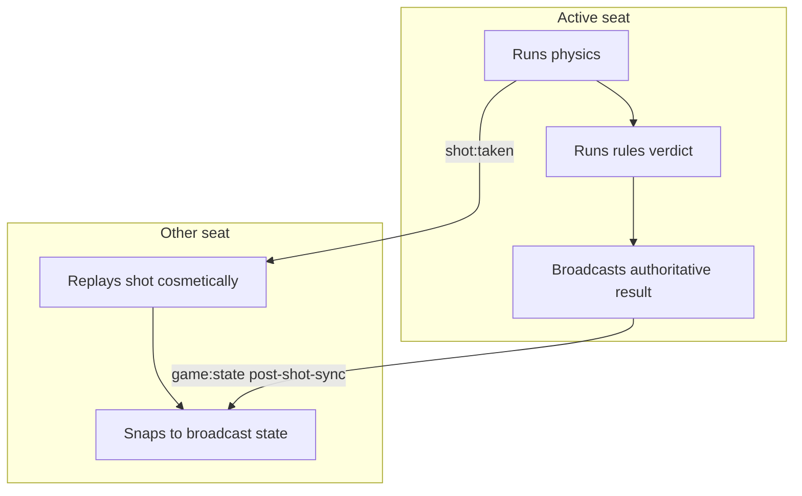
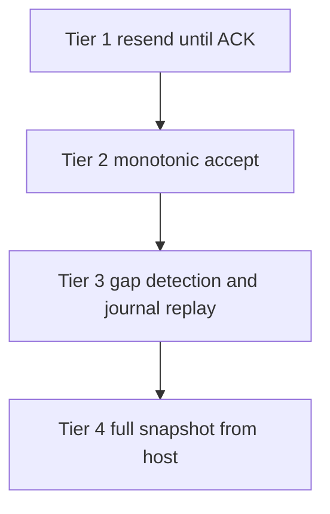

## The Single-Writer Model

Pool is turn-based: exactly one player acts at a time. Online multiplayer exploits this directly — **whoever's turn it is is the sole writer of that shot's outcome**. The shooting client runs physics and rules locally, then broadcasts one authoritative message (`post-shot-sync` or `foul-sync`) containing the entire result: final ball positions, next turn index, per-seat scores, ball-in-hand, and — when a rack ends — the winner.

Every other client computes nothing. It animates the incoming `shot:taken` message for cosmetic continuity, then **snaps** to the authoritative broadcast when it arrives. Because no second opinion ever exists, there is nothing to reconcile.



Both seats are full writers of their own shots — the host (seat 0) and the joiner (seat 1) have identical shot-broadcasting paths. The host's `isStateAuthority` flag grants only two extra roles:

1. **Snapshot source** — join, reconnect, and spectator recovery requests are answered by the host.
2. **Rack author** — racking uses `Math.random`, so the layout cannot be reproduced on the other machine. The host generates it and ships it in a reliable `rack-start` message, re-sent until the joiner replies `rack-ack`.

One subtlety on the writer side: the post-shot broadcast is gated on a `localShotInFlight` flag set at `Shot.Start`, not on the live turn flag. By the time the balls settle, the shooter's own verdict may already have switched the turn — gating on the turn would make the shooter go silent on every miss. The broadcast is also deferred one tick so that a foul detected in the same tick can cancel it — a fouled shot ships `foul-sync` instead of `post-shot-sync`, never both.

### Seats and Roles

Each client instantiates one participant class, which fixes its seat and capabilities for the session:

| Role | `localPlayerIndex` | `canBroadcast` | `isParticipant` | `isStateAuthority` |
|------|--------------------|----------------|-----------------|--------------------|
| Host | `0` | `true` | `true` | `true` |
| Player (joiner) | `1` | `true` | `true` | `false` |
| Spectator | `-1` | `false` | `false` | `false` |

Note that `isStateAuthority` does not mean "the host simulates the game" — it governs only rack authorship, snapshot responses, and collecting rack-ready signals. Shot outcomes are always authored by whichever seat is shooting.

## Ownership Table

Every piece of shared state has exactly one writer and a well-defined apply path on the receiving side.

| State | Writer | Applier behavior |
|-------|--------|------------------|
| Ball rest positions | Shooter ships its actual final positions in `post-shot-sync` / `foul-sync` | Forced apply — restores ball state and syncs to store, overriding the cosmetic replay result |
| Turn index | Shooter's broadcast carries the post-verdict `currentPlayerIndex` | Idempotent compare-before-write via `applyAuthoritativeTurn` |
| Scores | Shooter ships a per-seat array of `gamesWon` and `score` | Applied by seat index, never by player id |
| Foul detection and consequence | The fouler only — the beneficiary stays silent | Applies balls, scores, turn, ball-in-hand, and restarts the shot clock |
| Ball-in-hand grant | Shooter flags `ballInHand` on the broadcast | Grants only when the local seat is the beneficiary; an authoritative `false` clears a stale local grant |
| Win / game-over | The verdict owner attaches `gameEnd` with the winner seat to its next `post-shot-sync` | Dispatches a local game-end event; deliberately does not re-run rules, which would double-count the win |
| Shot-clock foul | The verdict owner only; the watcher's clock is paused during remote turns | Adopted via the resulting `foul-sync` |
| Rack layout | Host authors the random rack and re-sends `rack-start` until acknowledged | Joiner applies the layout, adopts the turn, replies `rack-ack`; duplicates are re-acked without re-racking |
| Match restart | Host broadcasts `match-restart` after the rematch countdown | Receiver re-dispatches the rematch event locally; the room stays connected |
| Recovery | The original writer replays journaled results by `rackId:shotId:reason`; the host answers full snapshot requests | See the recovery tiers below |

Two traffic classes fall outside the table because they carry no authority at all: `cue:move` (the opponent's live aim, power, and english, throttled to roughly 16 Hz) and `ball:move` (live cue-ball placement during ball-in-hand). Both are fire-and-forget cosmetic streams — a dropped packet means a briefly stale cue pose, corrected by the next packet or by the shot itself. Nothing downstream ever depends on them.

Turn adoption is the one place where idempotence is load-bearing. At-least-once delivery means duplicate authoritative payloads are normal, and `switchToPlayer` is not idempotent — calling it when the indices already agree double-fires the turn pipeline. `applyAuthoritativeTurn` therefore compares before writing: matching indices are a no-op (with a re-assert of the derived remote-turn flag if it is stale), and only a genuine divergence triggers an absolute switch to the target seat.

## The Verdict Gate

The entire model hangs on a single early return in the rules layer. When balls stop moving, `RulesManager.Handle_OnShotMotionStopped` checks verdict ownership before computing anything:

```typescript
// RulesManager.Handle_OnShotMotionStopped — before any verdict runs
if (!Store.getters['game/ownsShotVerdict']) {
    ChalkySticks.Utility.Log.info(
        'multiplayer:flow',
        'Shot resolved by remote seat — applying authoritative broadcast, skipping local verdict',
    );
    return;
}
```

This one gate sits upstream of every verdict and recording path — shot completion, foul detection, game-complete, and custom-rule action resolution. A client that fails the check computes nothing and records nothing; it simply waits for the shooter's broadcast.

The predicate lives in the game store module:

```typescript
/**
 * Whether this client owns the verdict for the shot that just resolved.
 *
 * @return boolean
 */
ownsShotVerdict: (state, localGetters, rootState): boolean => {
    const isOnline = rootState.match?.config?.isOnline === true;

    // Offline: every seat is its own authority, including AI turns
    if (!isOnline) {
        return true;
    }

    // Online with an unresolved scoreboard: fail safe, do NOT own the verdict.
    // Returning true here would let a watcher produce a phantom shot-clock foul.
    const currentPlayer = rootState.scoreboard?.currentPlayer;

    if (!currentPlayer) {
        return false;
    }

    const players = rootState.scoreboard?.players || [];
    const currentPlayerIndex = players.findIndex((player) => player.id === currentPlayer.id);

    return currentPlayerIndex === state.localPlayerIndex;
},
```

Three details matter here:

- **Why not `isLocalPlayerTurn`?** That getter returns `false` on an AI turn. Gating the verdict on it would break offline play against the CPU — the AI's shots would never resolve. `ownsShotVerdict` short-circuits to `true` for every seat offline (practice, vs-CPU, local hot-seat), so the gate is completely inert outside online matches.
- **The fail-safe branch.** Online, with the scoreboard's current player not yet populated, the getter returns `false` rather than `true`. Failing open here allowed a watcher whose scoreboard had not resolved to produce a phantom shot-clock foul — the exact "both clients foul and permanently disagree on the turn" desync this model exists to prevent.
- **Timing.** At motion-stop the turn has not yet switched, so `currentPlayerIndex` is still the shooter's seat. The getter is precisely the "am I the shooter?" test.

The same getter gates the shot clock's expiry handler (only the shooter fouls on timeout; the watcher logs and waits for the `foul-sync`) and the game-complete capture that attaches the `gameEnd` marker to the next broadcast.

## Core Invariants

Five rules keep the model coherent. Every one of them is enforced at a specific code point, and each has a failure mode that was observed in practice before the enforcement existed.

1. **One writer per shot.** The active seat's client authors the outcome; every other client applies it and runs no verdict of its own. Enforced by the verdict gate above, the shot-clock ownership gate, and the game-complete capture gate.
2. **Never re-simulate across machines.** The shooter ships final ball *state*, not inputs to be re-run. The applier's `shot:taken` replay is cosmetic animation only — the forced state apply lands regardless of how the replay played out, and the replay is skipped without consequence when the client is not idle on the same rack.
3. **Compare before writing the turn index.** A turn is adopted only when the authoritative index differs from the local one. At-least-once delivery makes duplicate payloads routine, and the underlying switch call is not idempotent — the no-op branch is the only thing preventing a double-fired turn switch.
4. **Everything new rides `game:state`.** The transport delivers a fixed allowlist of event names and silently drops anything else. New signals are added as a new `reason` string on `game:state`, never as a new event name.
5. **At-least-once plus monotonic.** Resolution messages are re-sent until acknowledged and gated by a monotonic `rackId` / `shotId` high-water mark on the applier, so a late or duplicate copy can never re-apply and rewind state.

## Why Not Lockstep

The previous implementation was a hybrid: full physics and rules ran on **both** clients, and divergence was reconciled with table checksums. That is deterministic lockstep — RTS netcode — applied to a turn-based game, and it requires bit-perfect cross-machine determinism that this engine does not have:

- **The frame timer drops time.** `FrameTimer` caps each frame delta at 100 ms and discards the remainder with no accumulator carry-over. A GC pause, a throttled background tab, or a slow phone runs *fewer* fixed physics steps than the other machine, so the two simulations diverge by construction.
- **Racking is genuinely random.** Rack layouts come from `Math.random` (a Fisher-Yates shuffle plus random placement). There is no shared seed, so two clients cannot even start a rack from the same state without one of them shipping it.
- **The shot clock is real time.** Two independent local timers expire at slightly different real moments. Under the hybrid, one client would foul and switch the turn while the other did not — a permanent split, and the most visible drift source in practice.

Once the simulations drift, checksums mismatch and the reconciliation tier spends its life chasing drift rather than correcting rare faults. Single-writer removes the determinism requirement entirely by shipping final *state* instead of inputs-to-replay. Among the standard netcode families, it is the natural fit:

| Family | Typical use | Fit here |
|--------|-------------|----------|
| Deterministic lockstep | RTS games with many simultaneous actors | No — requires bit-perfect determinism |
| Server-authoritative with client prediction | Shooters, real-time action | Overkill — no server-side simulation exists or is needed |
| Authoritative resolver plus state push | Turn-based games | Yes — one actor at a time makes the active client the natural resolver |

Two deliberate residues of the hybrid remain in the code:

- A `tableChecksum` still rides every state broadcast — an fnv1a hash over the sorted balls with positions quantized to three decimals. It is a **divergence detector for logs only**: the applier logs match or mismatch and applies the authoritative state either way. It never gates whether state crosses the wire or gets applied.
- The old host accept-or-reject baseline gate (`shouldApplyRemoteState`) is hardwired to `true`. Authoritative broadcasts are always applied; correctness comes from the monotonic acceptance tier below, not from any client second-guessing the writer.

## Delivery and Recovery Tiers

Single-writer concentrates all the risk into one place: the authoritative resolution message must arrive, exactly once, in order. Four escalating tiers guarantee that over a lossy transport.



| Tier | Mechanism | Detail |
|------|-----------|--------|
| 1. At-least-once | The writer re-sends an unacknowledged resolution verbatim every 700 ms, up to 8 attempts, and journals the last 12 authored results | Only an ACK from the opposing participant seat stops the timer; spectator ACKs are informational |
| 2. Monotonic accept | The applier ACKs first, then rejects any resolution at or below its `rackId` / `shotId` high-water mark | Duplicates and late copies are re-acked but never re-applied, so state can never rewind |
| 3. Targeted replay | A sequence gap on a resolution triggers `shot-result-request`; the seat that authored the missing shot replays the exact journaled payload | Source-aware — joiner-authored results are replayed by the joiner, never overwritten by stale host state |
| 4. Full snapshot | Anything unrecoverable — a gap on a non-resolution message, a journal miss, a rack-handshake timeout — requests `snapshot-full` from the host | Always applies, and advances the high-water mark so a later stale resolution cannot rewind past it |

One invariant ties tiers 1 and 2 together: every distinct terminal resolution must carry a strictly greater `shotId`. A resolution with no shot behind it — a shot-clock timeout today, any future concede — must explicitly advance the resolution id first, or it collides with the previous shot's id, gets rejected as stale, and deadlocks both clients. Ids only need to be monotonic, not contiguous.

Beyond the realtime tiers there is a durable backstop: every persisted shot record stores the table state after the shot, so a full reload or long disconnect can rebuild the table from the last persisted shot via the replay machinery. This lives in the stats and recording layer, is asynchronous, and may lag the live game by a shot or two — it is a recovery net, not part of the sync loop.

Full message shapes, the `game:state` reason catalog, and the exact resend and acceptance mechanics are covered in [Wire Protocol](/trainer/multiplayer/protocol). Step-by-step walkthroughs of each flow — shots, fouls, rack transitions, recovery — are in [Sync Flows](/trainer/multiplayer/sync-flows). The classes implementing all of this are mapped in [Components](/trainer/multiplayer/components).
