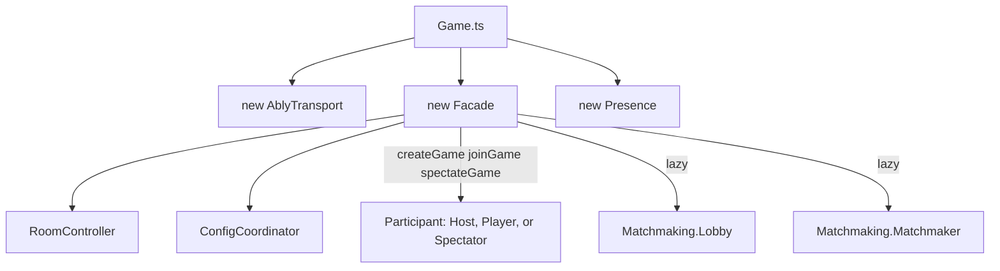

## Folder Map

All realtime multiplayer code lives in `src/App/System/Multiplayer/`. The barrel (`index.ts`) exports `ConfigCoordinator`, `Facade` (as `MultiplayerFacade`), `RoomController`, and the `Matchmaking`, `Participant`, and `Transport` sub-barrels. `Presence`, `Checksum`, `InviteIntent`, `RealtimeAuth`, `SequenceTracker`, and `TransportPayload` are deep-imported by their consumers.

```text
src/App/System/Multiplayer/
├── Facade.ts                Public API; orchestrates everything below
├── ConfigCoordinator.ts     Match-startup config handshake
├── RoomController.ts        Ably room lifecycle, presence, seat/role state
├── Presence.ts              In-match disconnect countdown state machine
├── RealtimeAuth.ts          Deferred token-based Ably initialization
├── SequenceTracker.ts       Per-sender sequence dedup / gap detection
├── Checksum.ts              Ball-state checksums (diagnostic only)
├── TransportPayload.ts      Envelope unwrap helper
├── InviteIntent.ts          Invite-link capture singleton
├── index.ts                 Barrel
├── Participant/
│   ├── Base.ts              The protocol core (~2,800 lines)
│   ├── Host.ts              Seat 0, state authority
│   ├── Player.ts            Seat 1, joiner
│   └── Spectator.ts         Read-only observer
├── Transport/
│   └── AblyTransport.ts     Wire implementation of IMultiplayerTransport
└── Matchmaking/
    ├── Lobby.ts             Open-table listings + heartbeat
    └── Matchmaker.ts        Quick-match queue
```

Construction is rooted in `Game.ts`. The facade owns the room controller and config coordinator from birth, creates a participant per entry point, and builds the matchmaking objects lazily:



`Game.ts` constructs the facade with `{ aimSystem, ballManager, playerManager, rulesManager, transport: new AblyTransport() }`, exposes it as `GameService.multiplayerManager`, registers `setNextRackStarter((breakerIndex) => this.matchManager.continueToNextGame(breakerIndex))`, and attaches/detaches it alongside the rest of the game systems.

## Facade

The thin public API (`Facade.ts`, extends `ChalkySticks.Core.Event.Dispatcher`). Everything outside the folder talks to multiplayer through this class; nothing else should be touched directly.

| Method | Purpose |
|---|---|
| `createGame(gameId: string): Promise<void>` | Auth, create a Host participant, create the room |
| `joinGame(gameId: string): Promise<void>` | Auth, set `isRemoteTurn = true`, create a Player participant, join, broadcast player info |
| `spectateGame(gameId: string): Promise<void>` | Auth, create a Spectator participant, join read-only, send `state:request` |
| `leaveGame(): Promise<void>` | Detach and null the participant, leave the room, reset the coordinator |
| `isConnected(): boolean` | Room controller has a `gameId` |
| `isStateAuthority(): boolean` | Participant flag; defaults `true` with no participant so offline play is unchanged |
| `isOpponentConnected(): boolean` / `isSpectating(): boolean` | Room state queries |
| `broadcastForfeit(winnerIndex: number)` | Sends `match:end` with reason `forfeit` before leaving |
| `getGameId()` / `getLocalPlayerIndex()` / `getCurrentRackId()` / `getCurrentShotId()` | Identity and protocol counters |
| `setMultiplayerConfig(config, playerName)` | Stores the host's pending match config on the coordinator |
| `setNextRackStarter(starter)` | Registers the callback the rack handshake uses to start the next rack |
| `readyForNextRack(breakerIndex)` / `requestFullSnapshot(reason)` / `broadcastMatchRestart()` | Delegate to the participant |
| `resetProtocolForMatchRestart()` | Clears protocol counters for a rematch while keeping the room alive |
| `generateRoomCode()` / `getLobby()` / `getMatchmaker()` | Room codes and lazy matchmaking singletons |

The public field `isRemoteTurn: boolean` is the live turn flag, written by the Online player strategy (see [Integration Points](#integration-points-outside-the-folder)). `attachEvents()` also captures a pending invite via `InviteIntent.capture()` and dispatches `Event.Menu.Open` 500 ms later so the menu can drill to the join flow.

`createParticipant()` wires the participant with callbacks and dependencies: `aimSystem`, `ballManager`, `configCoordinator`, `getCurrentRackId`, `getCurrentShotId`, `getGameId`, `getIsRemoteTurn`, `setIsRemoteTurn`, `startNextRack`, `playerManager`, `rulesManager`, `transport`.

## Participant/Base — the core

`Participant/Base.ts` (~2,800 lines) is where the entire bidirectional gameplay protocol lives. Host, Player, and Spectator are thin flag-and-handler layers on top of it. If you are tracing a sync bug, start here. The message formats it produces are documented in [Wire Protocol](/trainer/multiplayer/protocol) and the runtime sequences in [Sync Flows](/trainer/multiplayer/sync-flows).

Key state: `localShotInFlight` (set at the local `Shot.Start`, gates the post-shot broadcast — this is not the turn flag), `currentRackId` / `currentShotId` protocol counters, a monotonic `(lastAppliedRackId, lastAppliedShotId)` high-water mark, the unacked-result resend state, a result journal (last 12 results keyed `rackId:shotId:reason`), rack-handshake state, and a deferred remote snapshot slot.

Method groups:

| Group | Representative methods | One-liner |
|---|---|---|
| Broadcast | `broadcastShot`, `broadcastGameState(reason, extra)`, `broadcastControlState(reason, extra)`, `broadcastFoulSync(foulData)`, `broadcastAimUpdate`, `broadcastBallMove`, `broadcastMatchRestart` | Send `shot:taken`, full snapshots, lightweight control messages, foul results, and cosmetic aim/ball streams |
| Delivery guarantee | `journalResult`, `armResultResend`, `handleResultAck`, `acknowledgeResult` | At-least-once delivery: 700 ms resend cadence, 8 attempts, ACKs only counted from the opposing participant seat |
| Acceptance gate | `acceptResolution(payload, reason): boolean`, `isStaleResolution`, `noteResolutionApplied` | ACK first, then drop anything at or below the applied high-water mark |
| Authoritative apply | `applyRemoteBallState`, `applySeatScores`, `applyRemoteBallInHand`, `applyRemoteGameEnd`, `applyAuthoritativeTurn`, `handleRemoteFoulSync` | Forced state recovery: snap balls, scores, ball-in-hand, turn index, and game end from the writer's broadcast |
| Cosmetic replay | `handleRemoteShotPayload`, `replayRemoteShot`, `applyRemoteBallMove` | Visually replay the remote shot locally; skipped safely on rack mismatch or wrong state |
| Routing | `parseIncomingGameState`, `handleSharedGameState`, `validateGameStatePayload` | Sequence dedup/gap detection, then reason-string dispatch |
| Rack handshake | `readyForNextRack`, `handleRemoteRackReady`, `tryStartReadyRack`, `handleRemoteRackStart`, `handleRemoteRackAck` | Ready → start → ack handshake between racks, with resends and duplicate re-ack |
| Recovery | `requestFullSnapshot(reason)`, `handleSnapshotRequest`, `handleShotResultRequest`, `processPendingRemoteSnapshot` | Full-snapshot and targeted journal-replay recovery paths |
| Lifecycle | `attachEvents` / `detachEvents`, `reset()`, `resetProtocolForMatchRestart()` | Bus/transport wiring; rematch reset keeps the room and listeners |

Common bus listeners (all roles): `GameState.Change`, `Shot.MotionStopped`, `Rules.GameComplete`. Common transport listeners: `ball:move`, `cue:move`, `game:state`, `shot:taken`.

## Participant/Host

Seat 0, `role = 'host'`, `isStateAuthority = true`, `canBroadcast = true`. Created by `Facade.createGame()`.

- `Handle_OnMatchGameStart` — authors `rack-start` (deferred 100 ms; `startMode` is `'initial'` for rack 1, `'next'` after).
- `Handle_OnShotMotionStopped` — broadcasts the post-shot result, gated on `localShotInFlight`.
- `Handle_OnFoulResolved` — fouler-only: early-returns when the foul belongs to the other seat.
- `Handle_OnStateRequest` — answers spectator `state:request` with a `spectator-sync` snapshot including current aim data.

Bus listeners: `Aim.GameAngleChange`, `Foul.Any`, `Foul.Resolved`, `Game.InputMode`, `GameBall.Moved`, `GameControl.Jump`, `Match.GameStart`, `Shot.MotionStopped`, `Shot.Start`. Transport: `state:request`.

## Participant/Player

Seat 1, `role = 'player'`, `isStateAuthority = false`. Created by `Facade.joinGame()`. A near-exact mirror of Host minus the `Match.GameStart` listener (only the host authors `rack-start`) and the `state:request` handler. The shot/foul handlers are currently duplicated between Host and Player — if you change one, change both; extracting them into Base is known cleanup debt.

## Participant/Spectator

`role = 'spectator'`, `localPlayerIndex = -1`, `canBroadcast = false`, `isParticipant = false`. Fully implemented and live, but the current Online menu has no spectate affordance — the only UI entry point is the legacy `View/Modal/MatchConfig.vue` modal. Discovery works through listings with `allow_spectators`, and solo online sessions (`System/Match/OnlineSessionCoordinator.ts`) still create spectator-broadcast rooms.

Structurally silenced (empty broadcast listeners) rather than gated. It overrides `Handle_OnRemoteShotTaken` (drops the `isRemoteTurn` gate — every turn is remote), `Handle_OnRemoteCueMove`, and `Handle_OnRemoteGameState` (applies `spectator-sync` snapshots plus aim data), and forces `Aiming` shortly after a replayed shot settles. It never joins the rack handshake, and its ACKs never satisfy the writer's resend timer — only the opposing participant seat counts.

## ConfigCoordinator

Handles the match-startup handshake, separate from gameplay sync. Constructed by the facade.

- `setMultiplayerConfig(config)` — host stores the pending match config before anyone joins.
- `broadcastPlayerInfo(localPlayerName)` — joiner sends `game:state` reason `player-info` with `playerAvatarUrl`, `playerName`, `playerUserId` (server user id).
- `handlePlayerInfoReceived(payload)` — stores remote identity, dispatches `Event.Multiplayer.OpponentInfo`, then `tryAutoStartMatch()`.
- `tryAutoStartMatch()` — host only; requires pending config, connected opponent, and received player info. Builds the final config with `playerNames`, `playerAvatars`, and `serverUserIds { user1, user2 }`, PATCHes the shared `GameMatch` row (`status: Full`, `user2_id`) via `patchServerMatchParticipants()`, broadcasts reason `match-start`, and dispatches `Event.Multiplayer.MatchAutoStart` locally.
- `handleMatchStartReceived(payload)` — joiner-only mirror; dispatches `MatchAutoStart` with the host's config.

Only the menu UI listens for `MatchAutoStart` (`View/Modal/MatchConfig.vue`, `View/Modal/Menu/Multiplayer.vue`) — there is no in-game scene listener, which is why rematches use the separate `match-restart` path instead.

## RoomController

Owns the Ably room lifecycle, presence, seat/role assignment, and store sync. Constructed by the facade.

- `createRoom` / `joinRoom` / `spectateRoom(gameId, localPlayerName)` — join the channel, attach transport listeners, enter presence, send `match:create` / `match:join` (spectators send nothing), commit store state, dispatch `RoomCreated` / `RoomJoined`.
- `broadcastForfeit(winnerIndex)` — sends `match:end { reason: 'forfeit', winnerIndex }` while still connected.
- `leaveRoom()` — `match:leave`, leave presence, detach, reset, dispatch `Disconnected`.
- `generateRoomCode()` — `POOL-` plus four characters from a 32-character alphabet with no `0/O/1/I` ambiguity.

Dispatches `Multiplayer.OpponentJoined` / `OpponentLeft` / `OpponentForfeited` from remote `match:*` events and presence-leave; echo suppression via `isOpponentConnected` guards (Ably echoes your own publishes). Commits `game/setIsMultiplayerConnected`, `game/setLocalPlayerIndex`, `game/setMultiplayerGameId`, `game/setMultiplayerRole`. A `beforeunload` handler sends `match:leave` and leaves presence on tab close.

## Presence

The in-match opponent-connection state machine behind the disconnect overlay. Raw presence-leave detection lives in RoomController; this class consumes the resulting `Multiplayer.OpponentLeft` / `OpponentJoined` bus events (plus `Match.Start` / `Match.End`). Constructed directly by `Game.ts`.

Inert unless the match is `InProgress`, online, and `VersusPlayer`. On opponent departure it writes `match/setOpponentConnection` (`'connected'`, `'disconnected'`, or `'degraded'`) and a 1 Hz `match/setDisconnectRemaining` countdown from `FALLBACK_HARD_TIMEOUT_SECONDS = 60` (ruleset-overridable via `disconnectHardTimeoutSeconds`); at zero the match degrades to asynchronous play. Shot-clock policy: it pauses the clock (`Match.ShotClockPause`) only when it is the local player's turn — a disconnected shooter's clock keeps burning.

## RealtimeAuth

Deferred, token-based Ably initialization. Module functions, not a class. `ensureRealtimeAuth()` no-ops without an `authentication/token`; otherwise it initializes `ChalkySticks.Extras.Service.Game.instance` with an `authCallback` that POSTs `{apiBase}/ably/token` with the live Sanctum bearer on every token renewal. Called at every entry point: `createGame`, `joinGame`, `spectateGame`, `Lobby.joinLobby`, `Matchmaker.joinQueue`. `resetRealtimeAuth()` exists for logout. See [Connectivity](/trainer/multiplayer/connectivity) for the token capability model.

## SequenceTracker

Pure per-sender sequence bookkeeping, one instance per participant. `consume(senderId: string, sequence: number)` returns `{ hasGap, isDuplicate }`: first message from a sender is accepted, `sequence` at or below the previous is a duplicate, more than one ahead is accepted with the gap flag set (triggering targeted or full recovery upstream).

## Checksum

Active but diagnostic-only. `ballChecksum(balls)` (alias `tableChecksum`) computes an fnv1a hash over balls sorted by number, with positions quantized to 3 decimals (about 1 mm). It rides every `shot:taken`, `post-shot-sync`, `foul-sync`, `rack-start`, and `snapshot-full`. On receipt it only produces the MATCH/MISMATCH log line — never a gate; authoritative state is always applied. Do not delete it without accepting the loss of the drift-report line.

## Transport/AblyTransport

Implements `Trainer.IMultiplayerTransport` over `ChalkySticks.Extras.Service.Game.instance`. `send(gameId, eventName, payload)` wraps the payload in an envelope carrying `senderId` (generated per construction) and a monotonic `sequence` — the per-sender stream SequenceTracker depends on. `joinChannel` / `leaveChannel` / `on` / `off` / `enterPresence` / `leavePresence` / `onPresenceLeave` delegate to the SDK service. Constructed once in `Game.ts` and handed to the facade.

## TransportPayload

A single helper, `resolveTransportPayload(e)`, that peels the triple wrapping the SDK applies to inbound messages: `e?.data?.data?.payload || e?.data?.payload || e?.data`. Used by every receive handler and by RoomController.

## Matchmaking/Lobby

Open-table discovery: REST for data (SDK `GameMatch` models), the realtime channel `cs:lobby` only for lightweight refetch signals (`game:listed` / `game:delisted` / `game:updated`).

- `createListing(options)` — POSTs the `GameMatch` row (`room_code`, `is_online: true`, `user1_id`; spectate-only listings use status `InProgress` instead of `Waiting`), starts the 60 s heartbeat, registers a `pagehide` keepalive DELETE.
- `fetchListings(filters?)` — queries with `fresh: '1'` so the server hides stale rows.
- `updateListing` / `removeListing` — patch or delete, with lobby-channel signals.
- `cleanupOwnStaleListings()` — sweeps the caller's own orphaned waiting/full rows on lobby entry (fetched without `fresh`, deliberately).

Dispatches `Multiplayer.GameListed` / `GameDelisted` / `LobbyUpdated`. Created lazily via `Facade.getLobby()`.

## Matchmaking/Matchmaker

Quick-match queue client. `joinQueue(preferences)` saves a `MatchmakingQueue` model (`game_type`, `race_to`, optional skill fields; wildcards `'Any'` and `0`) and subscribes to the personal channel `cs:user:{userId}` for `matchmaking:matched`. `leaveQueue()` deletes the entry. `resolveMatchPayload` walks the envelope tolerantly (keys `matchId` / `gameId` / `roomCode`, JSON-string layers included). Pairing itself happens server-side on a 10-second scheduled job. Dispatches `Multiplayer.QueueJoined` / `QueueLeft` / `MatchFound`. Created lazily via `Facade.getMatchmaker()`.

## InviteIntent

Singleton (`export default new InviteIntent()`) handling `?join=POOL-XXXX` invite links. `capture()` reads and validates the code via `Config.Multiplayer.parseJoinCodeFromLocation()` and strips the param from the address bar with `history.replaceState`; `consume()` returns and clears it so the join fires exactly once; `hasPending()` lets menus drill toward the Online view. The chain: `Facade.attachEvents` captures and opens the menu → `Play.vue` drills to Online → `Menu/Multiplayer.vue` consumes and joins. Invite URLs are built by `Config.Multiplayer.buildInviteUrl(roomCode)` from the room's Share button.

## Integration Points Outside the Folder

| Where | What |
|---|---|
| `System/Rules/RulesManager.ts` | **The verdict gate.** In `Handle_OnShotMotionStopped`, if `game/ownsShotVerdict` is false the manager returns before running any local verdict — `Shot.Complete`, `Foul.Any`, `Rules.GameComplete`, and the [custom rules](/trainer/custom-rules/index) resolver are all suppressed on the watching seat. |
| `Store/Module/Game/Getters.ts` | `ownsShotVerdict`: offline always `true` (AI turns included); online with an unresolved current player fail-safes to `false`; otherwise `currentPlayerIndex === localPlayerIndex`. Distinct from `isLocalPlayerTurn`, which is `false` on AI turns. |
| `System/Match/ShotClock.ts` | Only the verdict owner fouls on expiry; the watcher waits for the shooter's `foul-sync`. |
| `System/Player/Strategy/Online.ts` | The writer of `Facade.isRemoteTurn`: `true` at remote turn start, `false` at local; spectators stay `true`. |
| `Game.ts` | Constructs and attaches everything; handles `Multiplayer.MatchRestart` (protocol reset + restart in the same room) and `Multiplayer.OpponentForfeited` (instant win via `matchManager.endMatch`). |
| `View/Modal/GameOutcome.vue` | Per-rack outcome UI calls `readyForNextRack(breakerIndex)` with an 8 s fallback to `requestFullSnapshot('rack-timeout')`. |
| `View/Presentation/Takeover/MatchTakeover.vue` | Match-end takeover; 5 s auto-rematch countdown, host authors `broadcastMatchRestart()`; rematch requires `isOpponentConnected()`. |
| `View/Overlay/Multiplayer/Disconnect.vue` | Renders `match/opponentConnection` + `match/disconnectRemaining` (countdown banner, then "continues asynchronously"); mounted globally by `Scene/Shell.vue`. |
| `View/Presentation/TurnStatus.vue` | Persistent lower-third turn notifier whenever `game/isLocalPlayerTurn` is not `true` in a non-Practice match; pure store-derived. |
| `View/Modal/Menu/Multiplayer.vue` + children | The Online menu (`landing \| quickmatch \| room` views) with `HostCard`, `JoinCode`, `OpenTables`, `QuickMatch`, `Room`. Consumes `Multiplayer.OpponentInfo` for seat cards and `MatchAutoStart` to configure and start the match. Gated by the `play_online` feature flag. See [Connectivity](/trainer/multiplayer/connectivity). |

Store surface written by multiplayer code: `game/setIsMultiplayerConnected`, `game/setLocalPlayerIndex`, `game/setMultiplayerGameId`, `game/setMultiplayerRole`, `game/setInputBlocked`, `game/setBallInHand`, aim/power/english mutations, `match/setOpponentConnection`, `match/setDisconnectRemaining`.

## Persistence Model

Multiplayer does not persist anything itself — it feeds the same recording pipeline as offline play. Gameplay bus events flow into `System/Stats/Controller` (the sole bus subscriber), `Stats/Tracker` writes records and enqueues sync entries on a localStorage-persisted queue, and `GameRecorder/SyncRunner` drains that queue to the REST API parent-before-child, offline-tolerant, with exponential backoff.

What is written, and when:

| Row | Endpoint | When | Notes |
|---|---|---|---|
| Match | `POST matches` | `Match.Start` | Skipped when `config.serverMatchId` exists — the hosted listing or matchmaker row is adopted instead. Updated with winner/status on match end. |
| Game | `POST games` | Lazily on the first recorded shot of a rack | Includes `breaking_player_id` from the breaker seat; idle racks create no rows. |
| Inning | `POST /games/{id}/innings` | At each inning end | Turn switch is non-terminal; game end is terminal win/loss. |
| Shot | `POST /games/{id}/shots` | Per recorded shot | Cue params, result, table state before/after, `player_id` from the seat mapping. |

Only ranked-style formats persist (8/9/10-ball, Straight Pool, challenges); freeplay, custom rules, and drills skip sync entirely.

**Who writes records under single-writer:** the verdict gate suppresses the result events on the watching seat, so each shot is recorded exactly once — by the client of the seat that took it. The watcher's cosmetic replay buffers pending shot state but never lands a record. One nuance: both seats persist their own `games` / `innings` / `shots` lineages (there is no shared server game id) — only the `GameMatch` row is shared, when `serverMatchId` is present. Private room-code games without a listing lazily create a match row per client.

**Seat identity:** seat 0 is `user1` (host), seat 1 is `user2` (joiner). The hosted listing carries its `GameMatch` id into the live config as `serverMatchId`; the joiner's server user id travels in the `player-info` handshake; `ConfigCoordinator.tryAutoStartMatch` bakes `serverUserIds { user1, user2 }` into the config broadcast to both clients and PATCHes `user2_id` onto the shared row. Per-shot mapping is `serverPlayerId = playerIndex === 0 ? serverUserIds.user1 : serverUserIds.user2`. Opponent shots produce full records but never touch the local player's personal counters or lifetime stats.
