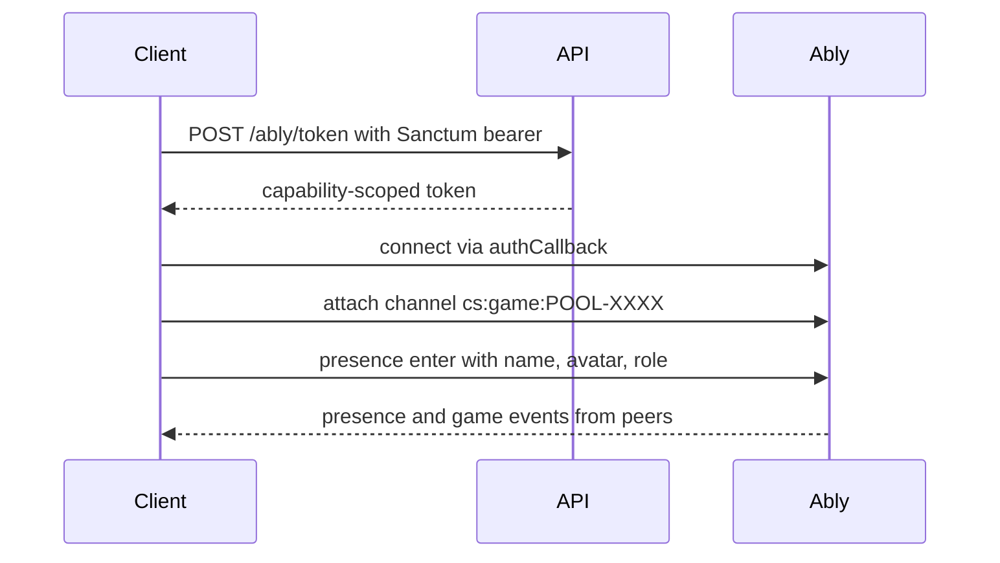
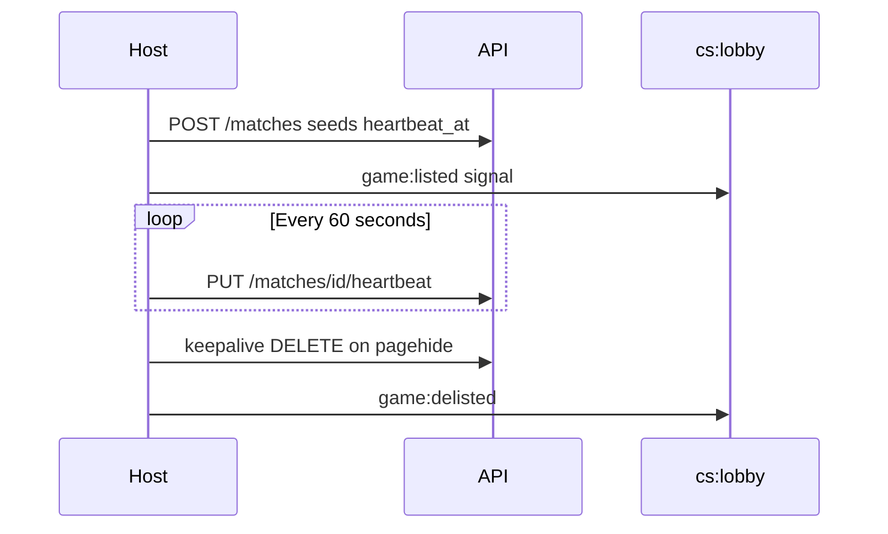
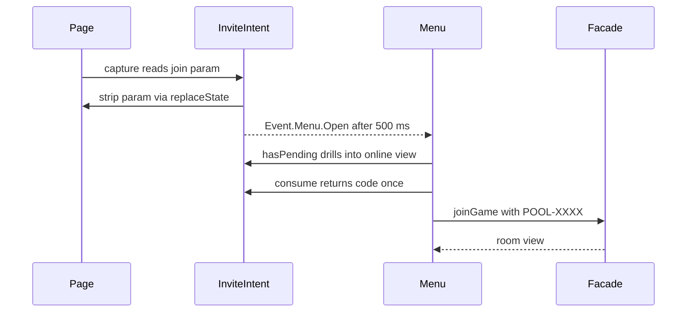
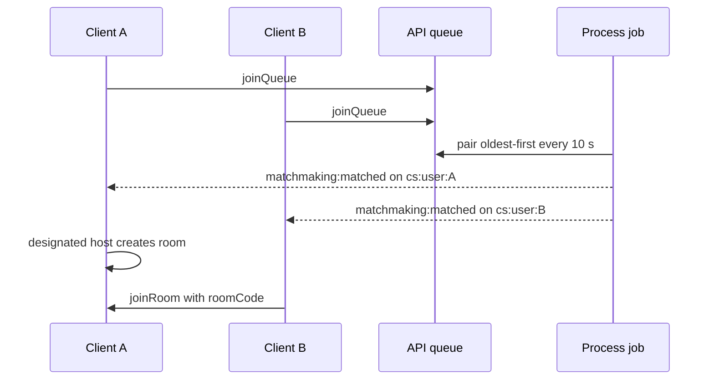

## Overview

There are three ways into an online 1v1 game, and all of them converge on the same **Room** — a shared Ably channel keyed by a room code like `POOL-7XKM`:

1. **Host + invite** — one player hosts a table (creating a discoverable listing) and shares the code or an invite link.
2. **Join by code** — the second player types the code, clicks an invite link, or picks the table from the Open Tables list.
3. **Quick match** — both players enter a server-side queue; a scheduled job pairs them, designates a host, and hands both the same room code.

Once both seats are occupied, the [config sync handshake](#config-sync-and-auto-start) broadcasts the host's match configuration and the match auto-starts on both clients. Gameplay from that point forward is covered in [Wire Protocol](/trainer/multiplayer/protocol) and [Sync Flows](/trainer/multiplayer/sync-flows).

Room codes are always `POOL-` plus four characters from a 32-character alphabet (`ABCDEFGHJKLMNPQRSTUVWXYZ23456789` — no `0`/`O`/`1`/`I` ambiguity), validated by `ROOM_CODE_PATTERN` in `src/Config/Multiplayer.ts`.

## Realtime Auth and Transport

Ably is **not** initialized at boot. It needs a capability-scoped token from `POST /ably/token`, which requires the Sanctum bearer — so the connection only exists post-login. Every multiplayer entry point (`createGame`, `joinGame`, `spectateGame`, `joinLobby`, `joinQueue`) calls `ensureRealtimeAuth()` first, which brings the connection up lazily.



The SDK is initialized with an `authCallback` rather than a static token, so every Ably token fetch or renewal re-reads the *current* bearer from the store — the connection survives token refresh and re-login without re-initialization. The token's capability map is the security boundary:

| Channel | Capabilities | Purpose |
|---------|-------------|---------|
| `cs:user:{ownId}` | subscribe only | Personal channel — matchmaking notifications; you cannot read anyone else's |
| `cs:lobby` | publish, subscribe | Lightweight listing refetch signals |
| `cs:game:*` | publish, subscribe, presence | Game rooms |

The token's `clientId` is `user-{id}`; the client deliberately does not set its own (Ably rejects mismatches). Channel naming: the SDK's Game service namespaces channel ids with `cs:game:`, so room code `POOL-7XKM` becomes channel `cs:game:POOL-7XKM`. Ids that already start with `cs:` pass through unprefixed — which is how `cs:lobby` and `cs:user:{id}` resolve correctly through the same service.

**Presence** is how disconnects are detected. Entering a room enters Ably presence with `avatarUrl`, `name`, and `role` (`player` or `spectator`). When a peer's presence *leave* fires, the room controller dispatches `Event.Multiplayer.OpponentLeft` locally — disconnect detection is presence-based, not a wire message. Spectator departures are ignored, and each client unsubscribes from presence-leave before leaving so its own departure never fires its own handler.

## Hosting a Table

Hosting does two things at once: creates the realtime room, and creates a REST **listing** (a `GameMatch` row) that makes the table discoverable and carries match persistence.

```typescript
// Multiplayer.vue — Handle_OnHostSubmit, condensed
const roomCode = GameService.multiplayerManager.generateRoomCode();

GameService.multiplayerManager.setMultiplayerConfig(this.buildHostConfig(gameType, raceToGames), localPlayerName);
await GameService.multiplayerManager.createGame(roomCode);

const listing = await GameService.multiplayerManager.getLobby().createListing({
    allowSpectators: true,
    format: gameType,
    raceTo: raceToGames,
    roomCode: roomCode,
    visibility: visibility,
});
```

Private tables are listed too — `visibility` controls discovery, and the row is still needed for match persistence. The listing carries `serverMatchId` back into the multiplayer config so scores persist against the right row.

### Heartbeat and freshness

A listing is only trusted while its host is provably alive:



- The client heartbeats every **60 seconds** (`PUT /matches/{id}/heartbeat`), from listing creation until removal — the beat spans both the table room and active play. Server-side the beat is a quiet save; it fires no match-changed events. A missed beat is retried next tick; the freshness window spans several intervals.
- Listing fetches pass `fresh=1`. The API hides online waiting/full rows whose `heartbeat_at` is older than **5 minutes** (rows with a null heartbeat get 5 minutes from `created_at`; new listings are seeded with `heartbeat_at = now()` so they are immediately fresh). In-progress, completed, and offline rows pass untouched. The client mirrors the same 5-minute window as a belt-and-suspenders filter in `OpenTables.vue`.

### Orphan cleanup

Three independent layers remove dead listings:

1. **Server sweep** — the matchmaking job (every 10 seconds) marks online waiting/full rows `Completed` when `heartbeat_at` is more than 10 minutes old, or when the heartbeat is null and the row is over 2 hours old, then publishes `game:delisted`.
2. **Client own-orphan sweep** — on lobby entry, the client fetches its own hosted rows *without* the `fresh` filter (stale rows are exactly what it needs to see) and deletes any hosted row that is not the current local listing. One player hosts one table, so any other own row is dead by definition.
3. **pagehide keepalive DELETE** — on browser close/refresh the client fires a `fetch` DELETE with `keepalive: true`, the only request type that survives page teardown. If it does not land, the server sweep catches the row within minutes.

### Timing constants

| Constant | Value | Where |
|----------|-------|-------|
| Heartbeat interval | 60 s | `src/Config/Multiplayer.ts` `HEARTBEAT_INTERVAL_MS` |
| Freshness window (`fresh=1`, client mirror) | 5 min | API `GameMatch.index()` / `LISTING_FRESH_WINDOW_MS` |
| Waiting-row hard age filter | 1 h from `created_at` | API `GameMatch.index()`, always on |
| Stale-heartbeat cleanup | 10 min | API `Matchmaking\Process` |
| Null-heartbeat cleanup | 2 h from `created_at` | API `Matchmaking\Process` |
| Stale queue entry cleanup | 30 min | API `Matchmaking\Process` |
| Matchmaking job cadence | every 10 s, no overlap | API scheduler |
| Invite capture to menu open | 500 ms | `Facade.attachEvents()` |

## Join by Invite

The room's Share button builds an invite URL — the current origin and path plus `?join=POOL-XXXX` — via `Config.Multiplayer.buildInviteUrl()`. Opening that link walks a capture-and-consume chain where every step no-ops when no code is pending:



1. `Facade.attachEvents()` calls `InviteIntent.capture()`, which reads and validates `?join=`, stores the code, and **strips the param from the address bar** with `history.replaceState` — a reload will not re-join. If a code was captured, `Event.Menu.Open` fires after 500 ms (letting the menu modal mount).
2. `Play.vue` sees `InviteIntent.hasPending()` on mount and skips its landing straight into the Online view.
3. `Multiplayer.vue` calls `InviteIntent.consume()` — returns the code exactly once — and runs the same join path as a typed code: `joinGame(code)`, then the room view. A failed join surfaces "Couldn't join `{code}` — the table may be gone."

Code normalization is shared by every entry point: `normalizeRoomCode()` trims, uppercases, strips whitespace, and prepends `POOL-` when only the four-character tail was typed. Validation is purely structural against `ROOM_CODE_PATTERN`.

## Quick Match

`QuickMatch.vue` joins the queue **on mount** — arriving at the view is the search intent. Two preference pills switch between a full wildcard entry and the specific game/race chosen on the landing hero; switching leaves and rejoins the queue (a lock prevents double-tapping into two entries). Cancel and "Host a Table Instead" work by unmounting, which leaves the queue in `beforeDestroy`.

```typescript
// Wildcard defaults from src/Config/Multiplayer.ts
await GameService.multiplayerManager.getMatchmaker().joinQueue({
    gameType: Config.Multiplayer.QUEUE_ANY_GAME_TYPE, // 'Any'
    raceTo: Config.Multiplayer.QUEUE_ANY_RACE_TO,     // 0 = any race
});
```

Server-side, a scheduled job runs every 10 seconds:



**Pairing** is a single global greedy pass, oldest entry first — deliberately *not* grouped by game type, since grouping would strand `Any` wildcards that must pair across groups. Two entries are compatible when they are different users, game types are equal or either is `Any`, races are equal or either is `0`, and (when all four skill fields are present) the skill gap fits inside both players' windows. A second pass seats leftover queue entries into compatible open, waiting, public tables — no new match row is created there; the listing *is* the match, and only the queued player is notified.

**Resolution**: specific beats `Any`; a double wildcard resolves to Nine Ball, race to 3. The job creates the match row in one transaction — earlier-queued player becomes `user1_id`, a fresh room code is generated with the same alphabet the client uses, and `heartbeat_at` is seeded so the room is not expired before the first client beat — then publishes `matchmaking:matched` to both personal channels:

```json
{
    "format": "NineBall",
    "gameId": "POOL-7XKM",
    "hostUserId": 42,
    "matchId": 981,
    "raceTo": 3,
    "roomCode": "POOL-7XKM"
}
```

**Host designation** matters: without it, nobody would create the room, broadcast the match config, or trigger auto-start. The client whose id matches `hostUserId` builds a host config, attaches `serverMatchId: payload.matchId` (no new listing — the matchmaker's row already exists), and calls `createGame(payload.roomCode)`. The other client simply joins with `joinRoom(payload.roomCode)`. The full payload must reach the menu's match-found handler intact — see [Debugging & Known Limitations](/trainer/multiplayer/debugging) for a known gap in the current re-emit.

## Config Sync and Auto-Start

Both seats are in the room; now the host's configuration has to reach the joiner. `ConfigCoordinator` runs the handshake over `game:state` wire messages (see [Wire Protocol](/trainer/multiplayer/protocol) for the envelope):

1. The host stored its config *before* creating the room via `setMultiplayerConfig()` — it sits as `pendingMatchConfig`.
2. After joining, the joiner broadcasts `game:state` with `reason: 'player-info'` carrying its name, avatar URL, and server user id.
3. The host's `handlePlayerInfoReceived` dispatches `Event.Multiplayer.OpponentInfo` — this fills the room's seat card — then calls `tryAutoStartMatch()`.
4. Auto-start fires **host-side only** when all four conditions hold: is host, pending config exists, opponent connected, remote player name received. Either ordering of join and player-info works — the opponent-joined event also retries.
5. The host builds the final config (player names, avatars, `serverUserIds`), fire-and-forget PATCHes the server match row to `Full` with `user2_id` when a `serverMatchId` exists, broadcasts `game:state` with `reason: 'match-start'` carrying the config, and dispatches `Event.Multiplayer.MatchAutoStart` locally.
6. The joiner receives `match-start` and dispatches the same `MatchAutoStart` event.

Only the menu listens for `MatchAutoStart`. `Multiplayer.vue` is where the game actually starts:

```typescript
/**
 * @param IEventPayload e
 * @return Promise<void>
 */
protected async Handle_OnMatchAutoStart(e: IEventPayload): Promise<void> {
    GameService.matchManager.configure(e.data.config);
    await GameService.matchManager.startMatch();

    // Reset room state, return to landing, close the menu
}
```

The host config comes from `onlineHostPreset()`: `isOnline: true`, `mode: VersusPlayer`, 30-second shot clock, winner breaks, undo disabled. See [Match System](/trainer/match-system) for the full `IMatchConfig` shape.

## Menu Surfaces

`Multiplayer.vue` is the Online section inside the Play menu, with three internal views. Back navigation is a priority chain — the panel steps its own stack back before the menu shell handles it, and a mid-launch back in the room is swallowed once an opponent has connected so it cannot abort the match.

| View | Component | System call |
|------|-----------|-------------|
| `landing` — host hero | `HostCard.vue` | `generateRoomCode()` + `setMultiplayerConfig()` + `createGame()` + `lobby.createListing()` |
| `landing` — join by code | `JoinCode.vue` | `multiplayerManager.joinGame(code)` |
| `landing` — open tables | `OpenTables.vue` | `lobby.joinLobby()` / `fetchListings()`; row Join runs `joinGame(roomCode)` |
| `quickmatch` | `QuickMatch.vue` | `matchmaker.joinQueue()` on mount, `leaveQueue()` on destroy |
| `room` | `Room.vue` | Presentational only; Leave runs `lobby.removeListing()` then `multiplayerManager.leaveGame()` |

While in the room, the parent keeps the listing status in sync: opponent joined flips the listing to `Full`, opponent left flips it back to `Waiting`. `OpenTables.vue` snapshots the SDK collection into a plain array on every `LobbyUpdated` event — SDK collections are not Vue-reactive — and tags the caller's own rows.

Component internals are covered in [Components](/trainer/multiplayer/components).
