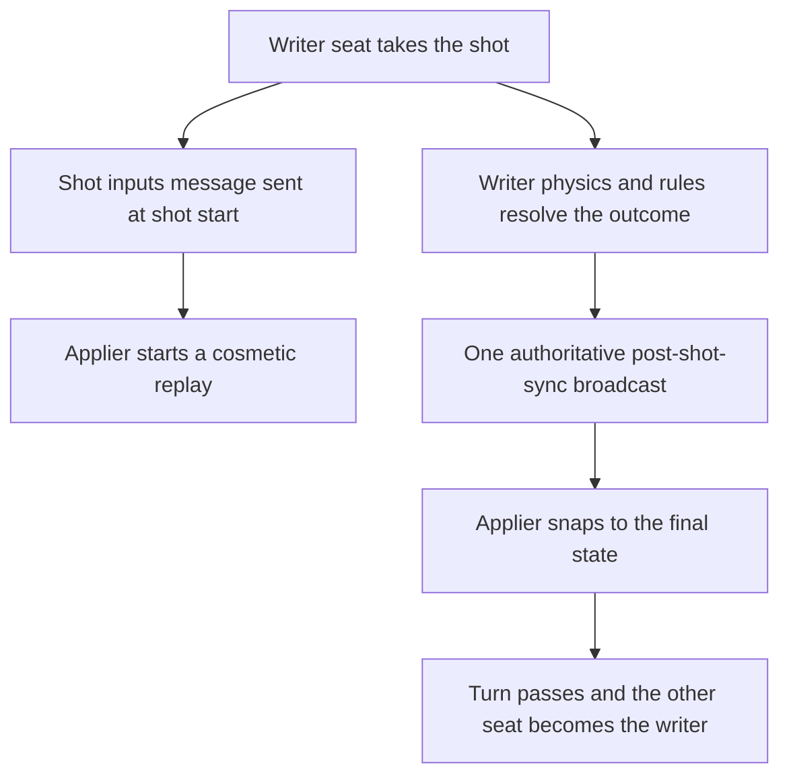

## Overview

The trainer supports online 1v1 matches built on a **single-writer authority** model. Pool is turn-based — exactly one player acts at a time — so the shooting client is the sole author of each shot's outcome. It runs physics and rules locally, then broadcasts one authoritative message containing the entire result: final ball positions, next turn index, per-seat scores, ball-in-hand, and (when a rack ends) the winner. The other client computes nothing — it replays the shot inputs as a cosmetic animation, then snaps to the authoritative broadcast. Because no second opinion ever exists, there is no cross-machine physics reconciliation, and the engine does not need to be deterministic across devices.

## The Mental Model

Authority follows the turn. Whoever is shooting is the *writer*; everyone else (the opponent, and any spectators) is an *applier*. The writer's client resolves the shot end-to-end — physics settle, foul detection, rules verdict, turn switch — and ships the final state. Appliers never run a rules verdict of their own; a gate in the rules layer suppresses local verdicts whenever the shot belongs to a remote seat.

The host (seat 0) is not a referee. Beyond being a normal writer on its own turns, its special roles are: it authors the random rack layout (racking uses `Math.random` and cannot be reproduced remotely), it arbitrates the reliable rack-start handshake for the next rack and assigns rack ids, it serves full-state snapshots for join, reconnect, and spectator recovery, it is the match-start config authority, and it authors the rematch restart.

## Transport vs Persistence

Two independent systems run side by side. Live sync makes the other browser mirror what just happened; persistence records the match for stats, replay, and discovery.

| Concern | System | Details |
|---------|--------|---------|
| Live gameplay sync | Ably realtime via `AblyTransport` | Room code `POOL-XXXX` is the channel id, namespaced by the SDK to `cs:game:POOL-XXXX`. Wire identity is `senderId` plus a per-sender `sequence` counter, and `rackId`/`shotId` per resolution. |
| Match records | REST API via `GameRecorder` | Persists match, game, inning, and shot rows through an offline-durable sync queue, drained parent-first. Gameplay sync never depends on API ids. |
| Discovery and matchmaking | REST plus lightweight realtime signals | Open-tables lobby and a quick-match queue; a matched pair receives the room code and joins the same Ably channel. |

Under single-writer authority, each shot is recorded exactly once — by the client of the seat that took it. Listed and matchmade games share one `GameMatch` row; game, inning, and shot rows are per-seat lineages beneath it.

## The Five Invariants

Every sync flow in the system upholds these rules. Break one and you get a desync.

1. **One writer per shot.** The active seat's client authors the outcome; every other client applies it and runs no verdict of its own.
2. **Never re-simulate across machines.** The writer ships final ball *state*, not inputs to be re-run. The applier's replay is cosmetic only and is skipped without consequence when conditions are wrong.
3. **Compare-before-write on the turn index.** A turn is adopted only when the authoritative index differs from the local one — the idempotent no-op prevents double turn switches.
4. **Everything new rides `game:state`.** The SDK delivers only a fixed allowlist of event names and silently drops anything else, so new signals are a new `reason` string on `game:state`, never a new event name.
5. **At-least-once plus monotonic.** Resolution messages are re-sent up to 8 times (700 ms apart) until acknowledged, with sequence-gap recovery — targeted replay or a full snapshot — as the longer-term net, and appliers gate acceptance on a monotonic `rackId`/`shotId` high-water mark, so a late or duplicate copy can never re-apply and rewind state.

## What Works and Current Limitations

**Working:** the verdict gate (inert offline, so practice and vs-CPU are unaffected); authoritative post-shot and foul application; per-sender sequence dedup; ACK/resend with the monotonic acceptance guard; fouler-only foul broadcasts including shot-clock fouls; single-writer shot-clock expiry with the watcher's clock paused during remote turns; opponent forfeit awarding an instant win; presence-based disconnect detection with a countdown that degrades the match to an async/offline-opponent state (banner only — async turn deadlines are not yet enforced); read-only spectating.

**Hardened in code, pending live two-browser verification:** gap recovery via targeted replay or full snapshot; the reliable rack handshake with resends and duplicate re-acks.

**Limitations:**

- The next-rack and rematch transitions are hardened in code but still owed live two-browser verification; historically this surface could desync turn ownership at the break.
- Online auto-rematch is a first cut: a 5-second countdown, host authors the restart, the joiner may see a brief rack flicker, and scores can lag one broadcast after reset.
- Private room-code games without a lobby listing create match rows lazily per client rather than sharing one.
- Server-authoritative shot re-validation is deliberately out of scope — the writer client is trusted.

## Page Map

<CardGroup cols={2}>
    <Card title="Architecture" href="/trainer/multiplayer/architecture">
        Single-writer authority in depth: the verdict gate, ownership table, and why cross-machine determinism was abandoned.
    </Card>
    <Card title="Connectivity &amp; Matchmaking" href="/trainer/multiplayer/connectivity">
        Rooms, invite codes, the open-tables lobby, quick-match queue, presence, and disconnect handling.
    </Card>
    <Card title="Wire Protocol" href="/trainer/multiplayer/protocol">
        The message envelope, the SDK event allowlist, every `game:state` reason, and the authoritative payload fields.
    </Card>
    <Card title="Sync Flows" href="/trainer/multiplayer/sync-flows">
        Shot resolution, fouls, rack handshake, game end, rematch, and recovery flows step by step.
    </Card>
    <Card title="Components" href="/trainer/multiplayer/components">
        The System/Multiplayer inventory: Facade, Participants, RoomController, transports, and integration points.
    </Card>
    <Card title="Debugging &amp; Known Limitations" href="/trainer/multiplayer/debugging">
        The multiplayer:flow log vocabulary, healthy traces, red flags, and the manual test matrix.
    </Card>
</CardGroup>

## Related

- [Match System](/trainer/match-system) — match configuration, lifecycle, and the shot clock the multiplayer layer builds on.
- [Custom Rules](/trainer/custom-rules) — the rules engine whose verdicts the writer seat authors.
