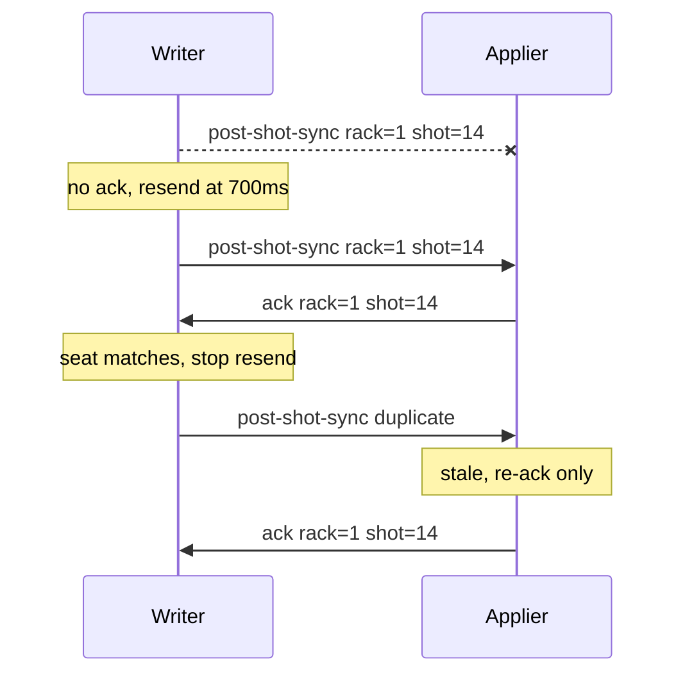
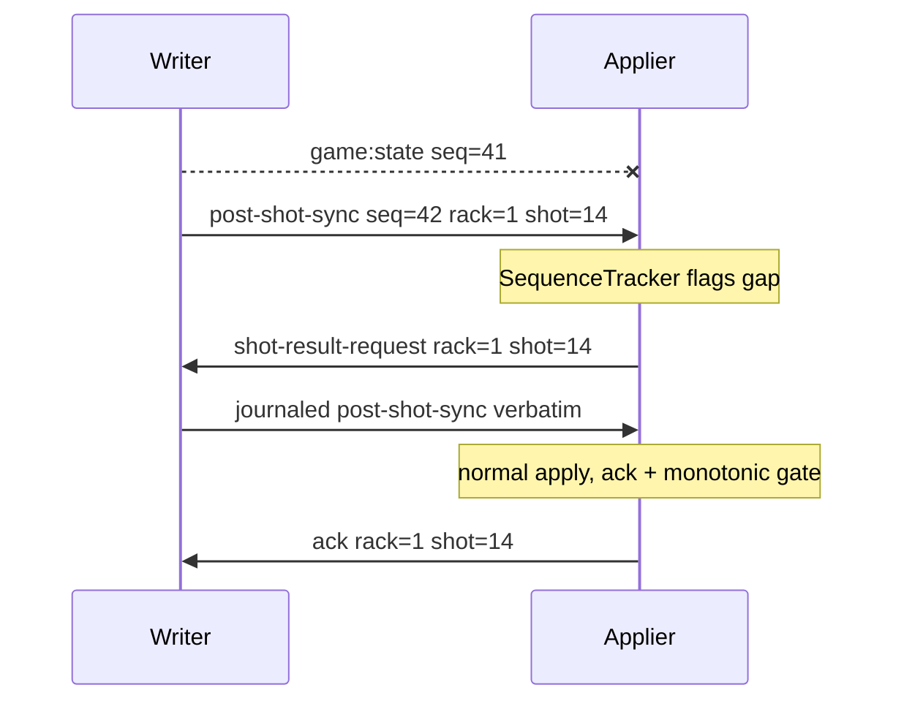

## Overview

Online play syncs over Ably realtime channels through `System/Multiplayer/Transport/AblyTransport.ts`. The protocol is small by design: the shooting client authors one authoritative result per shot and everyone else applies it (see [Architecture](/trainer/multiplayer/architecture)). This page documents the wire format itself — the event names the SDK will actually deliver, the envelope every message rides in, the `reason` strings that multiplex `game:state`, and the delivery guarantees that make an unreliable channel safe for turn-based state.

## Transport Events and the Allowlist

The SDK subscribes each game channel to a **fixed allowlist** of event names (`GAME_EVENTS` in the SDK's `Service/Game.ts`). Ably subscriptions are per event name, so a message published under any other name is accepted by the transport, never delivered to a subscriber, and produces no error. This is the single most important protocol constraint:

> **Rule:** never invent a new transport event name. Anything new rides `game:state` with a new `reason` string (or the already-allowlisted `state:request`).

The full allowlist: `ball:move`, `cue:move`, `game:state`, `match:create`, `match:end`, `match:join`, `match:leave`, `match:start`, `matchmaking:matched`, `shot:taken`, `state:request`.

Channels are namespaced `cs:game:` — a room code like `POOL-XXXX` becomes channel `cs:game:POOL-XXXX`.

Events the trainer actually uses:

| Event | Direction | Purpose |
| --- | --- | --- |
| `game:state` | both | The workhorse. Every gameplay signal rides this event, multiplexed by a `reason` field. |
| `shot:taken` | shooter to others | Shot inputs (aim, power, english, elevation, jump) for cosmetic replay, plus `rackId`/`shotId` and a pre-shot table snapshot. |
| `ball:move` | active seat to others | Live ball placement stream during ball-in-hand drag. Throttled to 60 ms, with an unthrottled `final` flush. |
| `cue:move` | active seat to others | Live aim stream: `aimAngle`, `aimLocal`, `elevation`, `english`, `power`. Throttled to 60 ms. Fire-and-forget. |
| `state:request` | spectator to host | Request full state; the host answers with `game:state` `reason=spectator-sync`. |
| `match:create` / `match:join` / `match:leave` | room lifecycle | Sent by `RoomController` on create, join, and leave. |
| `match:end` | forfeiting client to opponent | Explicit forfeit carrying `reason: 'forfeit'` and `winnerIndex`; the opponent ends the match immediately. |
| `matchmaking:matched` | server to user channel | Matchmaker pairing notification delivered on the user's personal channel, not the game channel. |

`ball:move` and `cue:move` are cosmetic streams with no reliability tier — a dropped packet just means a stale pose until the next one arrives.

## The Envelope

Every outgoing message is wrapped by `AblyTransport.send`:

```typescript
const message = {
    game_id: gameId,          // room code / channel id
    payload: payload,         // the caller's data
    senderId: this.senderId,  // stable per-client id, generated once per session
    sequence: ++this.sequence, // monotonic per-sender counter, incremented per send
    timestamp: Date.now(),
    type: eventName,          // the transport event name
    user_id: '',              // present but unused
};
```

`senderId` and `sequence` drive duplicate detection and gap detection on the receiving side via `SequenceTracker`: the first message from a sender is accepted; `sequence <= previous` is a duplicate and is dropped; `sequence > previous + 1` is accepted but flagged as a gap. Streams are tracked per sender — the host's and joiner's counters are independent.

By receive time the body is wrapped again by the SDK's channel and dispatcher layers, so handlers unwrap with `resolveTransportPayload(e)`, which falls back through `e?.data?.data?.payload`, `e?.data?.payload`, and `e?.data` so zero-, single-, and double-wrapped deliveries all resolve.

## game:state Reasons

Control messages carry a base of `{ currentPlayerIndex, playerIndex, rackId, reason, shotId }`; state-carrying messages add the full authoritative payload (next section). A self-echo guard drops any `game:state` whose `playerIndex` matches the local seat before routing.

| `reason` | Sender | Meaning | Payload highlights |
| --- | --- | --- | --- |
| `match-start` | host | Config handshake — carries the final match config so the joiner can auto-start. | `config` |
| `player-info` | both | Identity handshake — opponent display name, avatar, server user id. | player info fields |
| `rack-start` | host | Authoritative rack layout (racks are random, so only the host can author them). Re-sent until acked. | full state plus `breakerIndex`, `rackId`, `startMode` of `'initial'` or `'next'` |
| `rack-ready` | both | Seat declares readiness for the next rack. Never chooses the breaker — the host derives that from match state. | `playerIndex`, `rackId` |
| `rack-ack` | joiner | Confirms the rack was applied; stops the host's `rack-start` re-send. | `rackId` |
| `post-shot-sync` | shooter | The authoritative per-shot result — balls, turn, scores, ball-in-hand, optional game end. | full payload, next section |
| `foul-sync` | fouler | The authoritative foul result. Only the fouler broadcasts; the beneficiary stays silent. | post-shot shape plus `foulReason`, `foulType`, typically `ballInHand: true` |
| `shot-result-request` | applier that saw a gap | Ask the authoring seat to replay a specific journaled result. | `rackId`, `requestReason`, `resultReason`, `shotId`, `writerIndex` |
| `snapshot-request` | non-authority | Ask the host for a full state snapshot. | `requestReason` |
| `snapshot-full` | host | Full-state recovery response. Always applied, bypassing the staleness gate, but still advances the high-water mark. | full state plus `requestReason` |
| `spectator-sync` | host | Response to a spectator's `state:request`. Active players ignore it. | full state plus `aim`, `elevation`, `english`, `power` |
| `ack` | applier | Confirms receipt of a resolution; stops the writer's re-send when it comes from the opposing participant seat. | `ackReason`, `rackId`, `shotId` |
| `match-restart` | host | Online rematch in the same room; the receiver re-dispatches it as a local event. | none |

Unrecognized reasons fall through to a plain drift-correcting ball-state apply on the joiner; the host logs and ignores them.

Two strings that look like wire reasons but are not:

- `remote-game-end` — the `result.reason` inside the **local** `Event.Game.End` dispatch the applier fires when a `post-shot-sync` carries a `gameEnd` marker. The win travels as the `gameEnd` field, never as its own message.
- `presence-leave` — the `reason` field on the **local** `Event.Multiplayer.OpponentLeft` dispatch. Disconnect detection is driven by the Ably presence channel, not by a `game:state` message.

## The Authoritative Post-Shot Payload

`post-shot-sync` ends a shot. It carries the entire result so the receiver computes nothing:

| Field | Meaning |
| --- | --- |
| `ballChecksum` | Legacy duplicate of `tableChecksum`. Diagnostic only. |
| `ballInHand` | `true` when the incoming player places the cue ball. An authoritative `false` also clears a stale local grant. |
| `balls` | Every ball serialized via `toJSON()`. Consumed fields: `number`, `active`, `isPocketed`, `pocketedIn`, `visible`, `position`, `velocity`, `rotation`, `angularVelocity`. |
| `currentPlayerIndex` | Whose turn it is now, post-verdict — the baton. |
| `gameEnd` | `{ winnerIndex }` — present only when this shot ended the rack. Attached once and included verbatim in re-sends. |
| `playerIndex` | The sender's seat. Used for the self-echo guard and ACK seat identity. |
| `rackId` | Host-assigned monotonic rack counter. |
| `reason` | `'post-shot-sync'` |
| `scores` | Per-seat array of `{ gamesWon, score }` — indexed by seat, never keyed by player id. |
| `shotId` | Monotonic within the rack. The same id the shot's `shot:taken` used. |
| `tableChecksum` | Quantized hash of the final table. A divergence detector for logs only — never a gate. |

A representative message as it leaves the shooter (envelope fields abbreviated):

```json
{
    "game_id": "POOL-K4TQ",
    "payload": {
        "ballChecksum": "a91f3c",
        "ballInHand": false,
        "balls": [
            {
                "active": true,
                "angularVelocity": { "x": 0, "y": 0, "z": 0 },
                "isPocketed": false,
                "number": 0,
                "pocketedIn": null,
                "position": { "x": 0.412, "y": 0.028, "z": -0.31 },
                "rotation": { "w": 1, "x": 0, "y": 0, "z": 0 },
                "velocity": { "x": 0, "y": 0, "z": 0 },
                "visible": true
            }
        ],
        "currentPlayerIndex": 1,
        "playerIndex": 0,
        "rackId": 1,
        "reason": "post-shot-sync",
        "scores": [
            { "gamesWon": 0, "score": 3 },
            { "gamesWon": 1, "score": 5 }
        ],
        "shotId": 14,
        "tableChecksum": "a91f3c"
    },
    "senderId": "client-1733600000000-482913",
    "sequence": 42,
    "timestamp": 1733600000000,
    "type": "game:state",
    "user_id": ""
}
```

`foul-sync` is the same shape plus `foulReason` (defaults to `'unknown'`) and `foulType` (defaults to `'foul:any'`). It never carries `gameEnd`.

The receiver validates before mutating anything: `rackId` and `shotId` must be finite, `currentPlayerIndex` must be an integer within the player count, `scores` must be an array no longer than the player count, and `balls` is required for `post-shot-sync`, `foul-sync`, `snapshot-full`, and `rack-start`.

The ACK reply rides `game:state` (allowlist-safe):

```json
{ "ackReason": "post-shot-sync", "rackId": 1, "reason": "ack", "shotId": 14 }
```

## Delivery Guarantees

Ably delivers messages but the protocol assumes drops, duplicates, and reordering anyway. Four mechanisms layer together. Constants: re-send interval 700 ms, maximum 8 attempts, result journal of the last 12 authored results.

### At-Least-Once Re-send Until ACK

After broadcasting `post-shot-sync` or `foul-sync`, the writer journals the payload under the key `rackId:shotId:reason` and re-sends it **verbatim** every 700 ms — including any `gameEnd` marker, so a dropped first packet cannot lose the game-over — until an `ack` arrives or 8 attempts are exhausted (snapshot recovery remains the longer-term net).

ACKs are **seat-aware**: `handleResultAck` only stops the timer when the ACK's `playerIndex` is the opposing participant seat. Spectator ACKs are informational and never stop the re-send.



### Monotonic Acceptance

The applier side of the same exchange is `acceptResolution`, which runs on every incoming `post-shot-sync` and `foul-sync`:

1. **ACK first, always** — even a copy about to be rejected gets acknowledged, so the writer stops re-sending.
2. **Staleness check** against a monotonic `(rackId, shotId)` high-water mark: stale when `rackId` is behind, or the rack matches and `shotId <= lastAppliedShotId`. Stale copies are re-acked and never re-applied — no re-granted ball-in-hand, no stale turn adoption, no double game-end.
3. Fresh copies advance the high-water mark forward-only, then apply.

One corollary is load-bearing: **every distinct terminal resolution must carry a strictly greater `shotId`**. A resolution with no shot behind it (a shot-clock timeout today; any future concede) must call `advanceResolutionId()` first, or it reuses the previous shot's id, collides with the high-water mark, is rejected as stale, and deadlocks both clients. `broadcastFoulSync` does this for shot-clock fouls. Ids only need to be monotonic, not contiguous.

`snapshot-full` bypasses the staleness check — it always applies — but still advances the mark so a late older resolution cannot rewind past the snapshot.

### Sequence Gap, Targeted Replay, Full Snapshot

Every incoming `game:state` passes through `SequenceTracker.consume(senderId, sequence)` in `parseIncomingGameState`:

- **Duplicate** — dropped entirely.
- **Gap** — an earlier message from that sender was missed. If the arriving payload is itself a `post-shot-sync` or `foul-sync`, the client sends `shot-result-request` naming that resolution's `rackId`, `shotId`, and `writerIndex`; because every resolution carries the complete table state, replaying the newest authored result converges the applier regardless of which earlier message was dropped. Any other reason — or a malformed payload missing its ids — falls back to `requestFullSnapshot`.

The request is **source-aware**: only the peer whose seat matches `writerIndex` answers, replaying the exact authored payload from its journal. A missed joiner-authored result is replayed by the joiner, never overwritten by stale host state.



For recovery paths that cannot name a result — join, reconnect, spectate, rack timeout — `requestFullSnapshot` sends `snapshot-request` and the host answers with `snapshot-full`. Details of when each path fires are in [Sync Flows](/trainer/multiplayer/sync-flows).

### Reliable Rack Handshake

Rack transitions get their own handshake because racks are random and only the host can author them:

1. Each ready client sends `rack-ready` carrying only `{ playerIndex, rackId }`, re-sent every 700 ms up to 8 times until the rack starts. The breaker is never on the wire — the host derives it from its own match state.
2. When both seats are ready, the host increments `rackId`, resets `shotId` to 0, racks, and broadcasts `rack-start`, re-sending until the joiner replies `rack-ack`.
3. Duplicate `rack-start` packets are re-acked without re-racking, guarded by the last applied rack-start id.
4. Input is blocked on both clients for the duration of the handshake and unblocked from the adopted turn once the ACK lands.

## Versioning and Compatibility

There is no protocol version field; compatibility is handled by tolerant parsing and a few deliberate leftovers:

- **Wrap-depth tolerance.** `resolveTransportPayload` resolves zero-, single-, and double-wrapped deliveries, so changes in SDK envelope depth do not break handlers.
- **`ballChecksum`** is a legacy duplicate of `tableChecksum` and still rides every state broadcast. Both are divergence detectors for logs only — the old checksum-based accept/reject gate was removed outright (`shouldApplyRemoteState` is hardwired to accept), a deliberate residue of the abandoned dual-simulation model.
- **`foul-sync` field defaults.** Missing `foulReason` resolves to `'unknown'`, missing `foulType` to `'foul:any'`, and missing `currentPlayerIndex` to `0`, so a minimal foul payload still applies.
- **`shot:taken` diagnostic weight.** `preShotBalls` and `preShotChecksum` ride the wire but are never consumed by the replay handler — they exist for log-side diagnosis and can be ignored by receivers.
- **Optional `hostUserId` on `matchmaking:matched`.** A client treats itself as the designated room creator only when the field is present and matches its authenticated user id; payloads without it cause both clients to attempt a join rather than a create.
