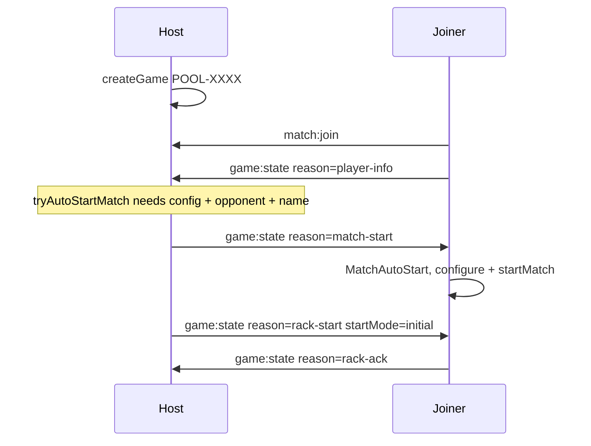
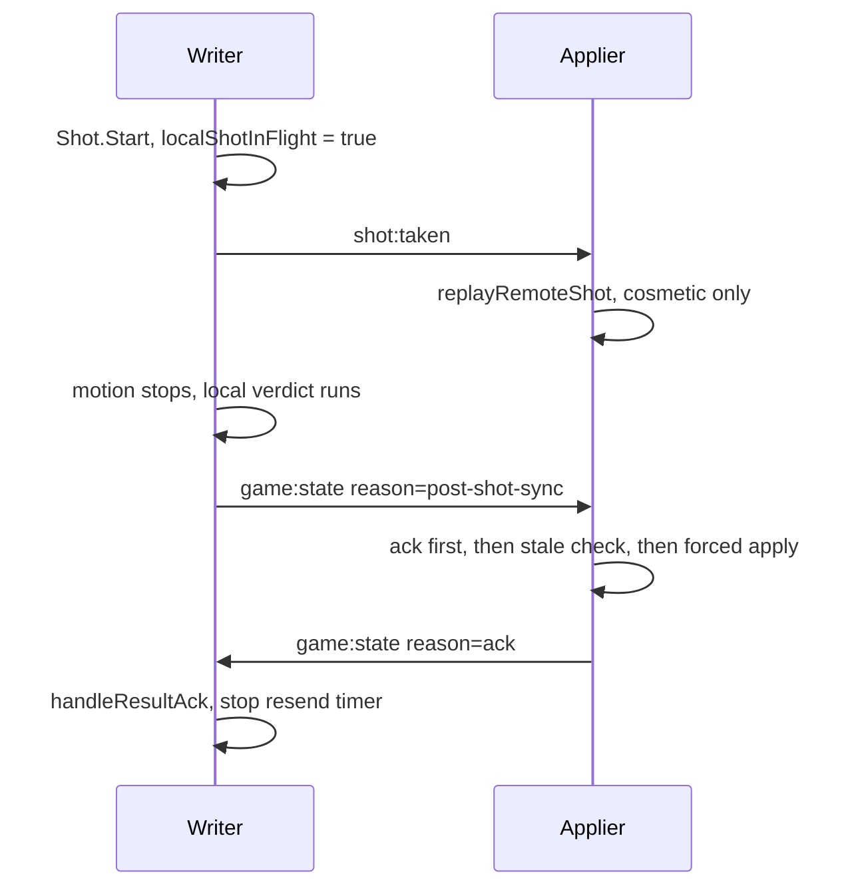
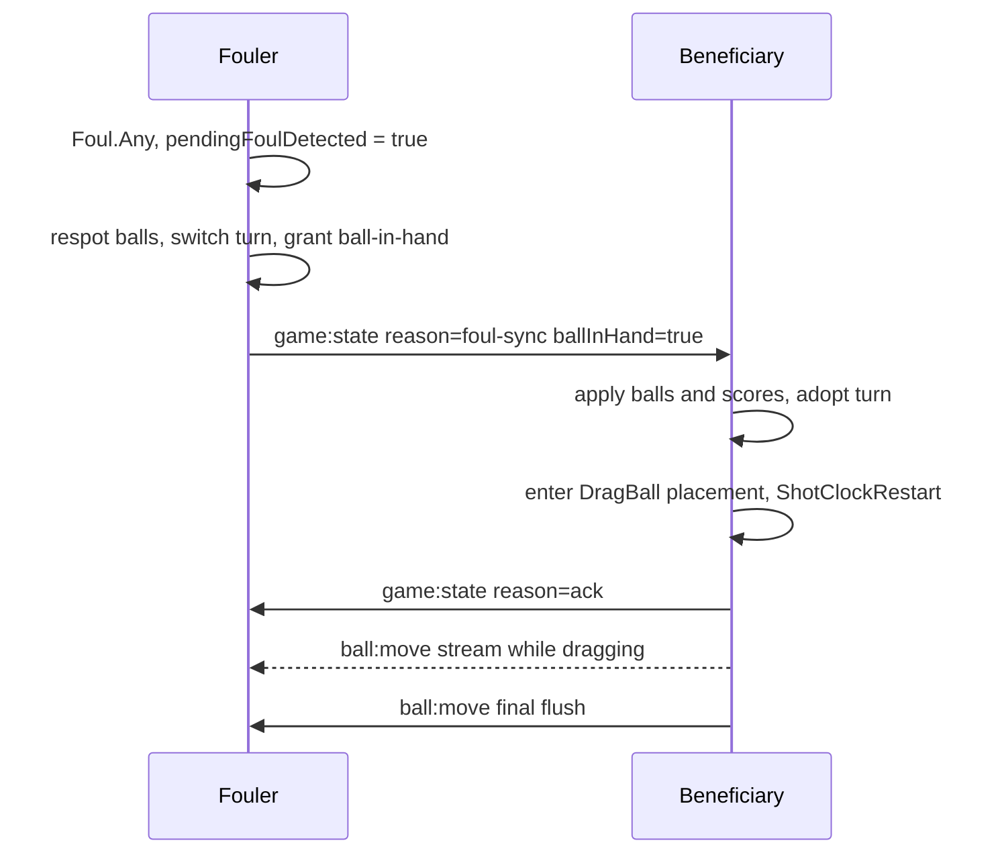
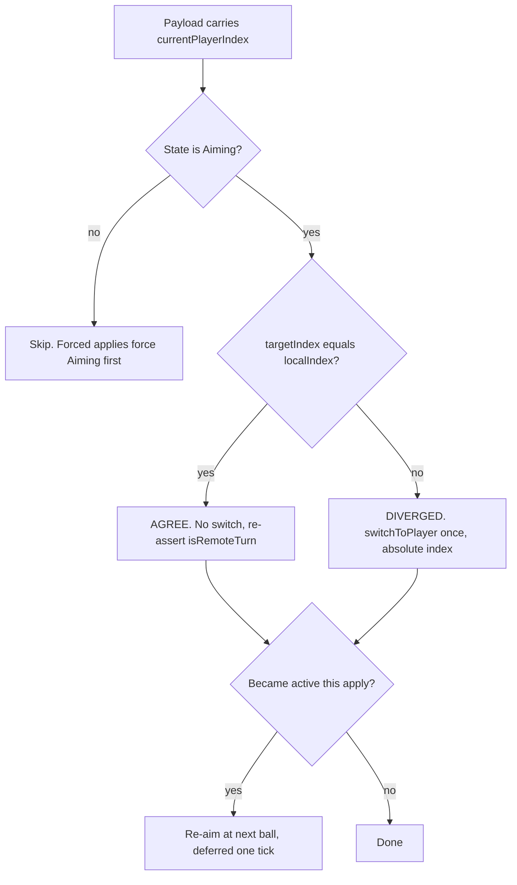
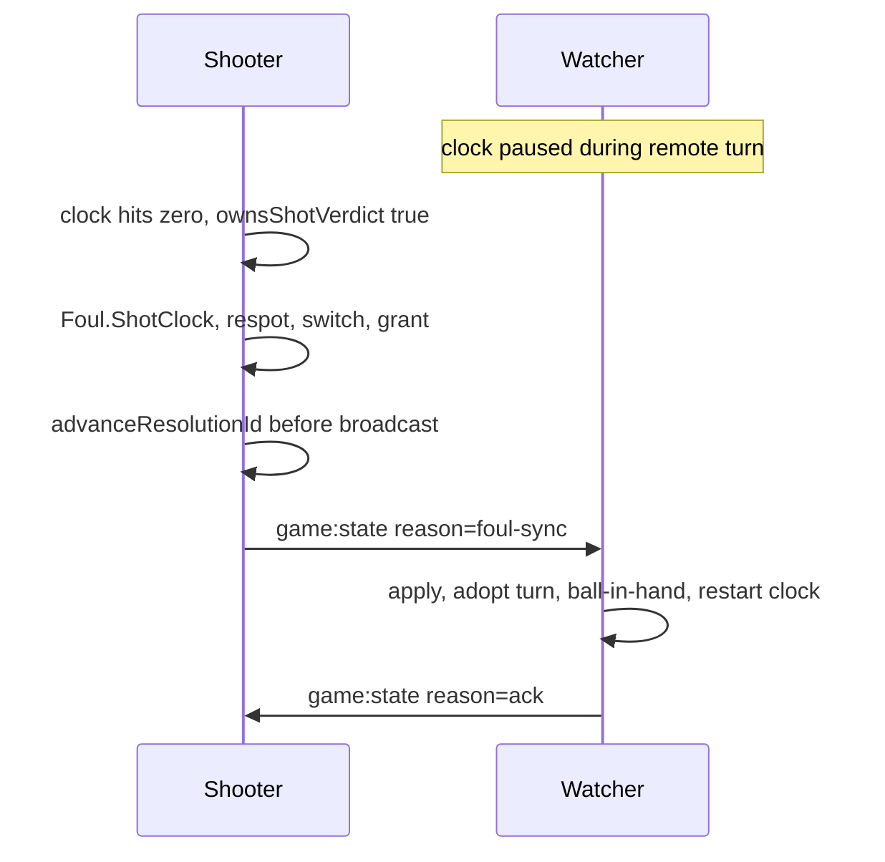
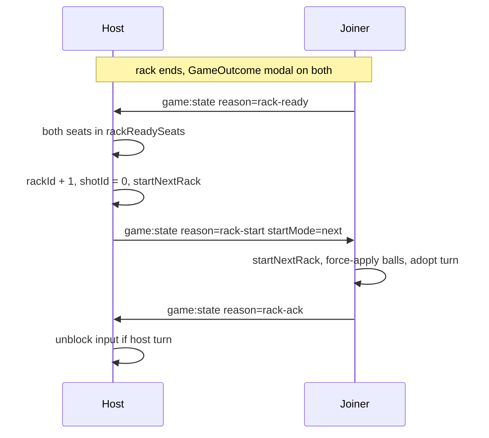
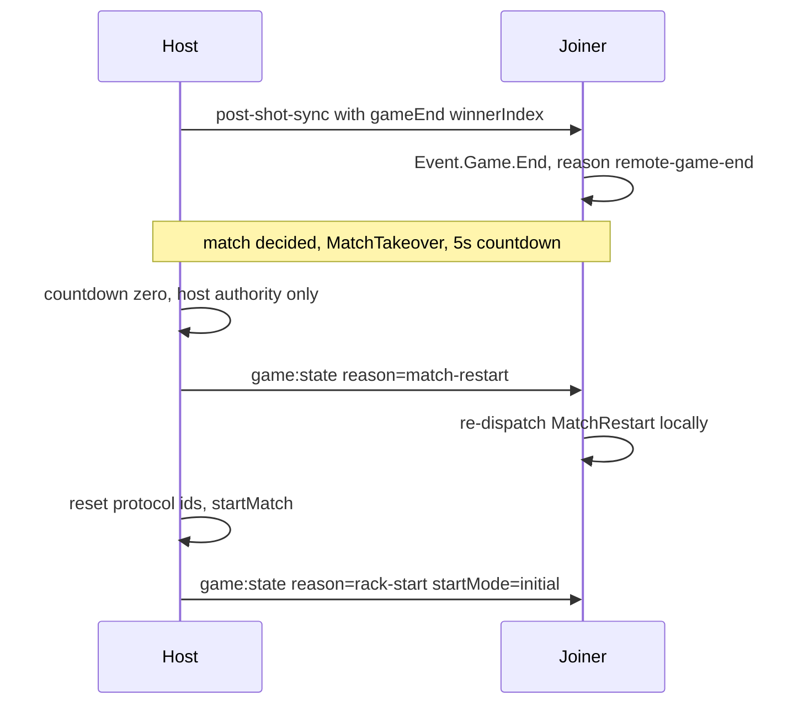
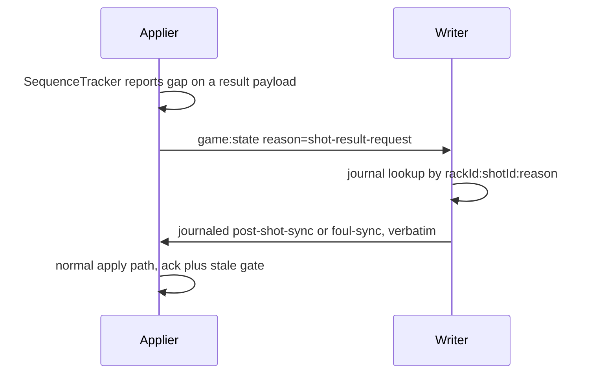
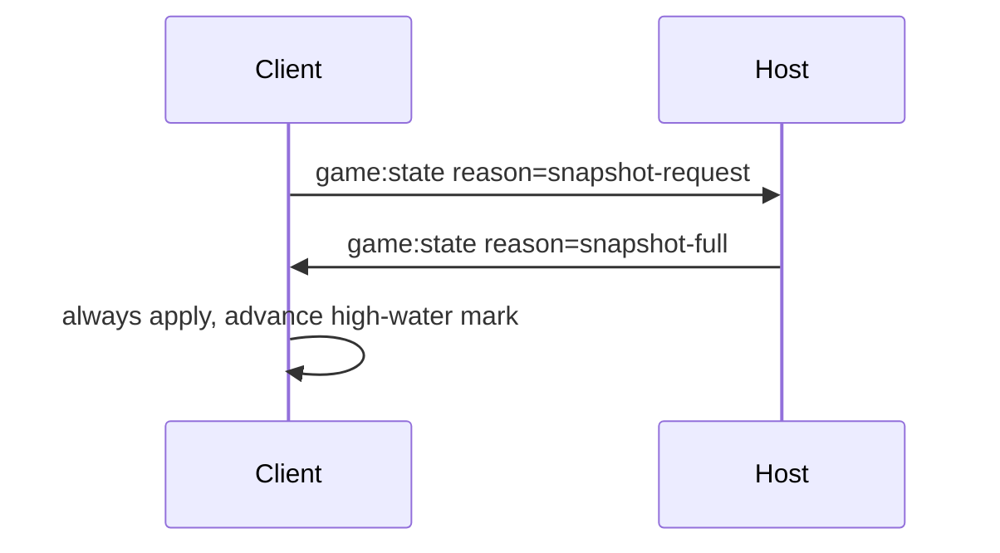
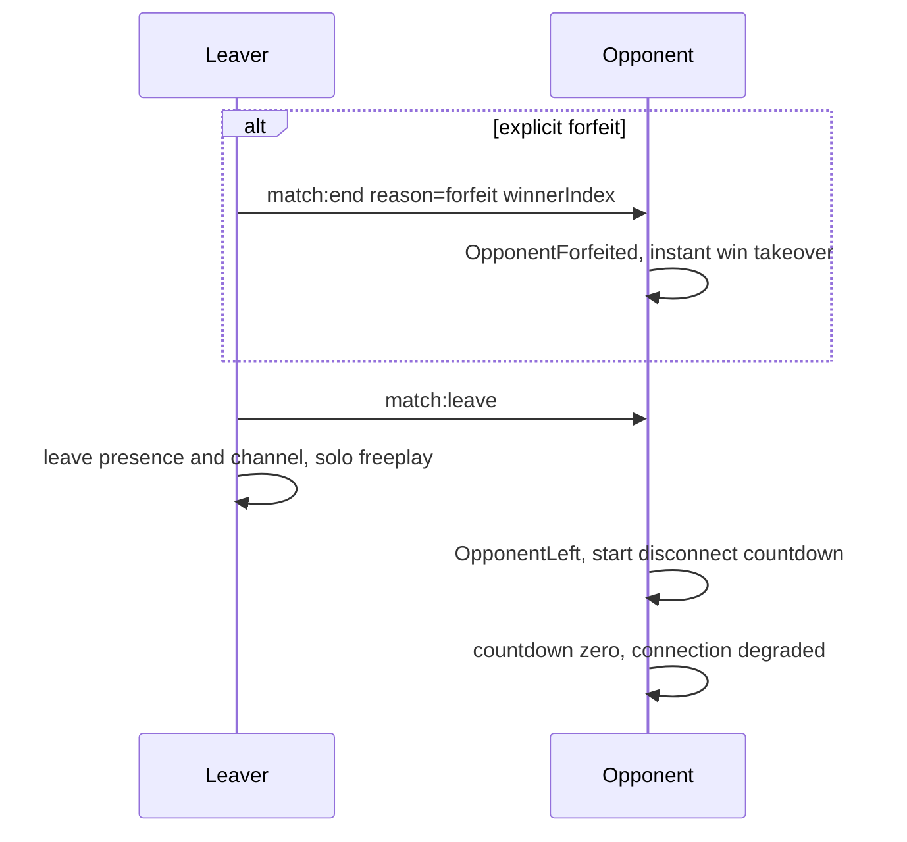

## Overview

This page walks through each gameplay sync flow as its own small sequence diagram. Conventions used throughout:

- **Host** = seat 0 (`isStateAuthority: true`), **Joiner** = seat 1. Both seats are full writers of their own shots — authority only governs rack authorship, snapshot responses, and rack-ready collection.
- **Writer** = whichever seat is shooting; **Applier** = the other client. The writer authors the outcome; the applier computes nothing and snaps to it.
- Every message rides one of the allowlisted transport events (see [Wire Protocol](/trainer/multiplayer/protocol)). Anything stateful travels as `game:state` with a `reason` string; those reason strings appear verbatim in the diagrams and in the `multiplayer:flow` debug logs.

The invariants these flows lean on — single writer, never re-simulate, compare-before-write, everything rides `game:state`, at-least-once plus monotonic ids — are defined in [Architecture](/trainer/multiplayer/architecture).

| Flow | Primary wire traffic | Reliability |
|------|---------------------|-------------|
| Connect and match start | `match:join`, `player-info`, `match-start`, `rack-start`, `rack-ack` | `rack-start` re-sent until acked |
| Normal shot | `shot:taken`, `post-shot-sync`, `ack` | at-least-once + monotonic ids |
| Foul and ball-in-hand | `foul-sync`, `ack`, `ball:move` | at-least-once + monotonic ids |
| Turn adoption | local procedure, no traffic of its own | compare-before-write |
| Shot clock | `foul-sync` only, no clock time on the wire | `advanceResolutionId` bump |
| Rack transition | `rack-ready`, `rack-start`, `rack-ack` | both legs re-sent until answered |
| Game end and rematch | `post-shot-sync` + `gameEnd`, `match-restart` | rides the resolution tier |
| Recovery | `shot-result-request`, `snapshot-request`, `snapshot-full` | journal replay, snapshot fallback |
| Disconnect and leave | `match:leave`, `match:end`, presence | fire-and-forget + presence |

## Connect and match start

The host creates a room (`POOL-XXXX` becomes the Ably channel), stores its pending match config, and waits. The joiner enters via room code, invite link, or quick match, then immediately broadcasts its identity. Once the host has a connected opponent, that opponent's `player-info`, and a pending config, it auto-starts the match and authors the first rack.

What to notice:

- The opponent-joined signal is the `match:join` transport event, not presence entry. Presence is used for disconnect detection only.
- The joiner sets `localPlayerIndex = 1` inside `joinRoom`, before the match can start, so seat identity is never ambiguous mid-handshake.
- Racking uses `Math.random`, so the layout cannot be reproduced remotely. For `startMode=initial` the joiner skips its own racking entirely and force-applies the host's authoritative ball positions.
- `rack-start` is re-sent every 700 ms (up to 8 attempts) until the joiner replies `rack-ack`. The ack also derives input blocking from the turn: the joiner's input stays blocked whenever it is not the breaker.
- `MatchAutoStart` is handled by menu and modal UI only — the live scene never listens for it. This is why rematch needed a separate `match-restart` signal (see game end below).
- Log vocabulary: `Connected and listening`, `wire game:state reason=rack-start`, `Re-sending rack-start rack=N`, `Duplicate rack-start rack=N — re-acking without re-rack`.

## A normal shot

The writer fires `shot:taken` at the moment of the stroke, runs full physics and rules locally, and broadcasts the entire resolved outcome once the balls settle. The applier plays the incoming shot as a cosmetic animation, then discards its own simulation result and snaps to the writer's authoritative state.

What to notice:

- The post-shot broadcast is gated on `localShotInFlight` (set at `Shot.Start`), not the live turn flag. By settle time the writer's own verdict may have already switched the turn — gating on turn produced the historical "shooter goes silent on a miss" deadlock.
- The applier's rules layer early-returns when `game/ownsShotVerdict` is false, logging `Shot resolved by remote seat — applying authoritative broadcast, skipping local verdict`. It computes and records nothing; only the shooter persists the shot.
- `post-shot-sync` carries final ball state, `currentPlayerIndex` (post-verdict), per-seat scores, `ballInHand`, and an optional `gameEnd` marker. The `tableChecksum` on the payload is a log-only divergence detector, never an acceptance gate.
- Delivery is at-least-once: the writer re-sends the exact payload every 700 ms up to 8 attempts. Only an ack from the opposing participant seat stops the timer — spectator acks are logged and ignored.
- The applier acks before the stale check, so even a rejected duplicate silences the writer's resend timer. The monotonic `rackId:shotId` high-water mark guarantees a duplicate is never re-applied.
- Healthy log sequence for a miss: `→ post-shot-sync`, `← post-shot-sync`, `DIVERGED, adopting`, `→ ack`, `Resolution ... ACKed — delivery confirmed`.

## A foul and ball-in-hand handoff

When the writer's own verdict detects a foul, the deferred `post-shot-sync` is cancelled and a `foul-sync` takes its place. The foul handler respots balls, switches the turn, and grants ball-in-hand locally on the fouler's machine first; the broadcast then replicates all of that in one message. The beneficiary never witnesses the foul — it learns everything from the payload.

What to notice:

- Only the fouler broadcasts. `Handle_OnFoulResolved` returns early when the resolved `currentPlayerIndex` equals the local seat — the beneficiary stays silent. The guard is deliberately not the turn flag, which is already stale after the switch.
- The ball-in-hand grant on the applier requires all three of: `ballInHand === true`, `currentPlayerIndex === localPlayerIndex`, and no grant already pending. An authoritative `ballInHand: false` clears a stale local grant and exits placement mode.
- `foul-sync` goes through the same ack-plus-monotonic acceptance as `post-shot-sync`, so a re-sent copy is re-acked and never re-applied — ball-in-hand cannot be re-granted after placement.
- While the beneficiary drags the cue ball, placement streams over `ball:move` at a 60 ms throttle; leaving DragBall or starting the shot triggers an unthrottled final flush, so the final placement always lands before the next `shot:taken`.
- Turn adoption on a foul always diverges (fouler to beneficiary), which is what triggers the beneficiary's `ShotClockRestart`.

## Turn adoption

Every authoritative payload that carries `currentPlayerIndex` — `post-shot-sync`, `foul-sync`, `rack-start`, `snapshot-full` — funnels through a single procedure, `applyAuthoritativeTurn`. It compares before it writes, because duplicate deliveries are normal under at-least-once and the underlying `switchToPlayer` is not idempotent.

What to notice:

- The AGREE no-op is the sole guard keeping `switchToPlayer` from double-firing — the historical "player 2 can't shoot" regression. Never loosen it.
- Even on AGREE, the derived `isRemoteTurn` flag is re-asserted if stale. The index can be correct while the flag is wrong after a rack or snapshot — the "both clients think it is their turn" symptom.
- Divergence always uses an absolute `switchToPlayer(targetIndex)`, never a relative advance, followed by `setCurrentPlayer`, `prepareForNextShot`, and input-block sync (which defers while a rack handshake is pending).
- On the remote-to-local transition only, the incoming player re-aims at the next legal ball so ghost and trajectory lines render — a turn adopted from a broadcast bypasses the local turn pipeline that normally aims.
- Clock side effects: became-remote dispatches `ShotClockPause`, became-active dispatches `ShotClockRestart`. The restart intentionally overlaps the foul handler's explicit restart; both are idempotent.
- Log vocabulary: `AGREE, no override`, `AGREE, corrected stale isRemoteTurn`, `DIVERGED, adopting`, `Reconciled turn`, `Became active — re-aiming at next ball`.

## Shot clock online

Both clients run independent local 100 ms interval clocks — there is no wire-level clock synchronization at all. Only the foul outcome syncs, and only one seat is allowed to produce it: the shot-verdict owner. The watcher's clock is additionally paused for the whole remote turn, so it can never fire a phantom foul.

What to notice:

- `game/ownsShotVerdict` has three branches: offline always true (practice, vs-CPU, and AI shot-clock fouls resolve normally); online with an unresolved scoreboard returns false as a fail-safe against phantom fouls; otherwise it is a seat comparison against `localPlayerIndex`.
- A shot-clock foul is a shot-less resolution: no `Shot.Start` ran, so `currentShotId` still equals the previously applied shot. `broadcastFoulSync` must call `advanceResolutionId()` first — without the strictly newer `shotId`, the applier's monotonic gate rejected the foul-sync as stale and both clients deadlocked. This was audited, fixed, and confirmed against two-browser logs.
- The applier re-syncs its `currentShotId` from the payload, so the next real shot stays monotonic on both machines.
- The watcher pause is a hardening, not the primary defense — even if the watcher's clock somehow expired, the `ownsShotVerdict` gate logs `Shot-clock EXPIRED — not my verdict, waiting for shooter foul-sync` and does nothing.
- The disconnect countdown (see below) pauses the clock only for the non-shooter; a shooter's clock keeps burning through their own disconnect, by design.

## Rack transition

Between racks in the same match, the `GameOutcome` modal appears on both clients and each player clicks Next Rack. Readiness is collected by the host; once both seats are ready the host advances the rack counter, racks locally, and ships the authoritative layout. Every leg of the handshake is retried.

What to notice:

- `rack-ready` carries only `{ playerIndex, rackId }`. It never chooses the breaker — the host derives the breaker from its own match state (`pendingNextBreakerIndex`), so a stale or forged ready message cannot redirect the break.
- Two independent reliability timers: the ready client re-sends `rack-ready` and the host re-sends `rack-start`, both at 700 ms up to 8 attempts. A duplicate `rack-start` is re-acked without re-racking, keyed on `lastAppliedRackStartId`.
- Input is blocked on both clients for the duration of the handshake; the turn-driven input sync explicitly defers while `awaitingRackAck` is set.
- UI fallback: `GameOutcome` arms an 8 second timeout. If `NetworkRackStart` never arrives, it requests a full snapshot with reason `rack-timeout` and re-enables the button instead of hanging on "Waiting for opponent".
- Verification status: the hardening (retries, duplicate re-ack, host-derived breaker) is code-verified and build-verified, but live two-browser verification of host-break, joiner-break, and next-rack sequences is still outstanding.
- Log vocabulary: `Re-sending rack-ready`, `Re-sending rack-start rack=N`, `rack-ready still unanswered after N re-sends — waiting for UI retry`, `rack-start rack=N still unacked after M re-sends`.

## Game end and auto-rematch

A rack win is captured by the winning writer and attached to its next `post-shot-sync` as a `gameEnd` marker — game over is never a separate message that could race the final ball state. When the match itself is decided, the result takeover appears on both clients with a five second rematch countdown, and only the host acts on it.

What to notice:

- Either seat can author the `gameEnd` (the diagram shows the host winning; the joiner path is symmetric). The marker is consumed once, and resends reuse the captured payload verbatim — a dropped first packet cannot lose the game-over.
- The applier dispatches `Event.Game.End` with `result.reason: 'remote-game-end'` — deliberately not `Rules.GameComplete`, which would double-increment `gamesWon` and echo another capture back onto the wire. `remote-game-end` is a local string, never a wire reason.
- The joiner's countdown is cosmetic. Only the host broadcasts `match-restart`, which the joiner relays as a local bus event handled by `Game.ts` — always alive in the live scene, unlike the menu-only `MatchAutoStart`.
- `resetProtocolForMatchRestart` clears rack and shot ids, high-water marks, ready and ack state, resend timers, the result journal, and any pending game-end. The room connection and listeners stay alive; the rematch reuses the same channel.
- The rematch's first rack is a normal `startMode=initial` `rack-start` from the host; duplicates are re-acked without re-racking.
- Verification status, honestly: the game-end delivery itself is verified in live play. Auto-rematch is a first cut — compile-clean and code-verified, but manual two-browser verification is pending. Known edges: Leave pressed mid-countdown, a brief joiner rack flicker before the authoritative `rack-start` lands, and a one-broadcast cosmetic score lag.

## Recovery

Every incoming `game:state` passes through a per-sender `SequenceTracker`. Duplicates are dropped outright. A gap triggers recovery scaled to what was missed: if the payload that revealed the gap is itself a resolution, the applier asks the actual author to replay it from a journal; anything else falls back to a full host snapshot.

### Sequence gap, targeted replay

### Full snapshot

What to notice:

- Replay is source-aware: the request carries `writerIndex`, and only the peer whose seat matches answers. A missed joiner-authored result is replayed by the joiner from its own 12-entry journal — never overwritten by stale host state.
- The replayed payload is the exact original `stateData`, so it flows through the standard `acceptResolution` path; the ack and monotonic gate make replays safe even if the original eventually arrives too.
- `snapshot-full` bypasses the staleness check (it always applies) but still advances the `rackId:shotId` high-water mark, so a later stale resolution cannot rewind past the snapshot.
- A non-forced state apply that arrives while the local machine is not in `Aiming` is parked in `pendingRemoteSnapshot` and replayed once the state settles. Forced applies (all resolutions) never defer.
- A third, durable tier exists outside the participant layer: each persisted shot stores `table_state_after`, so a full reload can rebuild the table via the replay machinery. It is asynchronous and can lag the live table by a shot or two.
- Verification status: this tier is build-verified hardening; it is not on the verified-in-live-play list.
- Log vocabulary: `GAP, requesting targeted result`, `GAP, requesting full snapshot`, `DUPLICATE, ignoring`, `Replaying journaled result`, `No journaled result found`, `Resolution still unacked after N re-sends — giving up`.

## Disconnect and leave

Three distinct signals cover departure: `match:leave` for a clean exit (Leave button, page unload via `beforeunload`), the Ably presence leave for crashes and network drops, and `match:end` with a forfeit payload when a player explicitly quits an in-progress match. The remaining player's experience depends on which arrives.

What to notice:

- `presence-leave` is not a wire `game:state` reason. It is only the `reason` field on the local `OpponentLeft` bus event fired when the presence channel reports a departure — disconnect detection is presence-based, not message-based.
- The forfeiting client broadcasts `match:end` before leaving the room, and the receiver clears its opponent-connected flag first, so the trailing presence drop is inert. The opponent gets an immediate victory takeover with no countdown, and the rematch countdown refuses to arm when the opponent is absent.
- Without a forfeit, the remaining player enters a disconnect countdown: the rule set's `disconnectHardTimeoutSeconds`, falling back to 60 seconds. At zero the connection is marked degraded and the match becomes asynchronous rather than force-ended.
- During the countdown, the remaining player's shot clock pauses only if it is their own turn. A disconnected shooter's clock keeps burning — disconnecting cannot buy thinking time.
- If the opponent reconnects before the countdown expires, presence recovery resets the state to connected and resumes any paused clock.
- The leaving client tears down cleanly into solo freeplay: room left, store flags cleared, and the cue reset to seat 0 so it does not keep playing with the opponent's cue.
- Log vocabulary: `Opponent left via presence`, `Broadcasting forfeit`, `Opponent forfeited — awarding win`, `match:leave ignored — no opponent was connected`.

## Related pages

The payload shapes and reason strings referenced above are specified field by field in [Wire Protocol](/trainer/multiplayer/protocol). The per-flow log vocabulary and the outstanding verification items are collected in [Debugging and Known Limitations](/trainer/multiplayer/debugging). Match configuration and lifecycle outside the sync layer are covered in [Match System](/trainer/match-system).
